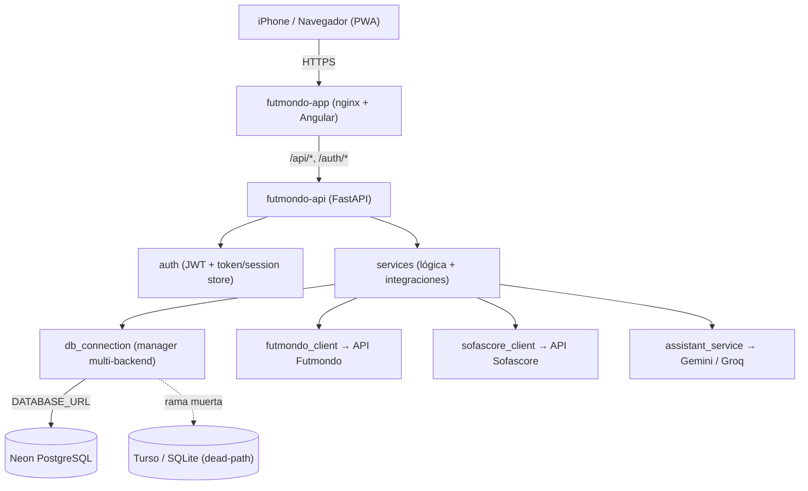
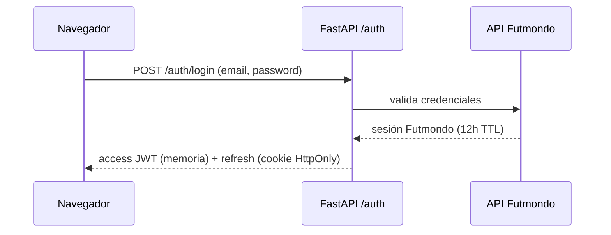
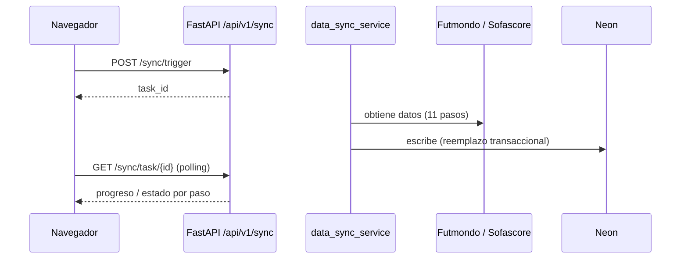

# Arquitectura — Futmondo Analytics

## Visión general del sistema

Sistema web de dos aplicaciones desplegadas por separado en Fly.io (región
`cdg`): un **frontend** Angular 22 (PWA servida por nginx) y un **backend**
FastAPI (Python 3.12), con **Neon PostgreSQL** (Frankfurt, tier free) como
base de datos. El backend integra APIs externas (Futmondo, Sofascore,
Gemini/Groq). Auth por JWT (access token en memoria del navegador + refresh
token en cookie HttpOnly).

## Estilo arquitectónico

**Monolito modular** en el backend (un único proceso FastAPI con subpaquetes
`core`/`services`/`api`/`auth`/`stores`/`security`/`models`) desplegado como
un servicio, más un SPA independiente. Evidencia: un solo `main.py` monta los
24 routers; los servicios comparten proceso y acceso directo a BD vía
`db_connection`. No hay límites de despliegue por dominio (no microservicios).

**Smell brownfield**: la capa de servicios contiene god-files
(`data_manager_v2.py` ~166 KB, `data_sync_service.py` ~84 KB) con SQL en
routers — deuda registrada; regla afirmada de NO ampliarlos.

## Relaciones entre componentes

**Fallback en texto**: el navegador habla HTTPS con `futmondo-app` (nginx +
Angular), que proxya `/api/*` y `/auth/*` a `futmondo-api` (FastAPI). El
backend usa `auth` (JWT), `services` (lógica de negocio e integraciones) y,
a través de `db_connection`, resuelve la conexión de BD: en producción a
**Neon (DATABASE_URL)**; las ramas **Turso/SQLite** existen en código pero
están muertas en operación (deuda del intent). Los servicios llaman a las APIs
externas Futmondo, Sofascore y Gemini/Groq.

## Flujo de datos

Petición HTTP → `AuthMiddleware` (valida Bearer JWT salvo rutas públicas) →
router `/api/v1/*` → servicio de negocio → `db_connection` (Neon) y/o cliente
de integración externo → respuesta JSON. El sync es asíncrono: un endpoint
lanza la tarea (devuelve `task_id`), el estado se persiste vía `stores` y el
frontend hace polling del progreso.

## Interaction Diagrams — transacciones de negocio principales

### Login (autenticación contra Futmondo + emisión JWT)

**Fallback**: el navegador envía credenciales a `/auth/login`; el backend las
valida contra la API de Futmondo, y si son correctas devuelve un access JWT
(en memoria, 1h) y un refresh token en cookie HttpOnly (30 días).

### Sync asíncrono (progreso por pasos)

**Fallback**: el usuario dispara `/sync/trigger` y recibe un `task_id`; el
servicio de sync recorre 11 pasos consultando Futmondo/Sofascore y
escribiendo en Neon; el frontend consulta `/sync/task/{id}` para el progreso.
El estado de paso usa `sync_step_status.py` (recuperable → `DEGRADED`,
fatal → aborta limpio).

## Decisiones de diseño clave

- **Multi-backend de BD** (`db_connection`) diseñado para PostgreSQL/SQLite/
  Turso — hoy solo Neon (PostgreSQL) está vivo en producción; el resto es
  dead-path (ver `code-quality-assessment.md`, FR14).
- **JWT dual** (access en memoria, refresh en cookie HttpOnly) por seguridad.
- **Excepciones de integración tipadas propagadas** (`integration_errors.py`,
  raíz `IntegrationError`) en lugar de `return None` silencioso.
- **Despliegue on-merge** a Fly.io con smoke `/health`.

## Oportunidades de mejora

Foco del intent: eliminar el dead-path de BD, unificar el doble montaje de
`matchdays`, retirar IDs hardcodeados y limpiar residuos versionados. Deuda
mayor fuera de alcance: descomposición de god-files y patrón SQL-en-router.
