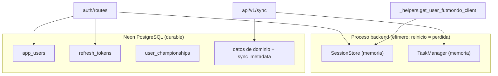
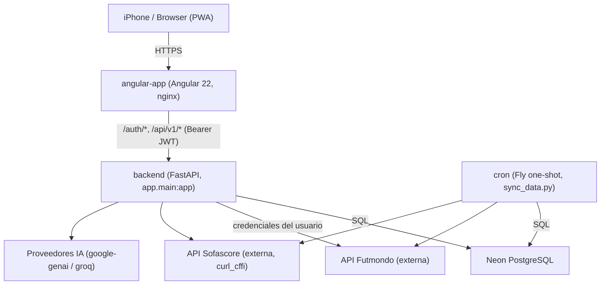
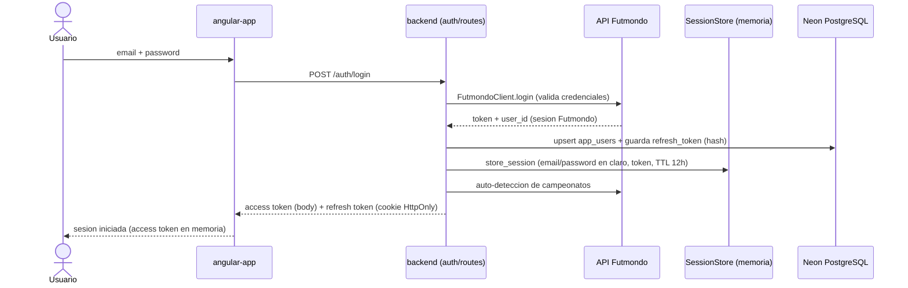
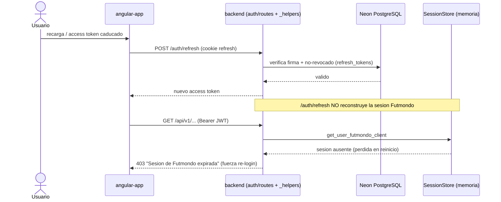
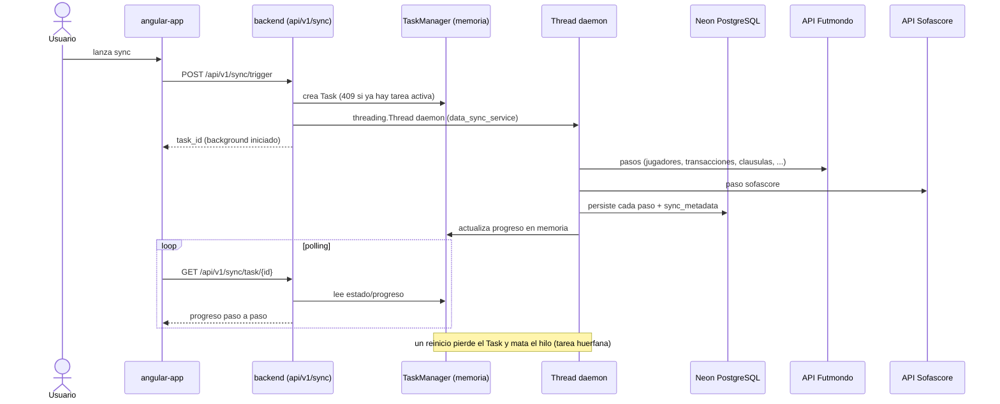

# Architecture — Futmondo Analytics

> Artefacto CodeKB (architect). Base: `developer-scan.md`. Store STALE tras FOCUSED SCAN del backend `backend/` (durabilidad de estado y credenciales). La prosa fuera de `backend/` (frontend, bundle) se preserva del análisis previo.

## System Overview

Sistema web de tres capas desplegado en Fly.io: un **frontend Angular 22 (PWA)** servido por nginx, un **backend FastAPI (Python 3.12)** que actúa como API y como cliente de integraciones externas (Futmondo, Sofascore, IA), y una **base de datos Neon PostgreSQL** (serverless). Un proceso **cron** one-shot reutiliza la imagen del backend para sincronizaciones programadas. En local, un **proxy nginx** enruta hacia frontend y backend vía docker-compose.

## Architectural Style

**Monolito modular desplegado como pocos servicios** (hybrid, orientado a servicios de despliegue, no microservicios):

- El backend es un único servicio FastAPI (`app.main:app`) con routers montados por dominio (patrón *modular monolith*): auth, mercado, finanzas, sync, analytics, etc. No hay bases de datos por servicio ni comunicación inter-servicio por eventos.
- El frontend es una SPA/PWA standalone (Angular signals + standalone components), con routing 100 % lazy por ruta (`loadComponent`/`loadChildren`).
- El cron es el mismo artefacto que el backend ejecutado como proceso distinto (`python scripts/sync_data.py`).

**Evidencia**: `backend/app/main.py` monta todos los routers en un solo proceso; `cron/fly.toml` reutiliza `backend/Dockerfile`.

**Trade-off analysis (decisión de estilo)**: se conserva el monolito modular frente a microservicios porque el equipo es pequeño y el coste operativo debe ser 0 €; microservicios multiplicarían despliegues Fly y romperían la restricción de coste. Alternativa rechazada: separar sync en un servicio propio permanente — descartada por coste (se resuelve con máquinas Fly efímeras en su lugar).

## Estado del backend: memoria de proceso vs persistencia (foco del intent activo)

Verificado en profundidad este run. El backend mantiene **dos almacenes de estado en memoria de un único proceso** que no sobreviven a reinicio/redeploy, frente a lo que sí es durable en Neon PostgreSQL:

| Estado | Ubicación | Durable | Riesgo |
|--------|-----------|---------|--------|
| Sesión Futmondo por usuario (`UserSession`: `email`, `password` **en claro**, `token`, `user_id`, TTL 12h) | `app/auth/session_store.py` (`SessionStore`, singleton de proceso, `dict` + `threading.Lock` global + locks por usuario) | **No** | Se pierde al reiniciar; `_helpers.get_user_futmondo_client` devuelve **403** forzando re-login. Credenciales en claro en RAM. |
| Tareas de sync async (`Task`: estado/progreso, cap 20, stale 10 min) | `app/services/task_manager.py` (`TaskManager`, singleton de proceso, `dict`) | **No** | El hilo daemon muere con el proceso; tarea en curso queda huérfana. Sin idempotencia. |
| Identidad de usuario, refresh tokens, campeonatos | `app/auth/token_store.py` → `app_users`, `refresh_tokens` (hash SHA-256, `revoked`, `expires_at`), `user_championships` | **Sí** (Neon) | — |
| Datos de dominio (transacciones, jugadores, standings, sync_metadata) | `data_manager_v2` / `data_sync_service` sobre `db_connection.py` | **Sí** (Neon) | — |

`fly.toml` fija `min=max=1` máquina: oculta el problema multi-instancia pero **no** el de reinicio. Un diseño de durabilidad no debe asumir instancia única.

<!-- Text fallback: El proceso backend mantiene en memoria SessionStore (sesion Futmondo con credenciales en claro) y TaskManager (tareas de sync), ambos efimeros y perdidos al reiniciar. En Neon PostgreSQL persisten app_users, refresh_tokens, user_championships y los datos de dominio con sync_metadata. auth/routes escribe en SessionStore, refresh_tokens, app_users; api/v1/sync usa TaskManager y persiste datos de dominio; _helpers.get_user_futmondo_client lee de SessionStore y por eso falla con 403 tras un reinicio. -->

## Component Relationships

<!-- Text fallback: El usuario accede por HTTPS a angular-app (PWA servida por nginx). angular-app llama al backend FastAPI en /auth/* y /api/v1/* con Bearer JWT. El backend lee/escribe en Neon PostgreSQL y actua como cliente de las APIs externas Futmondo, Sofascore (via curl_cffi) e IA (google-genai/groq). El proceso cron reutiliza la imagen del backend y accede a PostgreSQL, Futmondo y Sofascore de forma programada. -->

## Composición del bundle inicial del frontend (preservado — intent previo `260914-bundle-optimization`)

> Prosa preservada del análisis previo del frontend; fuera del foco de este run (backend). Se mantiene para no perder cobertura documental.

El bootstrap del frontend es `src/main.ts` → `bootstrapApplication(App, appConfig)`. El chunk `initial` que mide el budget de `angular.json` se compone de lo alcanzable de forma **eager** desde `App` y desde `app.config.ts`. Tres cadenas eager arrastran librerías pesadas al chunk inicial: `provideCharts(withDefaultRegisterables())` (Chart.js/ng2-charts), `withPreloading(PreloadAllModules)`, y el import estático de `marked` en la cadena `App` → `AssistantFabComponent` → `AssistantChatComponent`. El shell de Material es eager legítimo. Detalle y ADR de ese intent constan en el historial del store; los ejes de deuda del bundle se resumen en `code-quality-assessment.md`.

## Data Flow

Las peticiones del usuario entran por nginx del frontend (SPA + assets PWA con service worker), viajan al backend como llamadas REST autenticadas por `AuthMiddleware` (Bearer JWT), y el backend resuelve cada dominio combinando (a) datos persistidos en PostgreSQL y (b) llamadas en vivo a Futmondo/Sofascore usando la sesión Futmondo del usuario. El sync (manual o cron) es el productor principal de datos: rellena PostgreSQL en varios pasos para que las lecturas analíticas sean rápidas. **El acceso a datos usa SQL directo con cursores sobre el abstractor multi-backend `db_connection.py` (SQLite / PostgreSQL-Neon / Turso-LibSQL), sin ORM**; migraciones ad-hoc (`token_store.init_auth_tables()` con `CREATE TABLE IF NOT EXISTS` + `ALTER TABLE` en `try/except`).

## Interaction Diagrams

Cómo se implementan las transacciones de negocio principales a través de los componentes. Foco de este run: auth/sesión Futmondo y sync/TaskManager (verificados en profundidad).

### Login (autenticación con credenciales Futmondo)

<!-- Text fallback: El usuario envia email y password al frontend, que hace POST /auth/login. El backend valida con FutmondoClient.login contra la API Futmondo, obtiene token y user_id, hace upsert en app_users y guarda el refresh token hasheado en Neon, y ademas guarda la sesion Futmondo en memoria (SessionStore) con email/password en claro y TTL de 12h; auto-detecta campeonatos. Devuelve access token en el cuerpo y refresh token en cookie HttpOnly. El frontend guarda el access token en memoria. Punto de deuda: la sesion y las credenciales viven solo en memoria de proceso. -->

### Refresh y reconstrucción de sesión (deuda del intent)

<!-- Text fallback: Al recargar o caducar el access token, el frontend hace POST /auth/refresh con la cookie de refresh. El backend verifica firma y no-revocacion contra refresh_tokens en Neon y emite un nuevo access token, pero NO reconstruye la sesion Futmondo en memoria. Cuando el frontend luego llama a /api/v1/... con Bearer valido, _helpers.get_user_futmondo_client busca la sesion en SessionStore; si el proceso se reinicio, la sesion no existe y el backend responde 403 forzando re-login. Este es el nucleo de la deuda de durabilidad (FR1/FR5). -->

### Sincronización asíncrona (background con polling)

<!-- Text fallback: El usuario lanza el sync; el frontend hace POST /api/v1/sync/trigger. El backend crea un Task en TaskManager (memoria; responde 409 si ya hay una tarea activa) y arranca un threading.Thread daemon que ejecuta data_sync_service. Devuelve un task_id. El hilo consulta Futmondo y Sofascore, persiste cada paso y sync_metadata en Neon, y actualiza el progreso en el TaskManager en memoria. El frontend hace polling GET /api/v1/sync/task/{id} y el backend lee el progreso de memoria. Un reinicio pierde el Task y mata el hilo daemon: la tarea queda huerfana. La sincronizacion diaria programada sigue el mismo flujo disparada por el cron. -->

## Key Design Decisions

- **JWT dual (access en memoria + refresh en cookie HttpOnly)**: mitiga XSS (token no accesible por JS) sin renunciar a sesión persistente. Consecuencia: el splash recupera sesión vía cookie al recargar. **Límite actual**: el refresh renueva JWT pero no reconstruye la sesión Futmondo.
- **Backend como Anti-Corruption Layer ante Futmondo/Sofascore**: aísla el modelo interno de las APIs externas; toda integración pasa por clientes dedicados (`futmondo_client.py`, `sofascore_client.py`).
- **Sync como productor, lecturas sobre PostgreSQL**: separa el coste de integración externa (sync) de las lecturas analíticas (rápidas sobre BD), evitando llamadas caras en el camino de lectura.
- **Estado de sesión y de tareas en memoria de proceso**: decisión implícita de simplicidad que hoy es la deuda central del intent — no es durable ni multi-instancia. Verificado: `SessionStore` y `TaskManager` son singletons de proceso.
- **Capa de datos propia sin ORM**: `db_connection.py` abstrae SQLite/PostgreSQL-Neon/Turso con SQL directo y adaptación manual de placeholders (`?`↔`%s`); migraciones ad-hoc sin Alembic ni versionado de esquema. Reversibilidad baja para cambios de esquema.
- **Cron efímero en Fly**: máquinas one-shot para no mantener workers permanentes → coste ~0.

### ADR (borrador) — Hacer durable el estado de sesión y proteger credenciales (intent activo `260914-durabilidad-estado-y-cre`, FR1 + FR5)

- **Context**: la sesión Futmondo (`SessionStore`) y el estado de tareas de sync (`TaskManager`) viven solo en memoria de un único proceso; un reinicio/redeploy en Fly.io los pierde (403 y tareas huérfanas). Las credenciales `email`/`password` se guardan **en claro** en memoria. Restricción de proyecto: coste 0 € (Neon ya disponible; Turso es ruta alternativa) y no asumir instancia única (aunque `fly.toml` fije min=max=1).
- **Decision (a validar en diseño)**: persistir el estado necesario en Neon PostgreSQL vía el abstractor `db_connection.py` (evita coste nuevo), decidiendo (a) qué reconstruir en `/auth/refresh` o al primer uso del cliente Futmondo, y (b) el tratamiento de credenciales — cifrado en reposo / re-derivación desde refresh, **evitando reintroducir el patrón de texto plano** en BD.
- **Consequences**: (+) el estado sobrevive a reinicios y a más de una instancia; (+) coste 0 €. (−) añade escritura/lectura en BD en el camino de sesión (latencia y contención a acotar); (−) el manejo de credenciales requiere una decisión de seguridad explícita (cifrado/secretos) que no puede quedar implícita.
- **Alternatives considered**: (a) mantener todo en memoria y asumir instancia única — rechazada: contradice FR1 y la regla de no asumir instancia única. (b) usar Turso/LibSQL para el estado — posible, pero Neon ya está en uso y activo; Turso queda como ruta alternativa. (c) cache externo (Redis) — rechazada bajo coste 0 € (nuevo servicio de pago).

**Implicación de seguridad**: la persistencia de credenciales es el punto crítico (FR5). Cualquier diseño debe cifrar en reposo o evitar guardar el `password`, y respetar el guard de arranque JWT ya endurecido (`test_jwt_startup.py`, NFR1.1). Como la metodología del repo es characterization-first y **no** hay tests de `SessionStore`/`TaskManager`, conviene congelar comportamiento antes de refactorizar.

## Improvement Opportunities

- Congelar comportamiento de `SessionStore`/`TaskManager` con tests de caracterización antes de tocar durabilidad (hoy sin cobertura).
- Reconciliar la comparación de expiración de `is_refresh_token_valid` (posible bug de precedencia por ternaria sin paréntesis) y sustituir `except Exception: pass` en migraciones/auto-detección por manejo explícito.
- Sustituir el `__import__(...)` dinámico de `get_db` en `refresh` por import estático (legibilidad/reversibilidad).
- Normalizar la versión de runtime Python (3.12 Docker vs 3.11 Nixpacks) si el diseño toca dependencias.
- Retirar restos heredados (`libsql-experimental`, `nixpacks.toml` de Railway) si confirmadamente muertos (ver `code-quality-assessment.md`).

## Referencias cruzadas

- Endpoints y contratos (auth y sync): `api-documentation.md`.
- Stack y versiones: `technology-stack.md`.
- Señales de deuda (durabilidad, seguridad, bundle): `code-quality-assessment.md`.
