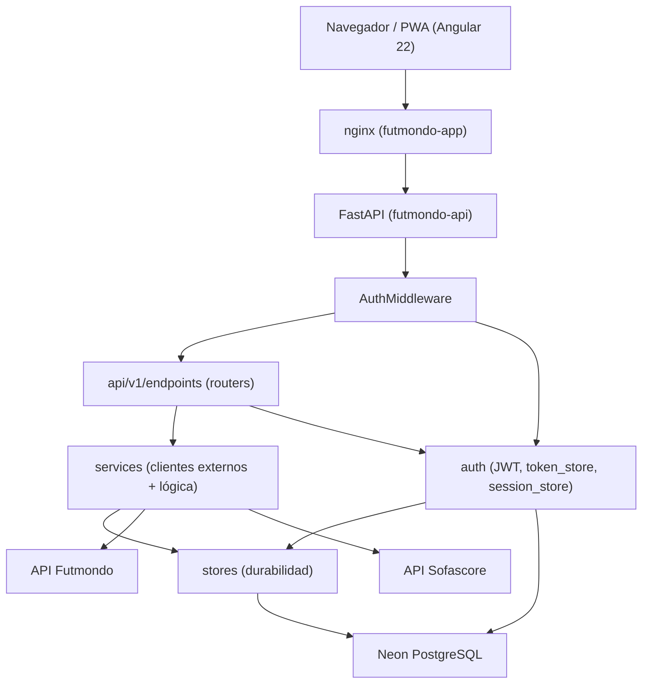
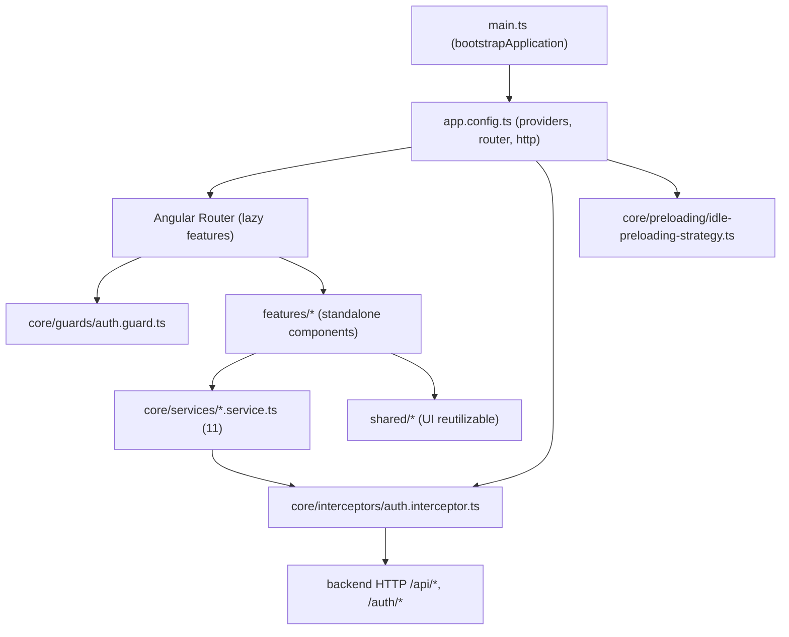
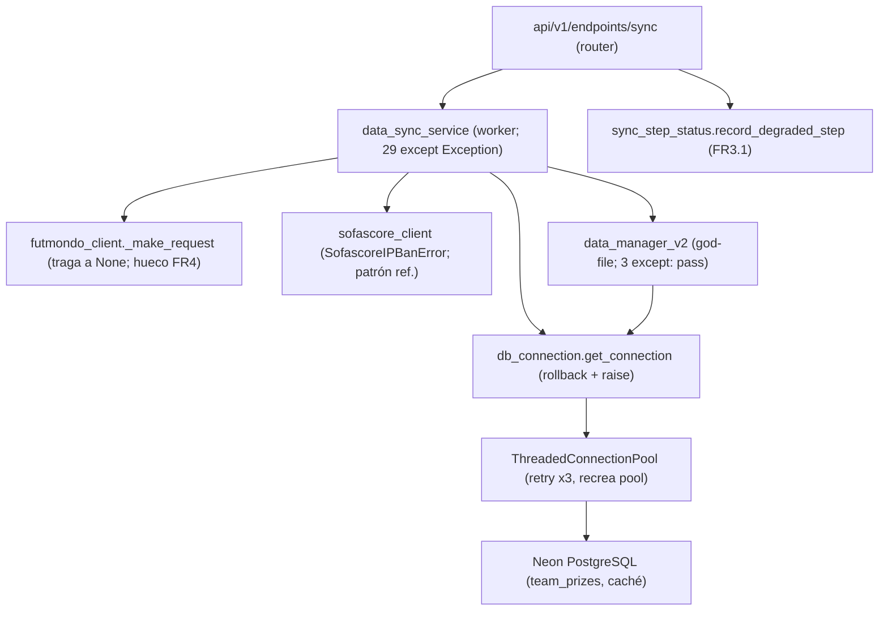
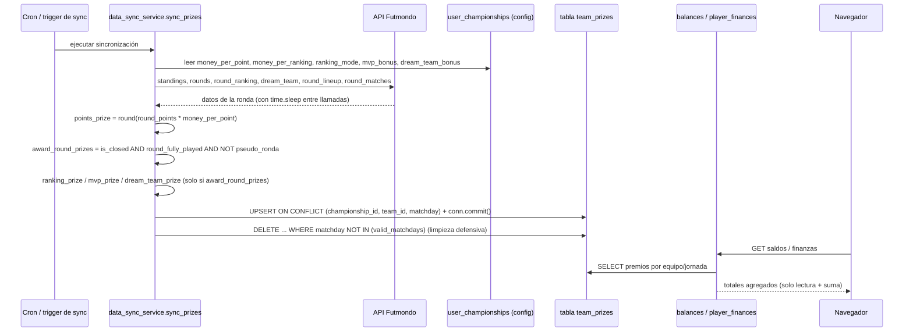
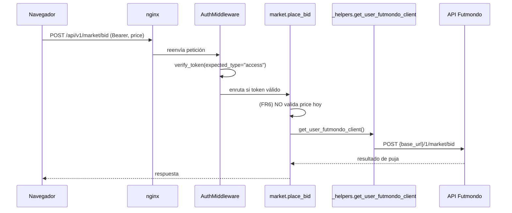
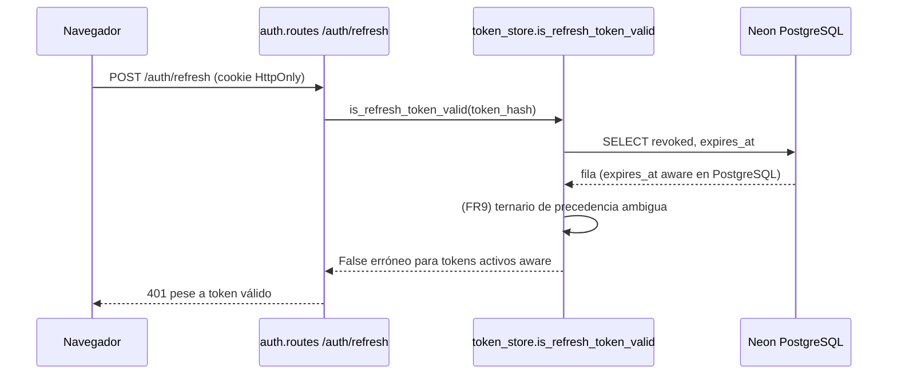
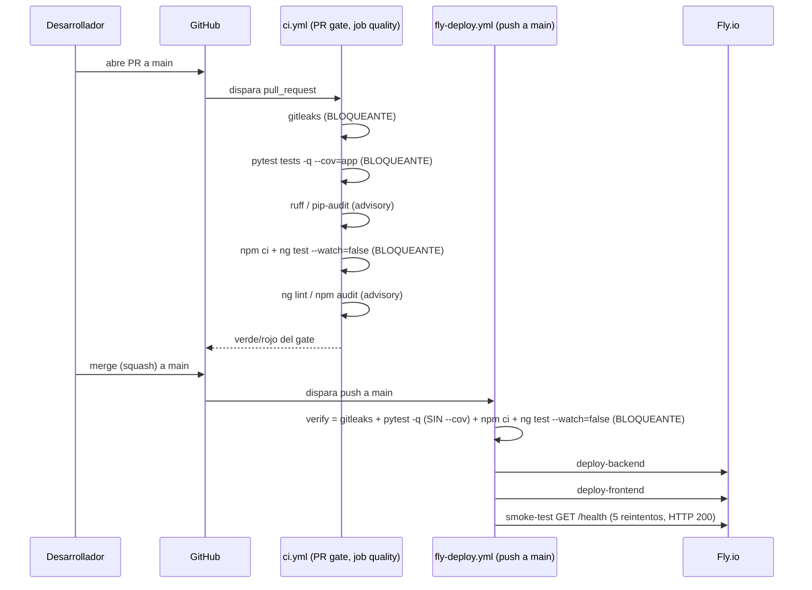

# Arquitectura — futmondo-analytics

## Visión General del Sistema

futmondo-analytics es un sistema de dos servicios desplegados por separado en Fly.io
(región `cdg`/París), respaldados por una base de datos Neon PostgreSQL (Frankfurt):

- **Backend** `futmondo-api`: aplicación FastAPI (Python 3.12), puerto 8000, healthcheck
  `/health`.
- **Frontend** `futmondo-app`: SPA/PWA Angular 22 servida por nginx (puerto 80), que además
  actúa como reverse proxy hacia el backend para `/api/*` y `/auth/*`.

Además del runtime, el repositorio incluye una **capa de entrega** (GitHub Actions +
Fly.io) que gobierna cómo el código llega a producción; su topología de verificación se
describe en las secciones de flujo de más abajo y su estado de calidad en
`code-quality-assessment.md`.

## Estilo Arquitectónico

**Monolito modular con frontend desacoplado.** El backend es un único despliegue FastAPI
con submódulos internos por responsabilidad (`api`, `auth`, `core`, `services`, `stores`,
`security`, `models`); no hay microservicios. La integración externa (Futmondo, Sofascore)
se hace vía clientes HTTP dentro de `services/`. El frontend es un despliegue independiente
que consume el backend por HTTP. Evidencia: routers montados en un solo `main.py`, un solo
`fly.toml` por servicio, sin buses de eventos ni colas.

El frontend Angular 22 es una **SPA/PWA de componentes standalone** (sin `NgModule` de
app; `bootstrapApplication`), con estado por signals, un `core/` transversal (servicios
HTTP, `auth.interceptor`, `auth.guard`, estrategia de precarga) y `features/` por pantalla.
El detalle físico está en `code-structure.md`.

El inventario completo de componentes y sus dependencias está en `component-inventory.md`;
aquí se describen relaciones y flujos, no el catálogo.

## Relaciones entre Componentes



<!-- Text fallback: el navegador (Angular PWA) habla con nginx, que hace reverse proxy a FastAPI. Toda petición pasa por AuthMiddleware, que enruta a los routers de api/v1/endpoints y consulta el módulo auth. Los routers usan services (clientes de Futmondo/Sofascore) y auth; ambos persisten vía stores hacia Neon PostgreSQL; auth también accede directamente a la BD para tablas de refresh tokens. -->

### Frontend (Angular 22) — relaciones internas



<!-- Text fallback: main.ts arranca la app con bootstrapApplication y app.config.ts registra providers (router, HttpClient con el auth.interceptor y la estrategia de precarga idle). El router aplica auth.guard y carga las features (componentes standalone), que usan los servicios de core/services y componentes de shared/. Los servicios emiten HTTP a través del auth.interceptor, que añade Bearer y gestiona el refresh ante 401 contra el backend. -->

### Camino de sincronización y fiabilidad (intent activo) — relaciones internas

Vista focalizada de los componentes que participan en el manejo de errores del backend
(FR3.2/FR4). El worker de sync (`data_sync_service`) es el orquestador; a su alrededor
conviven un cliente con excepción tipada (Sofascore, patrón de referencia), un cliente que
colapsa el fallo a `None` (Futmondo, hueco de FR4), una capa de conexión que hace
rollback+raise (`db_connection`) y un helper de degradación (`sync_step_status`) consumido
por el router `sync`.



<!-- Text fallback: el router sync arranca el worker data_sync_service y consume record_degraded_step del helper sync_step_status para marcar pasos no criticos como degradados. El worker llama a futmondo_client._make_request (que traga Timeout/RequestException/JSONDecodeError y devuelve None, hueco de FR4), a sofascore_client (que distingue SofascoreIPBanError fatal-de-repoblado del 404 recuperable, patron de referencia), y escribe vias db_connection.get_connection, que hace rollback y re-lanza ante cualquier Exception y se apoya en un ThreadedConnectionPool que reintenta hasta 3 veces conexiones muertas y recrea el pool. data_manager_v2 (god-file con 3 except: pass) tambien persiste via db_connection. -->

## Diagramas de Interacción

Cómo se implementan cinco transacciones/flujos representativos a través de los componentes.

### Transacción: cálculo y persistencia de premios de jornada

El cálculo de premios NO vive en los endpoints: vive por completo en
`data_sync_service.sync_prizes()` (un método dentro de un god-file de `services/`), que
consume la API de Futmondo, calcula todos los términos y UPSERTea la tabla `team_prizes`
(fuente de verdad). Los routers de finanzas/saldos sólo LEEN y SUMAN de esa tabla.



<!-- Text fallback: un cron o trigger de sync ejecuta data_sync_service.sync_prizes. El metodo lee la config de premios de user_championships (money_per_point, money_per_ranking, ranking_mode, mvp_bonus, dream_team_bonus) y consulta la API de Futmondo (standings, rounds, round_ranking, dream_team, round_lineup, round_matches) con time.sleep entre llamadas. Calcula points_prize (siempre), y solo si award_round_prizes = is_closed AND round_fully_played AND NOT pseudo-ronda calcula ranking_prize, mvp_prize y dream_team_prize. Hace UPSERT en team_prizes por (championship_id, team_id, matchday) con commit y una limpieza defensiva DELETE de matchdays ya no validos. Despues, los endpoints balances y player_finances solo leen y suman esos premios para presentar los totales al navegador. -->

### Transacción: manejo de fallo recuperable vs. fatal en el camino de sync (FR3.2)

Este es el flujo central del intent activo. Muestra las tres señales que YA existen y son la
base sobre la que endurecer: el cliente Sofascore re-lanza `SofascoreIPBanError` (fatal), la
capa `db_connection` hace rollback+raise (fatal), y el paso no crítico se marca `DEGRADED`
en vez de tumbar la tarea (recuperable). El **hueco** es que un paso equivalente que dependa
de `futmondo_client` NO recibe una excepción tipada: sólo ve `None`.

```mermaid
sequenceDiagram
    participant SY as sync (router)
    participant W as data_sync_service (worker)
    participant SC as sofascore_client
    participant FC as futmondo_client
    participant DBC as db_connection
    participant ST as sync_step_status

    SY->>W: ejecutar paso de sync
    W->>SC: fetch rating jugador
    alt 403 baneo de IP
        SC-->>W: raise SofascoreIPBanError (FATAL, se re-lanza antes del except genérico)
    else 404 / otro status
        SC-->>W: None (RECUPERABLE: sin datos)
    end
    W->>FC: fetch datos Futmondo
    FC-->>W: None ante Timeout/RequestException/JSONDecodeError (HUECO FR4: sin tipo)
    W->>DBC: escribir resultado
    alt éxito
        DBC-->>W: commit
    else Exception
        DBC-->>W: rollback + raise (FATAL, no traga)
    end
    W->>ST: record_degraded_step(paso) si el fallo es no crítico
    ST-->>SY: StepStatus.DEGRADED (nunca "done"; NO falla la tarea — FR3.1)
```

<!-- Text fallback: el router sync ejecuta un paso del worker data_sync_service. El worker pide un rating a sofascore_client: ante un 403 de baneo de IP re-lanza SofascoreIPBanError (fatal, antes del except generico), y ante 404 u otro status devuelve None (recuperable, sin datos). Luego pide datos a futmondo_client, que ante Timeout, RequestException o JSONDecodeError devuelve None sin distinguir recuperable de fatal (hueco de FR4). Al escribir via db_connection, el exito hace commit y cualquier Exception hace rollback y re-lanza (fatal, no traga). Si el fallo es de un paso no critico, el worker llama a record_degraded_step, que deja el paso en StepStatus.DEGRADED sin marcarlo done y sin fallar la tarea completa (FR3.1). -->

### Transacción: puja en el mercado (FR6)



<!-- Text fallback: el navegador envia POST /api/v1/market/bid con Bearer token y price. nginx lo reenvia; AuthMiddleware verifica el access token y enruta a place_bid. place_bid hoy NO valida price (hallazgo FR6), obtiene el cliente Futmondo del usuario via _helpers y proxya la puja a POST /1/market/bid de Futmondo; la respuesta vuelve al navegador. -->

### Transacción: refresco de sesión (FR9)



<!-- Text fallback: el navegador llama POST /auth/refresh con la cookie HttpOnly. auth.routes invoca is_refresh_token_valid, que consulta revoked y expires_at en PostgreSQL. Con expires_at aware, el ternario de precedencia ambigua (hallazgo FR9) devuelve False para tokens activos futuros, provocando un 401 indebido. -->

### Flujo: verificación de build/test del frontend y gate de CI/CD

El pipeline es la barrera que gobierna la llegada a producción. Hay **dos caminos** que
ejercitan los tests, ambos con `pytest` y `ng test --watch=false` BLOQUEANTES: el gate de
Pull Request (`ci.yml`) y el job `verify` del despliegue por push a `main`
(`fly-deploy.yml`). El intent `260918-frontend-coverage-gate` intervino aquí sobre la
cobertura del frontend; el estado de cobertura y la asimetría backend (`verify` corre
`pytest -q` SIN `--cov`) están en `code-quality-assessment.md`.



<!-- Text fallback: al abrir un PR a main, ci.yml corre el job quality: gitleaks bloqueante, pytest con --cov=app bloqueante, ruff y pip-audit advisory, luego npm ci y ng test --watch=false bloqueante, y ng lint / npm audit advisory. Tras el merge squash a main, fly-deploy.yml corre el job verify (gitleaks + pytest sin --cov + npm ci + ng test --watch=false, todos bloqueantes salvo lo advisory), y si pasa despliega backend, luego frontend en Fly.io y ejecuta un smoke-test contra /health con 5 reintentos esperando HTTP 200. -->

## Flujo de Datos

Toda petición autenticada entra por nginx → `AuthMiddleware` (que exige `Authorization:
Bearer <access>` salvo rutas en `AUTH_EXCLUDED_PATHS`) → router → `services`/`auth` →
persistencia (`stores` o SQL crudo) → Neon PostgreSQL o proxy a Futmondo/Sofascore. La
ruta `/static/photos/*` (StaticFiles) queda fuera del prefijo protegido y se sirve sin auth.

En el frontend, cada servicio de `core/services/*` emite HTTP a través del
`auth.interceptor`, que añade `Authorization: Bearer <access>` (salvo a `/auth/*`, donde usa
`withCredentials` para la cookie de refresh) y, ante un 401, encola las peticiones mientras
refresca el token; ante fallo de refresh o 403, fuerza logout.

Para los **premios**, el flujo tiene dos mitades desacopladas por la tabla `team_prizes`:
una **mitad de escritura** batch (`sync_prizes` → `team_prizes`) que sólo corre en la
sincronización, y una **mitad de lectura** en tiempo de petición (routers de saldos/finanzas
→ `SELECT` sobre `team_prizes`). No hay recálculo en la ruta de lectura.

### Flujo de datos del camino de sync — dónde se escribe y dónde se puede corromper (intent activo)

El worker `data_sync_service` escribe en varios puntos de la caché de datos en Neon. Los
puntos de escritura relevantes a "no corromper datos" son:

- `UPDATE transactions` (L269, L350).
- `DELETE/INSERT player_favorites` (L1367/L1378/L1385) — reemplazo transaccional.
- Bloque de premios: `INSERT ... ON CONFLICT DO UPDATE` (L1816) seguido de `conn.commit()`
  (L1825), y después **`DELETE FROM team_prizes ... matchday NOT IN (...)`** (L1846), cuya
  limpieza defensiva tiene su propio `try/except Exception → logger.warning` (L1859) que
  **traga el fallo de limpieza tras un `commit()` previo**. Éste es el **punto de corte de
  corrupción de datos**: si el `DELETE` falla después de que el UPSERT ya haya hecho commit,
  la caché puede quedar en estado mixto (matchdays obsoletos conviviendo con los nuevos) sin
  señal alguna al consumidor de lectura (`balances`/`player_finances`).

El patrón de reemplazo transaccional atómico (DELETE+INSERT en la misma transacción) del
caché de Sofascore, ya caracterizado por `test_sofascore_sync_characterization.py`, es el
patrón de referencia frente a la secuencia commit-luego-borrar del bloque de premios.

## Decisiones de Diseño Clave

- **Access token en memoria + refresh token en cookie `HttpOnly`**: minimiza exposición del
  token a XSS a costa de un flujo de refresco (donde vive el bug FR9). Implementado en el
  frontend por `auth.interceptor` (ya caracterizado por spec).
- **Frontend standalone + Vitest vía `@angular/build:unit-test`**: el proyecto ya migró a
  Vitest + jsdom (sin restos Karma/Jasmine); la cobertura se abordó en un intent previo.
- **Doble camino de verificación (`ci.yml` + `verify`)**: defensa en profundidad; los tests
  bloqueantes se propagan a AMBOS caminos.
- **Proxy hacia Futmondo con credenciales por usuario**: el backend no guarda password en
  claro en sesión; usa la sesión Futmondo del usuario (12h TTL) — ver `NEVER almacenar la
  contraseña en claro` en las reglas del proyecto.
- **Persistencia mixta**: coexisten una capa `stores/` (durabilidad reciente) y SQL crudo
  disperso en `auth`/routers (deuda descrita en `code-quality-assessment.md`).
- **Precálculo de premios como fuente de verdad**: `team_prizes` desacopla el cálculo caro
  (dependiente de la API externa) de la lectura barata en las pantallas.
- **Vocabulario recuperable-vs-fatal parcial pero de buena calidad (base de FR3.2)**: el
  diseño actual YA separa fallo fatal de recuperable en tres puntos: (1) `sofascore_client`
  con `SofascoreIPBanError` re-lanzado antes del `except Exception` genérico (fatal de
  repoblado) frente al `404 → None` (recuperable); (2) `db_connection.get_connection` con
  `rollback()` + `raise` (fatal, nunca traga) y un `ThreadedConnectionPool` que reintenta 3
  veces conexiones muertas y recrea el pool (recuperable a nivel de infraestructura); (3)
  `sync_step_status.record_degraded_step` que marca `StepStatus.DEGRADED` para pasos no
  críticos (registra, NO re-lanza) y `task_service._cache_call` que separa la autoridad
  (DB, debe tener éxito → `TaskPersistenceError`) del best-effort (caché, traga y loguea). La
  decisión de diseño a replicar es la del cliente Sofascore: excepción tipada +
  `except <Typed>: raise` antes del genérico.
- **Arranque resiliente en `main.py`**: la inicialización de tablas (auth/durable-session/
  durable-task) usa `try/except Exception → logger.warning` para degradar a warning en lugar
  de abortar el boot. Es una decisión de resiliencia consciente, NO un swallow silencioso
  (loguea).

## Oportunidades de Mejora

- **Contrato de integración del cliente Futmondo (FR4)**: `futmondo_client._make_request`
  traga `Timeout`/`RequestException`/`JSONDecodeError` y devuelve `None`, colapsando "sin
  datos" con "integración falló". La mejora es introducir un modo de fallo **tipado**
  (excepción replicando el patrón `SofascoreIPBanError`: `except <Typed>: raise` antes del
  genérico), sin ampliar el god-file. Blast radius alto: los getters `get_*` devuelven
  `Optional` y muchos `sync_*` del god-file asumen `None == sin datos`; hay que mapear los
  llamadores antes de cambiar el contrato.
- **Manejo de errores uniforme en el camino de sync (FR3.2)**: catalogar y clasificar las
  **29** ramas `except Exception` de `data_sync_service.py` y los **3 `except: pass`** de
  `data_manager_v2.py` como recuperable/fatal, replicando el patrón `record_degraded_step`
  para los no críticos y propagando señal tipada para los fatales.
- **Punto de corromper-datos (`DELETE ... NOT IN` en `team_prizes`)**: hacer que la limpieza
  defensiva sea atómica con el UPSERT (misma transacción, como el reemplazo de caché
  Sofascore) o, como mínimo, que su fallo NO se trague tras el commit previo, para no dejar
  caché en estado mixto sin señal.
- **Enforcement de bare-except (E722)**: `ruff.toml` tiene `E722` en `ignore`, así que el
  linter NO vigila los `except:` desnudos. Cualquier objetivo de FR3.2 que quiera enforcement
  requiere re-habilitar `E722` por trinquete, aislando el reflow (regla afirmada de NO
  reformatear brownfield en masa). Detalle en `code-quality-assessment.md`.
- **Premios**: caracterizar `sync_prizes` (ratios flop/top, gating de ronda completa, MVP,
  dream-team, pseudo-jornada negativa, limpieza defensiva) ANTES de refactor. Detalle en
  `code-quality-assessment.md`.
- Introducir validación de entrada en el backend para pujas (FR6) tras una capa estrecha.
- Aislar de forma inequívoca `SSL_VERIFY` al entorno local (FR8).
- Consolidar el acceso a datos de auth en una capa repositorio (FR9).
