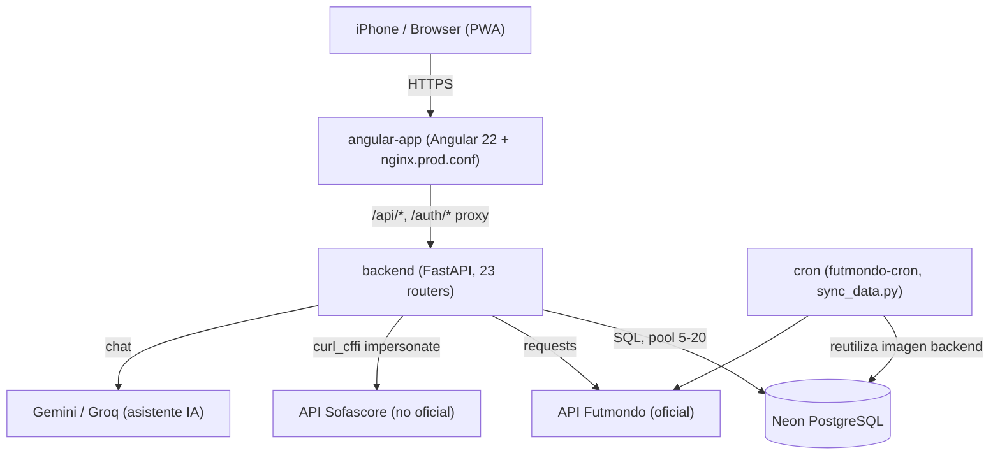
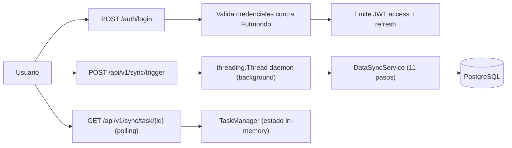
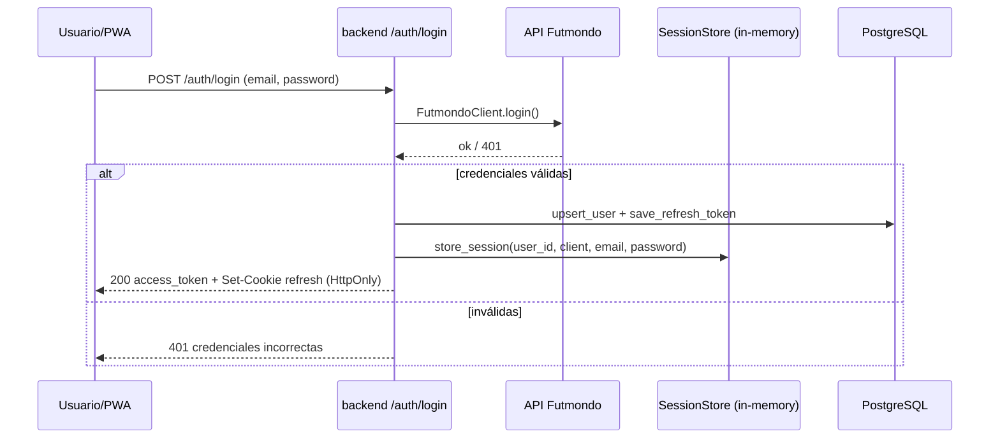
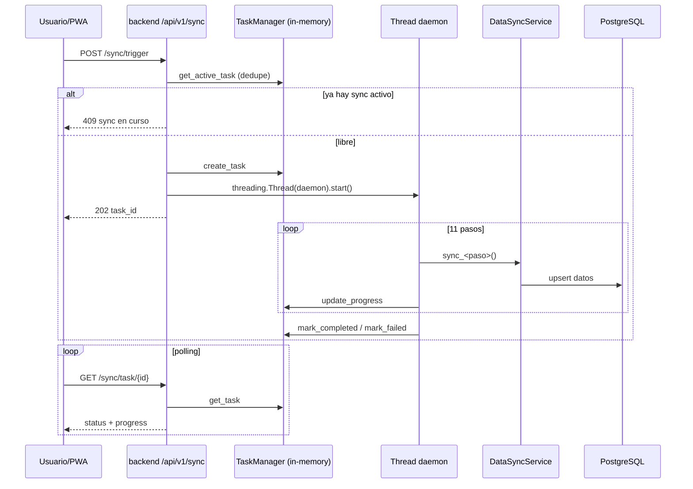
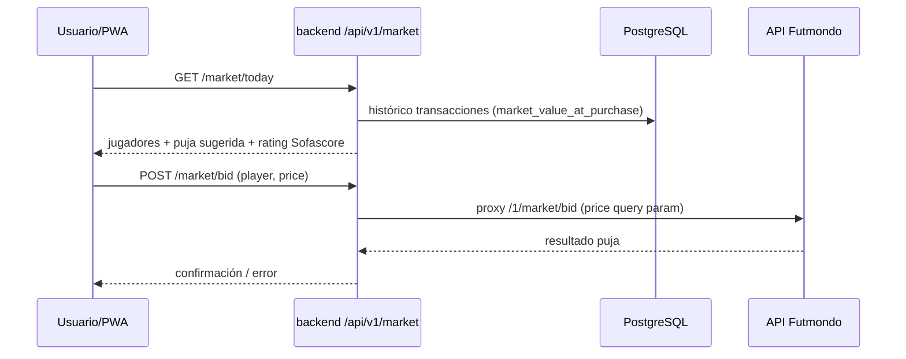

# Arquitectura del Sistema — Futmondo Analytics

> Reverse-engineering (escaneo FULL). Diagramas Mermaid validados; cada diagrama
> incluye un fallback de texto inmediatamente debajo.

## Visión general del sistema

Futmondo Analytics es una arquitectura de **tres componentes desplegables** más un
proceso cron one-shot:

- **angular-app/** — frontend Angular 22 (PWA/SPA + service worker). En producción
  la propia imagen del frontend incluye un nginx (`angular-app/nginx.prod.conf`)
  que proxya `/api` y `/auth` al backend.
- **backend/** — API FastAPI (Python 3.12) con arquitectura por capas
  (api → services → auth → core → models). Concentra la lógica de negocio, la
  sincronización y los clientes de integración externa.
- **proxy/** — nginx reverse proxy, **solo local** (`docker-compose.yml`). En
  producción su rol lo cumple el nginx embebido en el frontend.
- **cron/** — app Fly.io `futmondo-cron` que reutiliza `backend/Dockerfile` y
  ejecuta `python scripts/sync_data.py`.

La persistencia productiva es **Neon PostgreSQL** (Frankfurt), a través de una capa
de abstracción (`db_connection.py`) que soporta además SQLite y Turso/libSQL
(ramas heredadas, ver deuda técnica). Las integraciones externas son la API
oficial de Futmondo (`requests`) y la API no oficial de Sofascore (`curl_cffi`
con `impersonate="chrome"`).

## Estilo arquitectónico

**Monolito modular desplegado como servicios separados** (híbrido). El backend es
un monolito FastAPI por capas (no microservicios: un único proceso, una única
base de código, routers montados en `main.py`). El frontend es una SPA
independiente. La separación en apps Fly.io responde a la topología de despliegue
y coste, no a límites de dominio microservicio. Evidencia: `backend/app/main.py`
monta 23 routers en un solo proceso; no hay comunicación inter-servicio backend
salvo el proxy HTTP frontend→backend.

## Relaciones entre componentes

Fallback de texto: el navegador habla por HTTPS con `angular-app`; el nginx del
frontend proxya `/api/*` y `/auth/*` hacia `backend`. El `backend` accede a Neon
PostgreSQL mediante un pool de conexiones (5-20), consume la API Futmondo con
`requests`, la API Sofascore con `curl_cffi`, y el asistente IA (Gemini/Groq). El
proceso `cron` reutiliza la imagen del backend y escribe en la misma base de datos
consumiendo Futmondo directamente.

## Flujo de datos

Fallback de texto: el usuario hace login, el backend valida contra Futmondo y
emite JWT; el usuario dispara `sync/trigger`, que arranca un hilo daemon en
background ejecutando `DataSyncService` (11 pasos) que escribe en PostgreSQL; el
usuario consulta el progreso por polling contra el `TaskManager`, cuyo estado vive
solo en memoria del proceso.

## Diagramas de Interacción (transacciones de negocio clave)

### Login (autenticación)

Fallback de texto: el usuario envía email/password a `/auth/login`; el backend
crea un `FutmondoClient` y valida contra Futmondo. Si es válido, hace upsert del
usuario y guarda el hash del refresh token en BD, almacena la sesión Futmondo en
el `SessionStore` en memoria (incluidas las credenciales), devuelve el access
token en el cuerpo y el refresh token como cookie HttpOnly (`path=/auth`,
`samesite=lax`, `secure` según `COOKIE_SECURE`). Si es inválido, responde 401.

### Sincronización asíncrona (11 pasos)

Fallback de texto: `sync/trigger` comprueba si ya hay un sync activo para el
campeonato (dedupe → 409); si no, crea la tarea, lanza un hilo daemon y responde
202 con `task_id`. El hilo ejecuta los 11 pasos secuenciales de
`DataSyncService`, actualizando el progreso en el `TaskManager` tras cada paso;
los pasos `prizes` y `phantoms` degradan sus excepciones a "non-critical". El
usuario consulta el progreso por polling contra `/sync/task/{task_id}`. Punto
frágil: el estado del `TaskManager` y la sesión (`SessionStore`) viven solo en
memoria; un reinicio de la máquina Fly pierde la tarea y la sesión.

### Puja / Mercado

Fallback de texto: el usuario pide el mercado del día; el backend calcula la puja
sugerida a partir del histórico real de sobrepago (`_calculate_suggested_bid`,
margen ±25%) y adjunta el rating Sofascore. Al pujar, el backend proxya la puja a
`/1/market/bid` de Futmondo con `price` como query param entero. Riesgo: el
backend NO valida rango/positividad de `price` (solo el frontend valida min/max).

## Decisiones de diseño destacables

- **JWT en dos tokens**: access (60 min, en memoria del navegador) + refresh (30
  días, cookie HttpOnly) — reduce superficie XSS. Fail-fast del secreto JWT en
  arranque (`config.py::resolve_jwt_secret`).
- **Sync desacoplada por hilo + polling**: evita timeouts HTTP en operaciones
  largas, a costa de estado no durable.
- **Middleware de auth central** (`AuthMiddleware`): protege todo `/api/v1/*`
  salvo `AUTH_EXCLUDED_PATHS`.
- **Capa de abstracción de BD multi-backend**: flexibilidad histórica
  (SQLite/Turso/PostgreSQL) hoy con ramas muertas.

## Oportunidades de mejora arquitectónica

- Persistir el estado de sync y las sesiones (durabilidad frente a reinicios Fly).
- Podar el multi-backend de BD hacia Neon único.
- Romper los "god files" (`data_manager_v2.py`, `data_sync_service.py`).
- Hacer transaccional el reemplazo de la caché Sofascore (hoy DELETE antes de
  repoblar).
