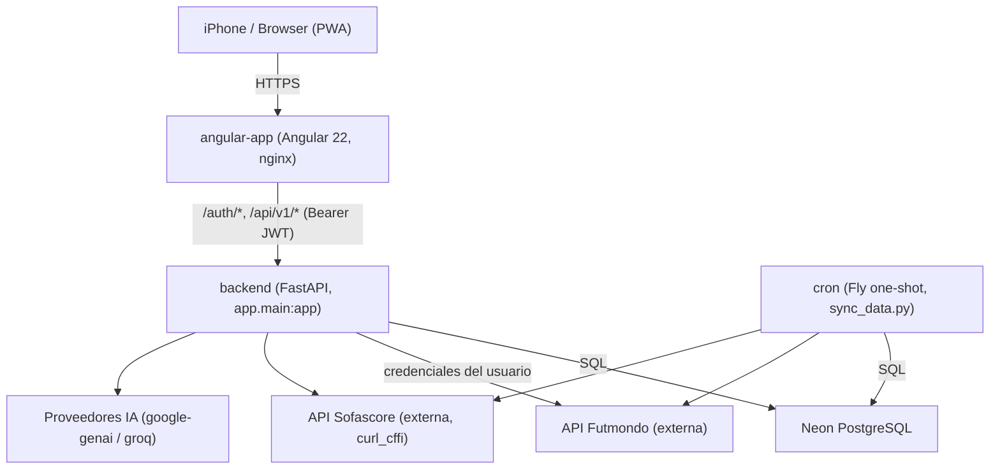
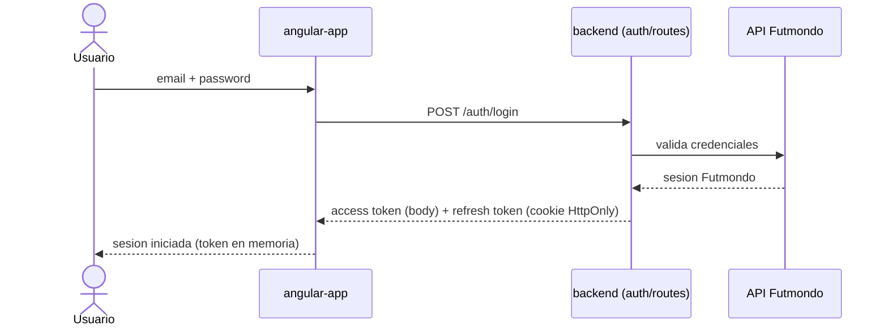
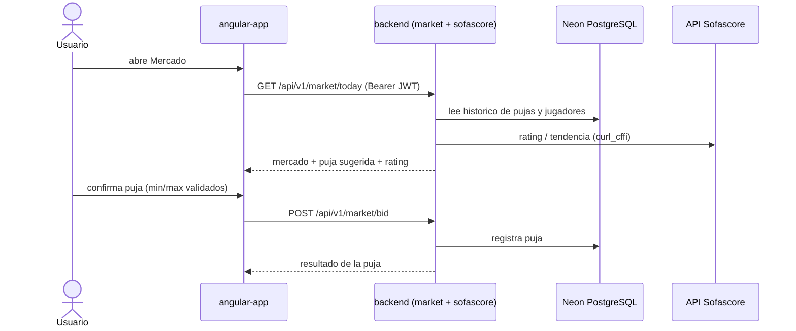
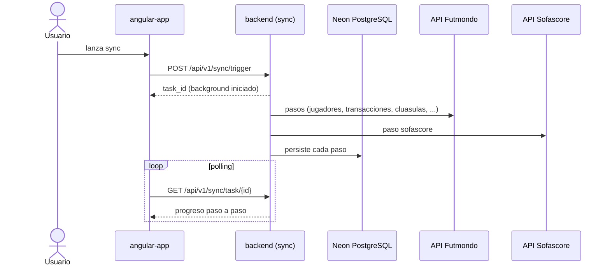

# Architecture — Futmondo Analytics

> Artefacto CodeKB (architect). Full rescan sobre `./`. Base: `developer-scan.md`.

## System Overview

Sistema web de tres capas desplegado en Fly.io: un **frontend Angular 22 (PWA)** servido por nginx, un **backend FastAPI (Python 3.12)** que actúa como API y como cliente de integraciones externas (Futmondo, Sofascore, IA), y una **base de datos Neon PostgreSQL** (serverless). Un proceso **cron** one-shot reutiliza la imagen del backend para sincronizaciones programadas. En local, un **proxy nginx** enruta hacia frontend y backend vía docker-compose.

## Architectural Style

**Monolito modular desplegado como pocos servicios** (hybrid, orientado a servicios de despliegue, no microservicios):

- El backend es un único servicio FastAPI (`app.main:app`) con routers montados por dominio (patrón *modular monolith*): auth, mercado, finanzas, sync, analytics, etc. No hay bases de datos por servicio ni comunicación inter-servicio por eventos.
- El frontend es una SPA/PWA standalone (Angular signals + standalone components).
- El cron es el mismo artefacto que el backend ejecutado como proceso distinto (`python scripts/sync_data.py`).

**Evidencia**: `backend/app/main.py` monta todos los routers en un solo proceso; `cron/fly.toml` reutiliza `backend/Dockerfile`.

**Trade-off analysis (decisión de estilo)**: se conserva el monolito modular frente a microservicios porque el equipo es pequeño y el coste operativo debe ser 0 €; microservicios multiplicarían despliegues Fly y romperían la restricción de coste. Alternativa rechazada: separar sync en un servicio propio permanente — descartada por coste (se resuelve con máquinas Fly efímeras en su lugar).

## Component Relationships

<!-- Text fallback: El usuario accede por HTTPS a angular-app (PWA servida por nginx). angular-app llama al backend FastAPI en /auth/* y /api/v1/* con Bearer JWT. El backend lee/escribe en Neon PostgreSQL y actúa como cliente de las APIs externas Futmondo, Sofascore (via curl_cffi) e IA (google-genai/groq). El proceso cron reutiliza la imagen del backend y accede a PostgreSQL, Futmondo y Sofascore de forma programada. -->

## Data Flow

Las peticiones del usuario entran por nginx del frontend (SPA + assets PWA con service worker), viajan al backend como llamadas REST autenticadas por `AuthMiddleware` (Bearer JWT), y el backend resuelve cada dominio combinando (a) datos persistidos en PostgreSQL y (b) llamadas en vivo a Futmondo/Sofascore usando la sesión Futmondo del usuario. El sync (manual o cron) es el productor principal de datos: rellena PostgreSQL en varios pasos para que las lecturas analíticas sean rápidas.

## Interaction Diagrams

Cómo se implementan las transacciones de negocio principales a través de los componentes.

### Login (autenticación con credenciales Futmondo)

<!-- Text fallback: El usuario envia email y password al frontend. El frontend hace POST /auth/login al backend, que valida contra la API Futmondo. Al validar, el backend devuelve el access token en el cuerpo y el refresh token en cookie HttpOnly. El frontend guarda el access token en memoria. -->

### Puja en mercado (transacción con enriquecimiento Sofascore)

<!-- Text fallback: El usuario abre Mercado; el frontend pide GET /api/v1/market/today con Bearer JWT. El backend lee historico de pujas y jugadores de PostgreSQL y consulta rating y tendencia en Sofascore via curl_cffi, devolviendo mercado con puja sugerida y rating. El usuario confirma la puja validada min/max; el frontend hace POST /api/v1/market/bid y el backend registra la puja en PostgreSQL y responde el resultado. -->

### Sincronización asíncrona (background con polling)

<!-- Text fallback: El usuario lanza el sync; el frontend hace POST /api/v1/sync/trigger y el backend devuelve un task_id iniciando el proceso en background. El backend ejecuta los pasos consultando Futmondo y Sofascore y persistiendo cada paso en PostgreSQL. Mientras tanto el frontend consulta en bucle GET /api/v1/sync/task/{id} para obtener el progreso paso a paso. La sincronizacion diaria programada sigue el mismo flujo disparada por el proceso cron en lugar del usuario. -->

## Key Design Decisions

- **JWT dual (access en memoria + refresh en cookie HttpOnly)**: mitiga XSS (token no accesible por JS) sin renunciar a sesión persistente. Consecuencia: el splash recupera sesión vía cookie al recargar.
- **Backend como Anti-Corruption Layer ante Futmondo/Sofascore**: aísla el modelo interno de las APIs externas; toda integración pasa por clientes dedicados (`futmondo_client.py`, `sofascore_client.py`).
- **Sync como productor, lecturas sobre PostgreSQL**: separa el coste de integración externa (sync) de las lecturas analíticas (rápidas sobre BD), evitando llamadas caras en el camino de lectura.
- **Cron efímero en Fly**: máquinas one-shot para no mantener workers permanentes → coste ~0.
- **Sistema de animaciones conservado por Angular Material (intent `260914-ci-tooling-mejoras`, FR3 / BR3.2-BR3.3)**:
  el frontend no usa la API antigua de `@angular/animations` (verificado: 0 imports, 0 `trigger`/`transition`/`animate`,
  0 metadatos `animations:` en componentes), por lo que **no hay migración a la nueva API `animate.enter`/`animate.leave`**.
  Aun así se **conserva** `provideAnimationsAsync()` en `app.config.ts` y la dependencia `@angular/animations` porque
  Angular Material (en uso amplio) depende del sistema de animaciones para ripples, overlays y menús; retirar el provider
  degradaría esa UX. **Observación de vigilancia:** revisar en futuras versiones de Angular/Material si cambia este
  acoplamiento o si publican guía de migración que permita retirar `@angular/animations`.

## Improvement Opportunities

- Retirar restos heredados (`libsql-experimental`, `nixpacks.toml` de Railway) si confirmadamente muertos — reduce superficie y ambigüedad de despliegue (ver `code-quality-assessment.md`).
- `NODE_TLS_REJECT_UNAUTHORIZED=0` en el build de producción (Google Fonts) es una señal de seguridad a revisar (fuera del scope del intent).
- Consolidar la versión de Node (engines) entre local y CI para reproducibilidad (`.nvmrc`).

## Referencias cruzadas

- Endpoints y contratos: `api-documentation.md`.
- Stack y versiones: `technology-stack.md`.
