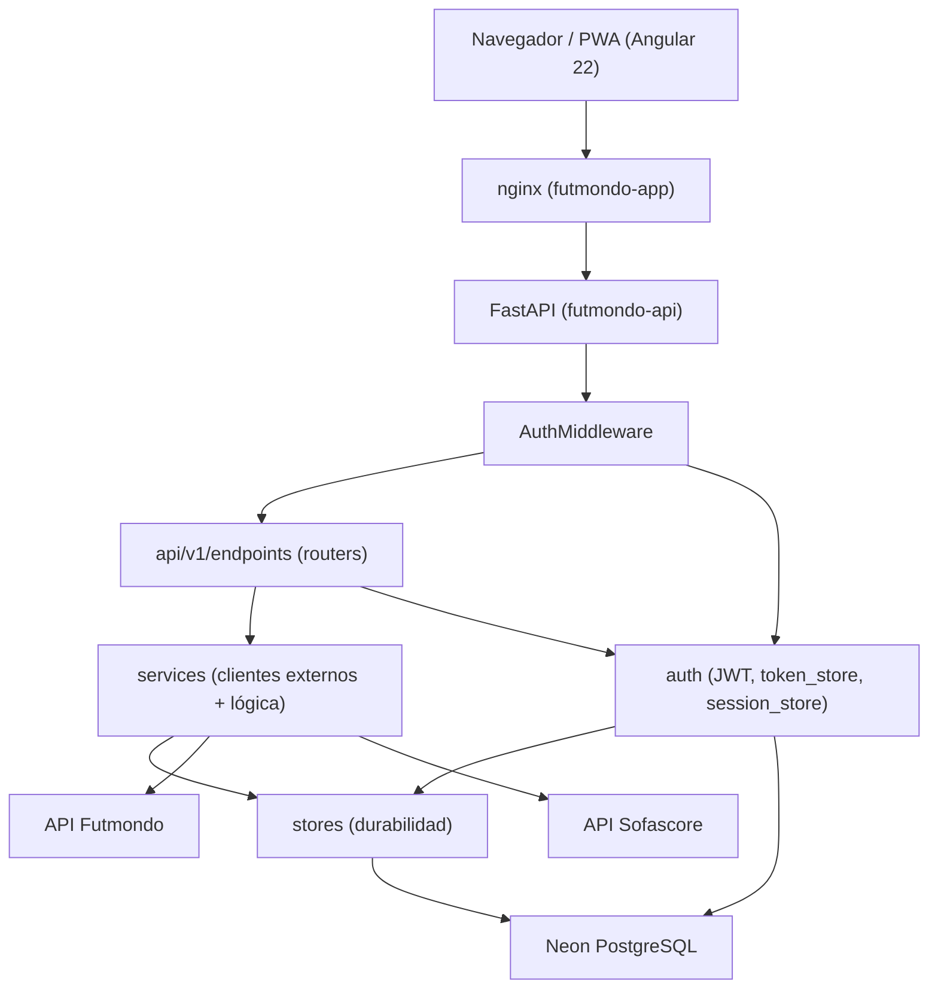
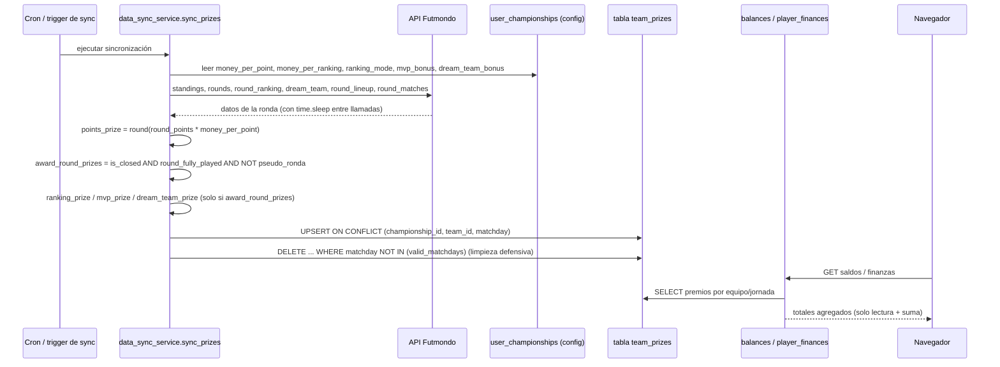
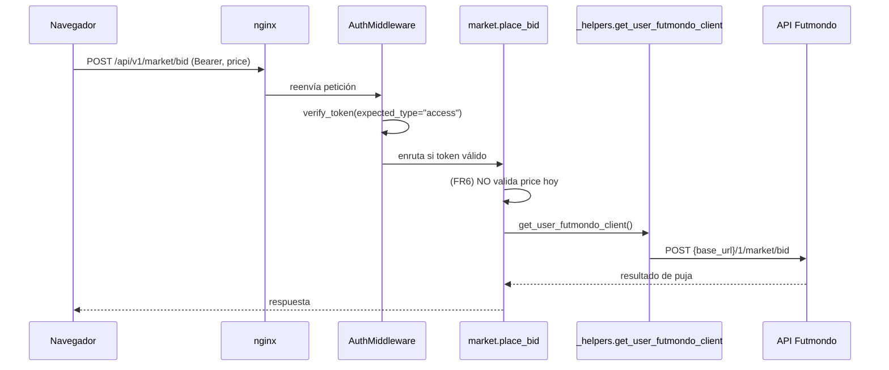
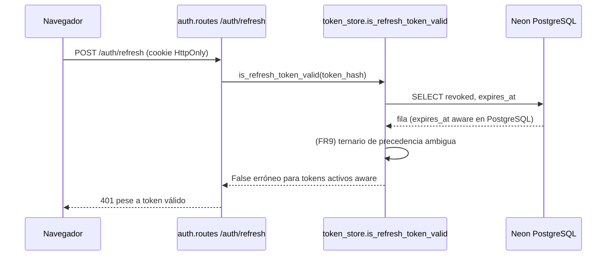

# Arquitectura — futmondo-analytics

## Visión General del Sistema

futmondo-analytics es un sistema de dos servicios desplegados por separado en Fly.io
(región `cdg`/París), respaldados por una base de datos Neon PostgreSQL (Frankfurt):

- **Backend** `futmondo-api`: aplicación FastAPI (Python 3.12), puerto 8000, healthcheck
  `/health`.
- **Frontend** `futmondo-app`: SPA/PWA Angular 22 servida por nginx (puerto 80), que además
  actúa como reverse proxy hacia el backend para `/api/*` y `/auth/*`.

## Estilo Arquitectónico

**Monolito modular con frontend desacoplado.** El backend es un único despliegue FastAPI
con submódulos internos por responsabilidad (`api`, `auth`, `core`, `services`, `stores`,
`security`, `models`); no hay microservicios. La integración externa (Futmondo, Sofascore)
se hace vía clientes HTTP dentro de `services/`. El frontend es un despliegue independiente
que consume el backend por HTTP. Evidencia: routers montados en un solo `main.py`, un solo
`fly.toml` por servicio, sin buses de eventos ni colas.

El inventario completo de componentes y sus dependencias está en `component-inventory.md`;
aquí se describen relaciones y flujos, no el catálogo.

## Relaciones entre Componentes

<!-- Text fallback: el navegador (Angular PWA) habla con nginx, que hace reverse proxy a FastAPI. Toda petición pasa por AuthMiddleware, que enruta a los routers de api/v1/endpoints y consulta el módulo auth. Los routers usan services (clientes de Futmondo/Sofascore) y auth; ambos persisten vía stores hacia Neon PostgreSQL; auth también accede directamente a la BD para tablas de refresh tokens. -->

## Diagramas de Interacción

Cómo se implementan tres transacciones de negocio representativas a través de los
componentes.

### Transacción: cálculo y persistencia de premios de jornada (intent activo)

El cálculo de premios NO vive en los endpoints: vive por completo en
`data_sync_service.sync_prizes()` (un método dentro de un god-file de `services/`), que
consume la API de Futmondo, calcula todos los términos y UPSERTea la tabla `team_prizes`
(fuente de verdad). Los routers de finanzas/saldos sólo LEEN y SUMAN de esa tabla.

<!-- Text fallback: un cron o trigger de sync ejecuta data_sync_service.sync_prizes. El método lee la config de premios de user_championships (money_per_point, money_per_ranking, ranking_mode, mvp_bonus, dream_team_bonus) y consulta la API de Futmondo (standings, rounds, round_ranking, dream_team, round_lineup, round_matches) con time.sleep entre llamadas. Calcula points_prize (siempre), y solo si award_round_prizes = is_closed AND round_fully_played AND NOT pseudo-ronda calcula ranking_prize, mvp_prize y dream_team_prize. Hace UPSERT en team_prizes por (championship_id, team_id, matchday) y una limpieza defensiva DELETE de matchdays ya no válidos. Después, los endpoints balances y player_finances solo leen y suman esos premios para presentar los totales al navegador. -->

### Transacción: puja en el mercado (FR6)

<!-- Text fallback: el navegador envía POST /api/v1/market/bid con Bearer token y price. nginx lo reenvía; AuthMiddleware verifica el access token y enruta a place_bid. place_bid hoy NO valida price (hallazgo FR6), obtiene el cliente Futmondo del usuario vía _helpers y proxya la puja a POST /1/market/bid de Futmondo; la respuesta vuelve al navegador. -->

### Transacción: refresco de sesión (FR9)

<!-- Text fallback: el navegador llama POST /auth/refresh con la cookie HttpOnly. auth.routes invoca is_refresh_token_valid, que consulta revoked y expires_at en PostgreSQL. Con expires_at aware, el ternario de precedencia ambigua (hallazgo FR9) devuelve False para tokens activos futuros, provocando un 401 indebido. -->

## Flujo de Datos

Toda petición autenticada entra por nginx → `AuthMiddleware` (que exige `Authorization:
Bearer <access>` salvo rutas en `AUTH_EXCLUDED_PATHS`) → router → `services`/`auth` →
persistencia (`stores` o SQL crudo) → Neon PostgreSQL o proxy a Futmondo/Sofascore. La
ruta `/static/photos/*` (StaticFiles) queda fuera del prefijo protegido y se sirve sin auth.

Para los **premios**, el flujo tiene dos mitades desacopladas por la tabla `team_prizes`:
una **mitad de escritura** batch (`sync_prizes` → `team_prizes`) que sólo corre en la
sincronización, y una **mitad de lectura** en tiempo de petición (routers de saldos/finanzas
→ `SELECT` sobre `team_prizes`). No hay recálculo en la ruta de lectura.

## Decisiones de Diseño Clave

- **Access token en memoria + refresh token en cookie `HttpOnly`**: minimiza exposición del
  token a XSS a costa de un flujo de refresco (donde vive el bug FR9).
- **Proxy hacia Futmondo con credenciales por usuario**: el backend no guarda password en
  claro en sesión; usa la sesión Futmondo del usuario (12h TTL) — ver `NEVER almacenar la
  contraseña en claro` en las reglas del proyecto.
- **Persistencia mixta**: coexisten una capa `stores/` (durabilidad reciente) y SQL crudo
  disperso en `auth`/routers (deuda descrita en `code-quality-assessment.md`).
- **Precálculo de premios como fuente de verdad**: `team_prizes` desacopla el cálculo caro
  (dependiente de la API externa) de la lectura barata en las pantallas. La contrapartida es
  que la corrección del importe depende de que `sync_prizes` gatee bien la ronda (completa,
  cerrada, no pseudo-jornada) y de la limpieza defensiva `DELETE ... NOT IN`.

## Oportunidades de Mejora

- **Premios (intent activo)**: caracterizar `sync_prizes` (ratios flop/top, gating de ronda
  completa, MVP, dream-team, pseudo-jornada negativa, limpieza defensiva) ANTES de refactor,
  y extraer la fórmula a una función/módulo estrecho testeable con dobles de la API de
  Futmondo, sin ampliar el god-file `data_sync_service.py`. Detalle en
  `code-quality-assessment.md`.
- Introducir validación de entrada en el backend para pujas (FR6) tras una capa estrecha,
  sin ampliar el patrón SQL-en-router.
- Aislar de forma inequívoca `SSL_VERIFY` al entorno local (FR8).
- Consolidar el acceso a datos de auth en una capa repositorio para eliminar la clase de
  bugs naive/aware (FR9). El detalle de deuda vive en `code-quality-assessment.md`.
