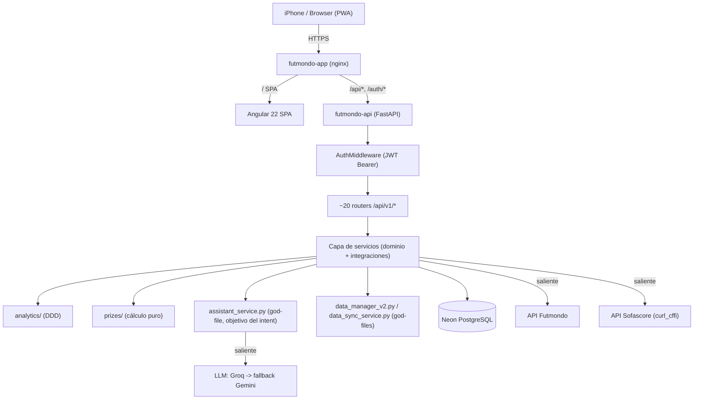
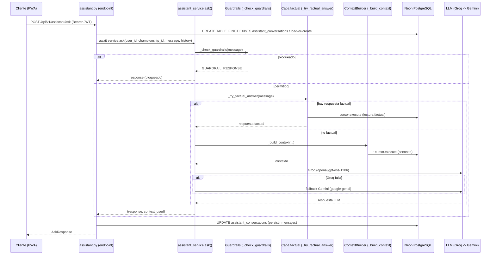
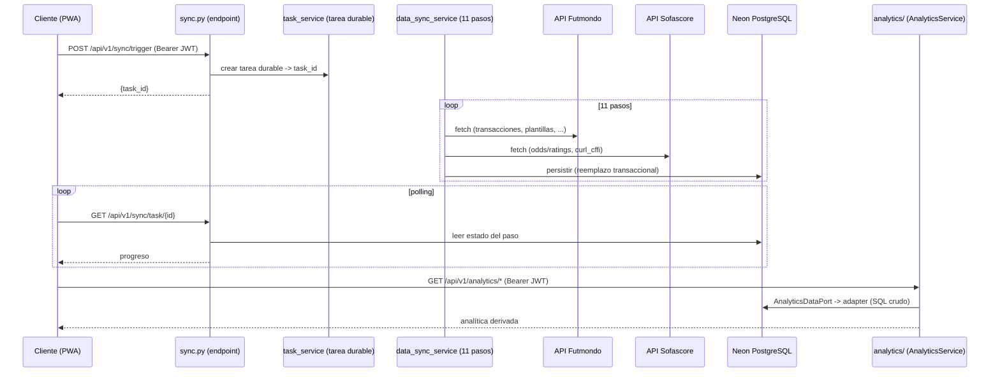

# Architecture — futmondo-analytics

## Architecture Analysis

### System Overview

Sistema web multi-usuario compuesto por dos unidades desplegables independientes
(backend API y frontend PWA) sobre una base de datos gestionada. El backend es
un **monolito modular** FastAPI: routers HTTP delgados bajo `/api/v1/*`
protegidos por un middleware de autenticación JWT, apoyados en una **capa de
servicios** que concentra la lógica de negocio y las integraciones salientes
(Futmondo, Sofascore, LLM). El frontend Angular 22 consume esa API vía un proxy
nginx.

### Architectural Style

**Monolito modular** (backend) + **SPA/PWA** (frontend), evidencia:
`backend/app/main.py` monta ~20 routers `/api/v1/*` de
`backend/app/api/v1/endpoints/` sobre un único proceso ASGI (`uvicorn`), sin
separación en microservicios. La capa de servicios está en transición hacia
**hexagonal / puertos-y-adaptadores** en los bounded contexts ya refactorizados
(`analytics/`, `prizes/`): dominio con `Protocol` sin SQL, aplicación pura,
adaptadores de infraestructura como único sitio con SQL crudo (evidencia:
`backend/app/services/analytics/domain/ports.py`,
`backend/app/services/analytics/infrastructure/data_manager_adapter.py`). El
resto de servicios (god-files) siguen un estilo procedural con SQL embebido.

### Component Relationships

```mermaid
graph TD
  Browser["iPhone / Browser (PWA)"] -->|HTTPS| Nginx["futmondo-app (nginx)"]
  Nginx -->|/ SPA| Angular["Angular 22 SPA"]
  Nginx -->|/api/*, /auth/*| API["futmondo-api (FastAPI)"]
  API --> Auth["AuthMiddleware (JWT Bearer)"]
  Auth --> Routers["~20 routers /api/v1/*"]
  Routers --> Services["Capa de servicios (dominio + integraciones)"]
  Services --> Analytics["analytics/ (DDD)"]
  Services --> Prizes["prizes/ (cálculo puro)"]
  Services --> Assistant["assistant_service.py (god-file, objetivo del intent)"]
  Services --> GodFiles["data_manager_v2.py / data_sync_service.py (god-files)"]
  Services --> DB[("Neon PostgreSQL")]
  Services -->|saliente| Futmondo["API Futmondo"]
  Services -->|saliente| Sofascore["API Sofascore (curl_cffi)"]
  Assistant -->|saliente| LLM["LLM: Groq -> fallback Gemini"]
```

Fallback de texto: el navegador llega por HTTPS a `futmondo-app` (nginx), que
sirve la SPA Angular en `/` y hace proxy de `/api/*` y `/auth/*` a
`futmondo-api` (FastAPI). En el backend, `AuthMiddleware` valida el Bearer JWT
antes de los ~20 routers `/api/v1/*`; los routers delegan en la capa de
servicios, que accede a Neon PostgreSQL y a las integraciones salientes
(Futmondo, Sofascore, y LLM Groq→Gemini solo desde el asistente).

### Data Flow

Entrada HTTP → `AuthMiddleware` (adjunta `request.state.user`) → router →
servicio de dominio → adaptador/SQL → Neon PostgreSQL. Las integraciones
salientes (Futmondo/Sofascore/LLM) se invocan desde la capa de servicios. El
sync es asíncrono: un endpoint dispara una tarea durable y el frontend hace
polling del progreso (11 pasos). El esquema de varias tablas se materializa en
caliente con `CREATE TABLE IF NOT EXISTS` (ver `code-quality-assessment.md`).

### Interaction Diagrams

#### Flujo del asistente IA (`/api/v1/assistant/ask` → `ask()`)

```mermaid
sequenceDiagram
  participant C as Cliente (PWA)
  participant E as assistant.py (endpoint)
  participant S as assistant_service.ask()
  participant G as Guardrails (_check_guardrails)
  participant F as Capa factual (_try_factual_answer)
  participant CB as ContextBuilder (_build_context)
  participant DB as Neon PostgreSQL
  participant L as LLM (Groq -> Gemini)
  C->>E: POST /api/v1/assistant/ask (Bearer JWT)
  E->>DB: CREATE TABLE IF NOT EXISTS assistant_conversations / load-or-create
  E->>S: await service.ask(user_id, championship_id, message, history)
  S->>G: _check_guardrails(message)
  alt bloqueado
    G-->>S: GUARDRAIL_RESPONSE
    S-->>E: response (bloqueado)
  else permitido
    S->>F: _try_factual_answer(message)
    alt hay respuesta factual
      F->>DB: cursor.execute (lectura factual)
      F-->>S: respuesta factual
    else no factual
      S->>CB: _build_context(...)
      CB->>DB: ~cursor.execute (contexto)
      CB-->>S: contexto
      S->>L: Groq (openai/gpt-oss-120b)
      alt Groq falla
        S->>L: fallback Gemini (google-genai)
      end
      L-->>S: respuesta LLM
    end
    S-->>E: {response, context_used}
  end
  E->>DB: UPDATE assistant_conversations (persistir mensajes)
  E-->>C: AskResponse
```

Fallback de texto: el endpoint autentica y carga/crea la conversación, luego
llama `ask()`. `ask()` orquesta: guardrails (regex puro) → si bloqueado devuelve
`GUARDRAIL_RESPONSE`; si no, intenta respuesta factual (lecturas SQL directas);
si no hay factual, construye contexto (mayoría de los `cursor.execute`) y llama
al LLM Groq con **fallback a Gemini**. El endpoint persiste ambos mensajes.

#### Flujo de sync/analytics

```mermaid
sequenceDiagram
  participant C as Cliente (PWA)
  participant Sy as sync.py (endpoint)
  participant T as task_service (tarea durable)
  participant DS as data_sync_service (11 pasos)
  participant FUT as API Futmondo
  participant SOF as API Sofascore
  participant DB as Neon PostgreSQL
  participant An as analytics/ (AnalyticsService)
  C->>Sy: POST /api/v1/sync/trigger (Bearer JWT)
  Sy->>T: crear tarea durable -> task_id
  Sy-->>C: {task_id}
  loop 11 pasos
    DS->>FUT: fetch (transacciones, plantillas, ...)
    DS->>SOF: fetch (odds/ratings, curl_cffi)
    DS->>DB: persistir (reemplazo transaccional)
  end
  loop polling
    C->>Sy: GET /api/v1/sync/task/{id}
    Sy->>DB: leer estado del paso
    Sy-->>C: progreso
  end
  C->>An: GET /api/v1/analytics/* (Bearer JWT)
  An->>DB: AnalyticsDataPort -> adapter (SQL crudo)
  An-->>C: analítica derivada
```

Fallback de texto: el cliente dispara `sync/trigger`, que crea una tarea durable
y devuelve `task_id`; el servicio de sync ejecuta 11 pasos consumiendo Futmondo
y Sofascore y persistiendo en Neon; el cliente hace polling del progreso.
Independientemente, las consultas de analytics pasan por `AnalyticsService`, que
lee vía `AnalyticsDataPort` implementado por un adaptador de infraestructura con
SQL crudo.

### Key Design Decisions

#### ADR — Descomposición DDD de servicios god-file (Oleada 1, replicable)

- **Context**: los servicios de negocio históricos son god-files con SQL crudo
  embebido y baja testabilidad (`data_manager_v2.py` 166 173 bytes,
  `data_sync_service.py` 84 591 bytes, `assistant_service.py` 51 681 bytes). La
  regla de proyecto prohíbe ampliarlos o extender el patrón SQL-en-router.
- **Decision**: extraer por bounded context a `facade + domain/ports +
  application + infrastructure` (evidencia `analytics/`): la fachada preserva la
  superficie pública y solo delega; el `Protocol` de dominio no contiene SQL ni
  framework; la aplicación es lógica pura sobre el port; el SQL crudo vive solo
  en el adaptador; el módulo original queda como shim de re-export
  (`analytics_service.py`).
- **Consequences**: (+) testabilidad por inyección de un stub port sin
  monkeypatching; (+) SQL aislado en un único punto; (+) import histórico
  intacto vía shim. (−) más ficheros/indirección; (−) coste de caracterización
  previa (characterization-first) en código con cobertura cero.
- **Alternatives**: reescribir el god-file in-place (rechazado: prohibido por
  regla afirmada y de alto riesgo sin cobertura); dejar el SQL en routers
  (rechazado: patrón SQL-en-router prohibido).

#### ADR — Autenticación JWT vía middleware ASGI

- **Context**: multi-usuario con credenciales Futmondo; superficie `/api/v1/*`
  debe exigir Bearer token, excepto rutas públicas.
- **Decision**: `AuthMiddleware` (Starlette `BaseHTTPMiddleware`) valida el
  Bearer y adjunta `request.state.user`; `AUTH_EXCLUDED_PATHS` exime
  `/auth/*`, `/health`, `/`, `/docs`, `/openapi.json`, `/redoc` (evidencia
  `backend/app/main.py`). Implicación de seguridad: `JWT_SECRET` no-default
  obligatorio en arranque (NFR1.1); el mount `/static/photos/*` es una
  superficie pública **intencional** documentada en `main.py`.
- **Consequences**: (+) autorización centralizada; (+) rutas públicas
  explícitas. (−) el middleware es un punto único que debe mantener sincronizada
  la allowlist de rutas.
- **Alternatives**: dependencias `Depends()` por router (rechazado: dispersa la
  política de auth y facilita olvidos).

### Improvement Opportunities

- Migraciones de esquema explícitas en lugar de `CREATE TABLE IF NOT EXISTS` en
  caliente (detalle en `code-quality-assessment.md`).
- Completar la descomposición DDD de los god-files restantes (`assistant/` es el
  objetivo del intent activo).
- Aislar los rangos de modelo LLM hardcodeados tras configuración.
