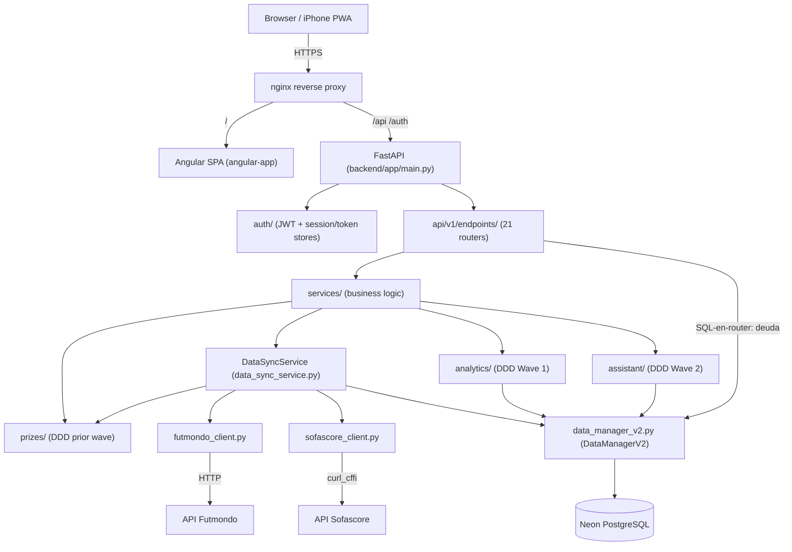
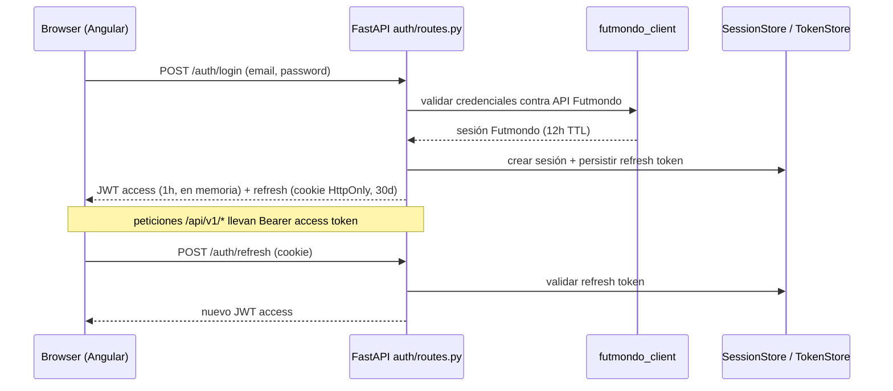
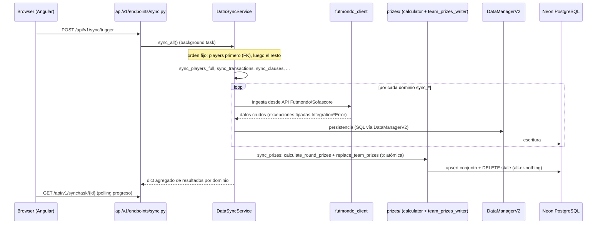

# Architecture

## System Overview

Futmondo Analytics es un sistema **cliente-servidor de dos apps desplegables**
sobre un mono-repo: un frontend Angular (PWA, `angular-app/`) y un backend
FastAPI (Python 3.12, `backend/app/`), con Neon PostgreSQL como almacén y dos
integraciones externas (API Futmondo, API Sofascore). En producción nginx sirve
la SPA y hace de reverse proxy hacia el backend (ver `README.md`).

## Architectural Style

**Monolito modular por capas** en el backend, con **contextos acotados DDD** en
progresiva extracción (oleadas `prizes/`, `analytics/`, `assistant/`). No es
microservicios: un único servicio FastAPI concentra routers + servicios +
integraciones + acceso a datos. Evidencia: capas `api/v1/endpoints/` →
`services/` → acceso a datos (`data_manager_v2.py`) dentro de un solo proceso
(`backend/app/main.py`). El estilo objetivo del refactor es **hexagonal por
dominio** (domain `ports.py` / application / infrastructure `*_adapter.py` /
`facade.py`), ya demostrado en `analytics/` y `assistant/`.

## Component Relationships

```mermaid
graph TD
  Browser["Browser / iPhone PWA"] -->|HTTPS| Nginx["nginx reverse proxy"]
  Nginx -->|/| NG["Angular SPA (angular-app)"]
  Nginx -->|/api /auth| API["FastAPI (backend/app/main.py)"]

  API --> Auth["auth/ (JWT + session/token stores)"]
  API --> Routers["api/v1/endpoints/ (21 routers)"]

  Routers --> Services["services/ (business logic)"]
  Services --> DSS["DataSyncService (data_sync_service.py)"]
  Services --> Analytics["analytics/ (DDD Wave 1)"]
  Services --> Assistant["assistant/ (DDD Wave 2)"]
  Services --> Prizes["prizes/ (DDD prior wave)"]

  DSS --> FClient["futmondo_client.py"]
  DSS --> SClient["sofascore_client.py"]
  DSS --> Prizes
  DSS --> DM["data_manager_v2.py (DataManagerV2)"]
  Analytics --> DM
  Assistant --> DM
  Routers -->|SQL-en-router: deuda| DM

  DM --> Neon[("Neon PostgreSQL")]
  FClient -->|HTTP| Futmondo["API Futmondo"]
  SClient -->|curl_cffi| Sofascore["API Sofascore"]
```

**Text fallback (component graph):** El navegador/PWA habla HTTPS con nginx, que
sirve la SPA Angular en `/` y hace proxy de `/api` y `/auth` al backend FastAPI.
FastAPI expone 21 routers (`api/v1/endpoints/`) y las rutas de auth; los routers
llaman a `services/`, donde vive `DataSyncService` y los contextos DDD
(`analytics/`, `assistant/`, `prizes/`). `DataSyncService` consume
`futmondo_client` y `sofascore_client`, delega el cálculo de premios a `prizes/`
y persiste vía `DataManagerV2` (`data_manager_v2.py`) contra Neon PostgreSQL.
Existe deuda de **SQL-en-router**: casi todos los routers acceden a `DataManagerV2`
con SQL crudo inline (ver `code-quality-assessment.md`).

## Data Flow

Ingreso de petición → router (`api/v1/endpoints/`) → servicio de aplicación
(`services/`) → acceso a datos (`DataManagerV2`) → Neon. Las lecturas de datos
externos entran por `futmondo_client` / `sofascore_client` durante el sync y se
materializan en Neon. Ver el flujo asíncrono de sync abajo.

## Interaction Diagrams

### 1. Login / Auth flow

```mermaid
sequenceDiagram
  participant U as Browser (Angular)
  participant A as FastAPI auth/routes.py
  participant F as futmondo_client
  participant S as SessionStore / TokenStore
  U->>A: POST /auth/login (email, password)
  A->>F: validar credenciales contra API Futmondo
  F-->>A: sesión Futmondo (12h TTL)
  A->>S: crear sesión + persistir refresh token
  A-->>U: JWT access (1h, en memoria) + refresh (cookie HttpOnly, 30d)
  Note over U,A: peticiones /api/v1/* llevan Bearer access token
  U->>A: POST /auth/refresh (cookie)
  A->>S: validar refresh token
  A-->>U: nuevo JWT access
```

**Text fallback (auth):** El navegador hace `POST /auth/login` con las
credenciales Futmondo; el backend las valida contra la API de Futmondo vía
`futmondo_client`, crea la sesión y persiste el refresh token en el store, y
devuelve un JWT access (1h, en memoria) más un refresh token (cookie HttpOnly,
30d). Las peticiones a `/api/v1/*` llevan Bearer; `POST /auth/refresh` renueva el
access desde la cookie.

### 2. Async sync flow (`sync_all` → 10 `sync_*` → DataManagerV2 / Neon)

```mermaid
sequenceDiagram
  participant U as Browser (Angular)
  participant R as api/v1/endpoints/sync.py
  participant D as DataSyncService
  participant F as futmondo_client
  participant P as prizes/ (calculator + team_prizes_writer)
  participant M as DataManagerV2
  participant N as Neon PostgreSQL
  U->>R: POST /api/v1/sync/trigger
  R->>D: sync_all() (background task)
  Note over D: orden fijo: players primero (FK), luego el resto
  D->>D: sync_players_full, sync_transactions, sync_clauses, ...
  loop por cada dominio sync_*
    D->>F: ingesta desde API Futmondo/Sofascore
    F-->>D: datos crudos (excepciones tipadas Integration*Error)
    D->>M: persistencia (SQL vía DataManagerV2)
    M->>N: escritura
  end
  D->>P: sync_prizes: calculate_round_prizes + replace_team_prizes (tx atómica)
  P->>N: upsert conjunto + DELETE stale (all-or-nothing)
  D-->>R: dict agregado de resultados por dominio
  U->>R: GET /api/v1/sync/task/{id} (polling progreso)
```

**Text fallback (async sync):** `POST /api/v1/sync/trigger` lanza `sync_all()` en
background. `sync_all()` es un coordinador fino que invoca los 10 `sync_*` en
orden (players primero por dependencia FK) y agrega los resultados en un dict.
Cada `sync_*` hoy mezcla ingesta desde `futmondo_client`/`sofascore_client`,
cálculo y persistencia vía `DataManagerV2` contra Neon; las excepciones de
integración están tipadas (`Integration*Error`). `sync_prizes` es la excepción ya
refactorizada: orquesta ingesta, delega el cálculo puro en `calculate_round_prizes`
y persiste el conjunto de forma atómica con `replace_team_prizes` (upsert +
`DELETE ... NOT IN` en una sola transacción, all-or-nothing). El frontend hace
polling de progreso con `GET /api/v1/sync/task/{id}`.

## Key Design Decisions

- **Superficie pública estable de sync**: `DataSyncService` con 10 `sync_*` +
  `sync_all()` es el contrato a preservar en el refactor (ver
  `api-documentation.md`).
- **Extracción DDD por oleadas**: `prizes/`, `analytics/`, `assistant/` demuestran
  el layering objetivo (domain port sin SQL, application puro, infrastructure con
  el único SQL, facade fino + shim de re-export). `sync_prizes` es el patrón exacto
  a replicar por dominio.
- **Escritura atómica set-replacement**: `replace_team_prizes` corrige el antiguo
  `try/except → logger.warning` que dejaba estado mixto; es el patrón de
  referencia para reemplazos de conjunto.
- **Auth JWT dual**: access en memoria + refresh en cookie HttpOnly (defensa
  contra XSS/robo de token).

## Improvement Opportunities

- Retirar el SQL-en-router llevándolo tras adaptadores de infraestructura.
- Completar la descomposición de `data_sync_service.py` (8 de 10 dominios aún
  mezclan ingesta/SQL/cálculo) y de `data_manager_v2.py` (~166 KB). Detalle y
  medidas en `code-quality-assessment.md`.
