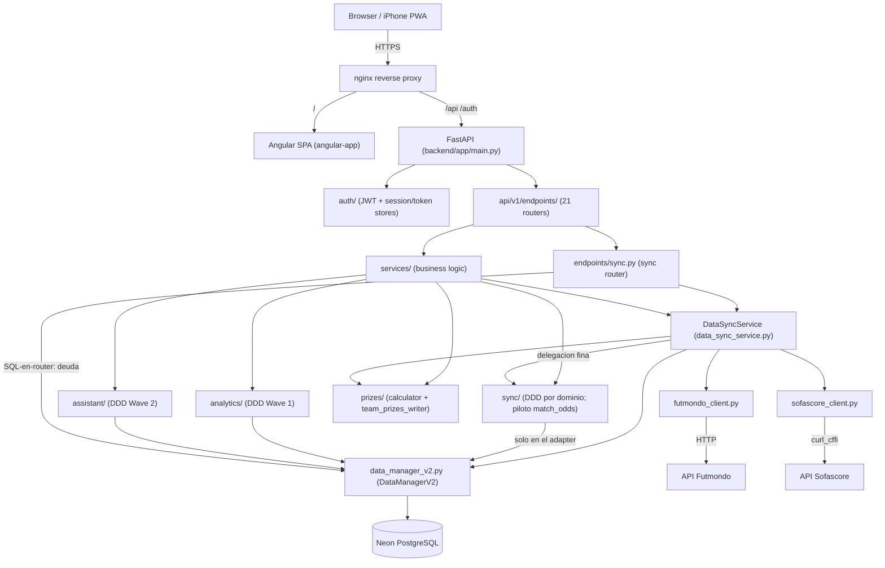
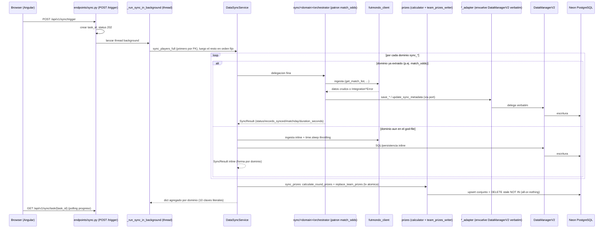
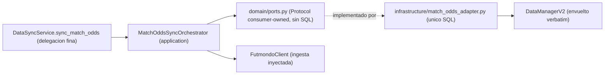

# Architecture

## System Overview

Futmondo Analytics es un sistema **cliente-servidor de dos apps desplegables**
sobre un mono-repo: un frontend Angular (PWA, `angular-app/`) y un backend
FastAPI (Python 3.12, `backend/app/`), con Neon PostgreSQL como almacén y dos
integraciones externas (API Futmondo, API Sofascore). En producción nginx sirve
la SPA y hace de reverse proxy hacia el backend (ver `README.md`).

## Architectural Style

**Monolito modular por capas** en el backend, con **contextos acotados DDD** en
progresiva extracción (oleadas `prizes/`, `analytics/`, `assistant/`, y la raíz
`sync/` sembrada por el piloto `match_odds`). No es microservicios: un único
servicio FastAPI concentra routers + servicios + integraciones + acceso a datos.
Evidencia: capas `api/v1/endpoints/` → `services/` → acceso a datos
(`data_manager_v2.py`) dentro de un solo proceso (`backend/app/main.py`). El
estilo objetivo del refactor es **hexagonal por dominio** (domain `ports.py` /
application `orchestrator.py` / infrastructure `*_adapter.py` / facade fino), ya
demostrado end-to-end en `analytics/`, `assistant/` y en `sync/match_odds/`.

Trade-off asumido (decisión de arquitectura, Inception): la extracción se hace
**por dominio y envolviendo verbatim** `DataManagerV2` tras un adapter en lugar
de reescribir el acceso a datos. Pros: equivalencia funcional estricta (FR5),
riesgo bajo y rollback quirúrgico por dominio. Contras: `DataManagerV2` sigue
siendo un god-file (~166 KB) y el SQL crudo permanece, sólo cambia su punto de
invocación. Alternativa descartada: reescribir el acceso a datos a la vez —
rechazada por su blast radius y por el mandato afirmado de no ampliar/reescribir
los god-files.

## Component Relationships

```mermaid
graph TD
  Browser["Browser / iPhone PWA"] -->|HTTPS| Nginx["nginx reverse proxy"]
  Nginx -->|/| NG["Angular SPA (angular-app)"]
  Nginx -->|/api /auth| API["FastAPI (backend/app/main.py)"]

  API --> Auth["auth/ (JWT + session/token stores)"]
  API --> Routers["api/v1/endpoints/ (21 routers)"]

  Routers --> SyncRouter["endpoints/sync.py (sync router)"]
  Routers --> Services["services/ (business logic)"]
  SyncRouter --> DSS["DataSyncService (data_sync_service.py)"]
  Services --> DSS
  Services --> SyncPkg["sync/ (DDD por dominio; piloto match_odds)"]
  Services --> Analytics["analytics/ (DDD Wave 1)"]
  Services --> Assistant["assistant/ (DDD Wave 2)"]
  Services --> Prizes["prizes/ (calculator + team_prizes_writer)"]

  DSS --> FClient["futmondo_client.py"]
  DSS --> SClient["sofascore_client.py"]
  DSS --> Prizes
  DSS -->|delegacion fina| SyncPkg
  DSS --> DM["data_manager_v2.py (DataManagerV2)"]
  SyncPkg -->|solo en el adapter| DM
  Analytics --> DM
  Assistant --> DM
  SyncRouter -->|SQL-en-router: deuda| DM

  DM --> Neon[("Neon PostgreSQL")]
  FClient -->|HTTP| Futmondo["API Futmondo"]
  SClient -->|curl_cffi| Sofascore["API Sofascore"]
```

<!-- Text fallback: El navegador/PWA habla HTTPS con nginx, que sirve la SPA Angular en / y hace proxy de /api y /auth al backend FastAPI. FastAPI expone 21 routers (api/v1/endpoints/) y las rutas de auth; el sync router (endpoints/sync.py) y el resto de routers llaman a services/. DataSyncService consume futmondo_client y sofascore_client, delega el calculo de premios a prizes/ y (para match_odds) delega de forma fina al paquete sync/; persiste vvia DataManagerV2 contra Neon. Los contextos DDD (sync/, analytics/, assistant/) tocan DataManagerV2 solo en su adapter de infraestructura. Existe deuda de SQL-en-router: casi todos los routers acceden a DataManagerV2 con SQL crudo inline. -->

## Data Flow

Ingreso de petición → router (`api/v1/endpoints/`) → servicio de aplicación
(`services/`) → acceso a datos (`DataManagerV2`) → Neon. Las lecturas de datos
externos entran por `futmondo_client` / `sofascore_client` durante el sync y se
materializan en Neon. Ver el flujo asíncrono de sync abajo.

## Interaction Diagrams

### 1. Login / Auth flow

```mermaid
sequenceDiagram
  participant U as Browser (Angular)
  participant A as FastAPI auth/routes.py
  participant F as futmondo_client
  participant S as SessionStore / TokenStore
  U->>A: POST /auth/login (email, password)
  A->>F: validar credenciales contra API Futmondo
  F-->>A: sesion Futmondo (12h TTL)
  A->>S: crear sesion + persistir refresh token
  A-->>U: JWT access (1h, en memoria) + refresh (cookie HttpOnly, 30d)
  Note over U,A: peticiones /api/v1/* llevan Bearer access token
  U->>A: POST /auth/refresh (cookie)
  A->>S: validar refresh token
  A-->>U: nuevo JWT access
```

<!-- Text fallback: El navegador hace POST /auth/login con las credenciales Futmondo; el backend las valida contra la API de Futmondo via futmondo_client, crea la sesion y persiste el refresh token en el store, y devuelve un JWT access (1h, en memoria) mas un refresh token (cookie HttpOnly, 30d). Las peticiones a /api/v1/* llevan Bearer; POST /auth/refresh renueva el access desde la cookie. -->

### 2. Async sync transaction flow (router → sync_all → sync_* → adapter → Neon)

```mermaid
sequenceDiagram
  participant U as Browser (Angular)
  participant R as endpoints/sync.py (POST /trigger)
  participant W as _run_sync_in_background (thread)
  participant D as DataSyncService
  participant O as sync/<domain>/orchestrator (patron match_odds)
  participant F as futmondo_client
  participant P as prizes (calculator + team_prizes_writer)
  participant A as *_adapter (envuelve DataManagerV2 verbatim)
  participant M as DataManagerV2
  participant N as Neon PostgreSQL
  U->>R: POST /api/v1/sync/trigger
  R->>R: crear task_id, status 202
  R->>W: lanzar thread background
  W->>D: sync_players_full (primero por FK), luego el resto en orden fijo
  loop por cada dominio sync_*
    alt dominio ya extraido (p.ej. match_odds)
      D->>O: delegacion fina
      O->>F: ingesta (get_match_list, ...)
      F-->>O: datos crudos o Integration*Error
      O->>A: save_* / update_sync_metadata (via port)
      A->>M: delega verbatim
      M->>N: escritura
      O-->>D: SyncResult (status/records_synced/matchday/duration_seconds)
    else dominio aun en el god-file
      D->>F: ingesta inline + time.sleep throttling
      D->>M: SQL/persistencia inline
      M->>N: escritura
      D-->>D: SyncResult inline (forma por dominio)
    end
  end
  D->>P: sync_prizes: calculate_round_prizes + replace_team_prizes (tx atomica)
  P->>N: upsert conjunto + DELETE stale NOT IN (all-or-nothing)
  D-->>W: dict agregado por dominio (10 claves literales)
  U->>R: GET /api/v1/sync/task/{task_id} (polling progreso)
```

<!-- Text fallback: POST /api/v1/sync/trigger crea un task_id, responde 202 y lanza _run_sync_in_background en un thread. El worker invoca el surface publico de DataSyncService en orden fijo (players primero por dependencia FK) con las mismas 10 claves que sync_all, mas phantoms (helper del router). Para un dominio ya extraido (match_odds) DataSyncService delega de forma fina al orchestrator del paquete sync/<domain>/, que ingesta desde futmondo_client (excepciones tipadas Integration*Error), persiste a traves de un port cuyo *_adapter envuelve DataManagerV2 verbatim contra Neon, y devuelve un SyncResult cuya forma depende del dominio. Para un dominio aun en el god-file, DataSyncService mezcla ingesta, time.sleep de throttling y SQL/persistencia inline. sync_prizes orquesta la ingesta, delega el calculo puro en calculate_round_prizes y persiste el conjunto de forma atomica con replace_team_prizes (upsert + DELETE ... NOT IN en una sola transaccion, all-or-nothing). El frontend hace polling con GET /api/v1/sync/task/{task_id}. -->

### 3. Target DDD layering per domain (match_odds como molde)

```mermaid
graph LR
  DSS["DataSyncService.sync_match_odds (delegacion fina)"] --> ORCH["MatchOddsSyncOrchestrator (application)"]
  ORCH --> PORT["domain/ports.py (Protocol consumer-owned, sin SQL)"]
  ORCH --> CLIENT["FutmondoClient (ingesta inyectada)"]
  PORT -.implementado por.-> ADAPTER["infrastructure/match_odds_adapter.py (unico SQL)"]
  ADAPTER --> DMV2["DataManagerV2 (envuelto verbatim)"]
```

<!-- Text fallback: El metodo publico sync_match_odds de DataSyncService es una delegacion fina al MatchOddsSyncOrchestrator (capa application). El orchestrator depende de un Protocol consumer-owned en domain/ports.py (sin SQL, sin framework) y del FutmondoClient inyectado para la ingesta; el port lo implementa infrastructure/match_odds_adapter.py, unico punto con SQL, que envuelve DataManagerV2 verbatim. Este es el molde a replicar por cada dominio de sync. -->

## Key Design Decisions

- **Superficie pública estable de sync**: `DataSyncService` con 10 `sync_*` +
  `sync_all()` (10 claves literales, orden fijo) es el contrato a preservar en el
  refactor (ver `api-documentation.md`). El worker `_run_sync_in_background` del
  router replica ese orden/claves y añade `phantoms`, por lo que cualquier cambio
  de firma rompería el worker.
- **Extracción DDD por dominio**: `sync/match_odds/` es el patrón de referencia
  exacto (orchestrator + domain port Protocol + infrastructure adapter que envuelve
  `DataManagerV2` verbatim); `prizes/` aporta el cálculo puro y la escritura atómica
  pero aún le falta el facade/orchestrator uniforme (comparar con
  `analytics/__init__.py` y `assistant/__init__.py`).
- **Escritura atómica set-replacement**: `replace_team_prizes` corrige el antiguo
  `try/except → logger.warning` que dejaba estado mixto; es el patrón de
  referencia para reemplazos de conjunto (all-or-nothing).
- **Manejo de errores tipado**: fatal `IntegrationBanError` propaga; recoverable
  (`IntegrationTimeoutError` / `IntegrationUnparseableError` / `IntegrationRequestError`)
  degrada vía `record_degraded_step`. Ninguna credencial/token alcanza mensajes de
  excepción, `repr` ni logs (`_log_integration_failure`, NFR1/BR4.2). Implicación
  de seguridad: esta garantía debe preservarse en cada adapter extraído.
- **Auth JWT dual**: access en memoria + refresh en cookie HttpOnly (defensa
  contra XSS/robo de token).

## Improvement Opportunities

- Retirar el SQL-en-router llevándolo tras adaptadores de infraestructura.
- Completar la descomposición de `data_sync_service.py` (8 de 10 dominios aún
  mezclan ingesta/SQL/cálculo; sólo `sync_match_odds` delega y `sync_prizes`
  delega parcialmente) sin ampliar `data_manager_v2.py`. Detalle y medidas en
  `code-quality-assessment.md`.
