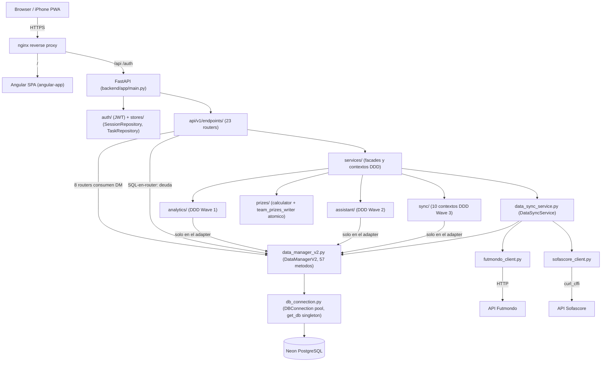
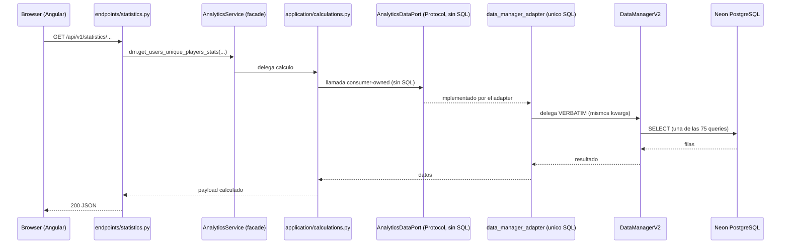
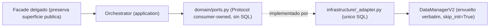

# Architecture

## System Overview

Futmondo Analytics es un sistema **cliente-servidor de dos apps desplegables**
sobre un mono-repo: un frontend Angular (PWA, `angular-app/`) y un backend
FastAPI (Python 3.12, `backend/app/`), con Neon PostgreSQL como almacén y dos
integraciones externas (API Futmondo, API Sofascore). En producción nginx sirve
la SPA y hace de reverse proxy hacia el backend (ver `README.md`).

## Architectural Style

**Monolito modular por capas** en el backend, con **contextos acotados DDD** en
progresiva extracción (oleadas `prizes/`, `analytics/`, `assistant/`, y los 10
contextos de `sync/`). No es microservicios: un único servicio FastAPI concentra
routers + servicios + integraciones + acceso a datos. Evidencia (handoff de esta
pasada): capas `api/v1/endpoints/` → `services/` → acceso a datos
(`data_manager_v2.py`) dentro de un solo proceso (`backend/app/main.py`). El
estilo objetivo del refactor es **hexagonal por dominio** (domain `ports.py` /
application `orchestrator.py` / infrastructure `*_adapter.py` / facade fino), ya
demostrado end-to-end en `analytics/`, `assistant/` y los contextos de `sync/`.

Trade-off asumido (decisión de arquitectura, Inception): la extracción se hace
**por responsabilidad y envolviendo verbatim** `DataManagerV2` tras un adapter en
lugar de reescribir el acceso a datos. Pros: equivalencia funcional estricta,
riesgo bajo y rollback quirúrgico por responsabilidad. Contras: el SQL crudo
permanece, sólo cambia su punto de invocación. Alternativa descartada: reescribir
el acceso a datos a la vez — rechazada por su blast radius y por el mandato
afirmado de no ampliar/reescribir los god-files.

## El god-file objetivo y su lugar en la descomposición DDD (foco de esta pasada)

Según el scan, `DataManagerV2` (3692 líneas, 57 métodos, 148 sentencias SQL
embebidas: 34 `INSERT` / 75 `SELECT` / 14 `UPDATE` / 15 `CREATE TABLE` / 24 `ON
CONFLICT`) es el **último god-file original sin descomponer**. Las 4 oleadas DDD
ya entregadas (`analytics/`, `assistant/`, los 10 contextos `sync/*`, y `prizes/`)
NO lo tocan: cada una lo consume **sólo** desde su `infrastructure/*_adapter.py`,
que lo envuelve verbatim (`DataManagerV2(skip_init=True)`, kwargs originales
preservados). Por eso la superficie pública exacta de `DataManagerV2` es el
contrato que el refactor debe preservar byte-a-byte: es la frontera de
infraestructura sobre la que descansa toda la arquitectura hexagonal ya construida.

El molde probado (patrón de referencia, mismo repo):

- **Facade delgado** — `analytics/facade.py` (`AnalyticsService`) preserva la
  superficie pública y delega.
- **Application / orchestrator** — `analytics/application/calculations.py`,
  `sync/<ctx>/orchestrator.py`: lógica por responsabilidad, sin SQL.
- **Domain port** — `analytics/domain/ports.py` (`AnalyticsDataPort`),
  `sync/<ctx>/domain/ports.py`: `typing.Protocol` consumer-owned, sin SQL ni
  framework; refleja la superficie de `DataManagerV2` verbatim.
- **Infrastructure adapter** — `analytics/infrastructure/data_manager_adapter.py`,
  los 10 `sync/*/infrastructure/*_adapter.py`: **único módulo con SQL**, envuelve
  `DataManagerV2` verbatim.
- **Reemplazo de conjunto atómico** — `prizes/team_prizes_writer.py`
  (`replace_team_prizes`): DELETE de filas stale + repopulado completo en UNA
  transacción, rollback todo-o-nada. Es el patrón a aplicar a los puntos de
  corrupción por reemplazo-de-conjunto del god-file (p. ej. `delete_orphan_players`).

La capa de persistencia estrecha de referencia (SQL fuera de routers y god-files,
todo parametrizado) es `app/stores/` (`SessionRepository`, `TaskRepository`,
esquemas `ensure_*`).

## Component Relationships

```mermaid
graph TD
  Browser["Browser / iPhone PWA"] -->|HTTPS| Nginx["nginx reverse proxy"]
  Nginx -->|/| NG["Angular SPA (angular-app)"]
  Nginx -->|/api /auth| API["FastAPI (backend/app/main.py)"]

  API --> Auth["auth/ (JWT) + stores/ (SessionRepository, TaskRepository)"]
  API --> Routers["api/v1/endpoints/ (23 routers)"]

  Routers -->|8 routers consumen DM| DM["data_manager_v2.py (DataManagerV2, 57 metodos)"]
  Routers --> Services["services/ (facades y contextos DDD)"]
  Routers -->|SQL-en-router: deuda| DM

  Services --> Analytics["analytics/ (DDD Wave 1)"]
  Services --> Assistant["assistant/ (DDD Wave 2)"]
  Services --> SyncPkg["sync/ (10 contextos DDD Wave 3)"]
  Services --> Prizes["prizes/ (calculator + team_prizes_writer atomico)"]
  Services --> DSS["data_sync_service.py (DataSyncService)"]

  Analytics -->|solo en el adapter| DM
  Assistant -->|solo en el adapter| DM
  SyncPkg -->|solo en el adapter| DM
  DSS --> DM
  DSS --> FClient["futmondo_client.py"]
  DSS --> SClient["sofascore_client.py"]

  DM --> DBConn["db_connection.py (DBConnection pool, get_db singleton)"]
  DBConn --> Neon[("Neon PostgreSQL")]
  FClient -->|HTTP| Futmondo["API Futmondo"]
  SClient -->|curl_cffi| Sofascore["API Sofascore"]
```

<!-- Text fallback: El navegador/PWA habla HTTPS con nginx, que sirve la SPA Angular en / y hace proxy de /api y /auth al backend FastAPI. FastAPI expone 23 routers (api/v1/endpoints/) mas las rutas de auth; auth usa stores/ (SessionRepository, TaskRepository) como capa de persistencia estrecha de referencia. 8 routers consumen DataManagerV2 directamente (ademas de SQL-en-router inline, que es deuda). Los contextos DDD (analytics/, assistant/, sync/, data_sync_service.py) tocan DataManagerV2 solo en su adapter de infraestructura, salvo DataSyncService que ademas lo usa directamente. DataManagerV2 accede a Neon via db_connection.py (DBConnection pool + get_db singleton). futmondo_client y sofascore_client ingestan datos externos durante el sync. -->

## Data Flow

Ingreso de petición → router (`api/v1/endpoints/`) → facade/servicio de aplicación
(`services/`) → port `Protocol` (`domain/ports.py`) → adapter de infraestructura
(`infrastructure/*_adapter.py`) → `DataManagerV2` (SQL) → `db_connection.DBConnection`
→ Neon. En los consumidores aún no descompuestos (8 routers + `DataSyncService`
inline) el router o el servicio llama a `DataManagerV2` directamente, saltándose
el port — ésa es la deuda que el patrón DDD elimina responsabilidad a
responsabilidad.

## Interaction Diagrams

### 1. Lectura analítica a través del adapter (molde DDD, patrón a replicar)

```mermaid
sequenceDiagram
  participant U as Browser (Angular)
  participant R as endpoints/statistics.py
  participant FA as AnalyticsService (facade)
  participant APP as application/calculations.py
  participant PORT as AnalyticsDataPort (Protocol, sin SQL)
  participant AD as data_manager_adapter (unico SQL)
  participant M as DataManagerV2
  participant N as Neon PostgreSQL
  U->>R: GET /api/v1/statistics/...
  R->>FA: dm.get_users_unique_players_stats(...)
  FA->>APP: delega calculo
  APP->>PORT: llamada consumer-owned (sin SQL)
  PORT-->>AD: implementado por el adapter
  AD->>M: delega VERBATIM (mismos kwargs)
  M->>N: SELECT (una de las 75 queries)
  N-->>M: filas
  M-->>AD: resultado
  AD-->>APP: datos
  APP-->>R: payload calculado
  R-->>U: 200 JSON
```

<!-- Text fallback: Un GET analitico entra por un router, que llama al facade (AnalyticsService). El facade delega en la capa de aplicacion (calculations.py), que depende de un port Protocol consumer-owned sin SQL (AnalyticsDataPort). El port lo implementa el data_manager_adapter, unico modulo con SQL del contexto, que delega verbatim en DataManagerV2 (mismos nombres y kwargs). DataManagerV2 ejecuta un SELECT contra Neon via db_connection y devuelve filas que suben por la cadena hasta el 200 JSON. Este es el molde a replicar al extraer cada responsabilidad del god-file. -->

### 2. Transacción de escritura con reemplazo de conjunto atómico (patrón de referencia)

```mermaid
sequenceDiagram
  participant W as sync worker / DataSyncService
  participant M as DataManagerV2 (metodo save_*/delete_*)
  participant DB as db_connection.DBConnection
  participant N as Neon PostgreSQL
  W->>M: save_players_batch(...) / delete_orphan_players(live_ids)
  M->>DB: get_cursor() + adapt_params ('?'->'%s')
  alt reemplazo de conjunto correcto (molde team_prizes_writer)
    M->>N: BEGIN
    M->>N: upsert conjunto completo (ON CONFLICT)
    M->>N: DELETE stale WHERE NOT IN / <> ALL(%s)
    M->>N: COMMIT (todo-o-nada)
  else riesgo de corrupcion (observado en delete_orphan_players)
    M->>N: upsert (una tx)
    M->>N: DELETE separado (sin tx compartida; fallo deja estado MIXTO)
  end
  N-->>M: filas afectadas
  M-->>W: count / None
```

<!-- Text fallback: Una escritura de conjunto (save_players_batch seguido de delete_orphan_players) obtiene cursor via db_connection, que adapta los placeholders '?'->'%s'. El patron CORRECTO (team_prizes_writer) hace upsert del conjunto completo y el DELETE de filas stale en UNA transaccion con COMMIT todo-o-nada. El patron de RIESGO observado en delete_orphan_players ejecuta el DELETE separado del upsert previo sin compartir transaccion explicita: si el DELETE falla, el estado queda MIXTO. El refactor debe elevar estos reemplazos de conjunto al patron atomico de referencia, nunca replicar el anti-patron de DELETE separado con fallo tragado. -->

### 3. Target DDD layering al extraer una responsabilidad del god-file

```mermaid
graph LR
  FACADE["Facade delgado (preserva superficie publica)"] --> ORCH["<Responsibility>Orchestrator (application)"]
  ORCH --> PORT["domain/ports.py (Protocol consumer-owned, sin SQL)"]
  PORT -.implementado por.-> ADAPTER["infrastructure/<resp>_adapter.py (unico SQL)"]
  ADAPTER --> DMV2["DataManagerV2 (envuelto verbatim, skip_init=True)"]
```

<!-- Text fallback: Al extraer una responsabilidad (players, transactions, clauses...) del god-file, el facade delgado preserva la superficie publica y delega en un orchestrator de aplicacion. El orchestrator depende de un port Protocol consumer-owned sin SQL (domain/ports.py); el port lo implementa infrastructure/<resp>_adapter.py, unico punto con SQL, que envuelve DataManagerV2 verbatim (skip_init=True, kwargs originales). Molde identico al de analytics/assistant/sync ya entregados. -->

## Key Design Decisions

- **Superficie pública estable de `DataManagerV2`**: constructor
  `DataManagerV2(db_path=None, skip_init=True)` + los 57 métodos (nombres y firmas)
  son el contrato a preservar byte-a-byte. 8 routers (`clausulable_players`,
  `initialize`, `matchdays`, `player_finances`, `reset_db`, `statistics`, `sync`,
  `user_stats`) + los adapters de `analytics`/`assistant`/`sync` + `data_sync_service`
  + `data_initializer_v2` + `futmondo_service` dependen de ella; romperla rompe las
  4 oleadas DDD ya entregadas.
- **Extracción DDD por responsabilidad (molde probado)**: facade/orchestrator/port
  Protocol/adapter con `DataManagerV2(skip_init=True)` por defecto. El SQL se
  envuelve verbatim; no se añade ningún método al god-file.
- **Reemplazo de conjunto atómico**: `replace_team_prizes` es el patrón de
  referencia (upsert + `DELETE ... NOT IN` en una sola transacción, all-or-nothing).
  `delete_orphan_players` (L549–595) es el candidato prioritario a elevarse a este
  patrón; hoy ejecuta el `DELETE ... NOT IN`/`<> ALL(%s)` sin transacción explícita
  compartida con los upserts previos (riesgo de estado mixto).
- **Divergencia de ramas SQL por engine**: múltiples métodos ramifican
  `if self.db.db_type in ["postgresql","postgres"]: ... else: (SQLite)`. Producción
  es PostgreSQL/Neon exclusivamente (`db_connection.py` lo documenta); la rama
  SQLite sobrevive para el fake de tests. Characterization debe cubrir la rama
  productiva sin romper la ejecución contra el `_FakeInMemoryDB`.
- **Manejo de errores a preservar**: 18 `except Exception` + 5 `except:` desnudos y
  16 `return None` en el god-file; distinguir contrato legítimo (`Optional` "no
  encontrado") de deuda (fallo silencioso), sin introducir fallos silenciosos
  nuevos ni credenciales en mensajes/`repr`/`exc_info`.
- **Auth JWT dual** (prosa preservada del store previo): access en memoria +
  refresh en cookie HttpOnly (defensa contra XSS/robo de token).

## Improvement Opportunities

- Descomponer `data_manager_v2.py` responsabilidad a responsabilidad (14 clusters
  observados) al molde facade/orchestrator/port/adapter sin ampliarlo.
- Elevar `delete_orphan_players` (y otros reemplazos de conjunto) al patrón atómico
  de `team_prizes_writer.py`.
- Retirar el SQL-en-router (17 de 23 routers con `cursor.execute` inline) llevándolo
  tras adaptadores de infraestructura — deuda a NO ampliar en esta etapa.
- Sanear la deuda de lint registrada del god-file (`per-file-ignores`
  `E722,F841,F401,I001`) en los ficheros NUEVOS que surjan de la extracción, no
  in-place.
