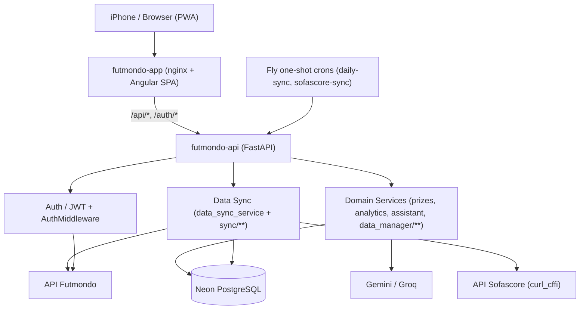
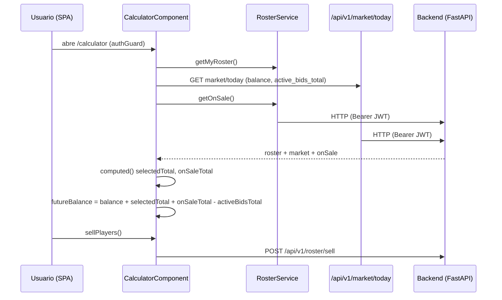
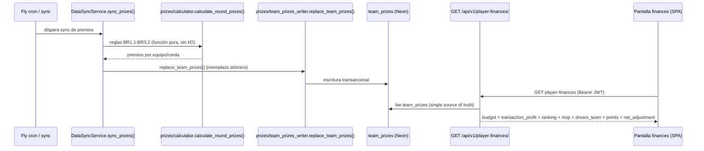
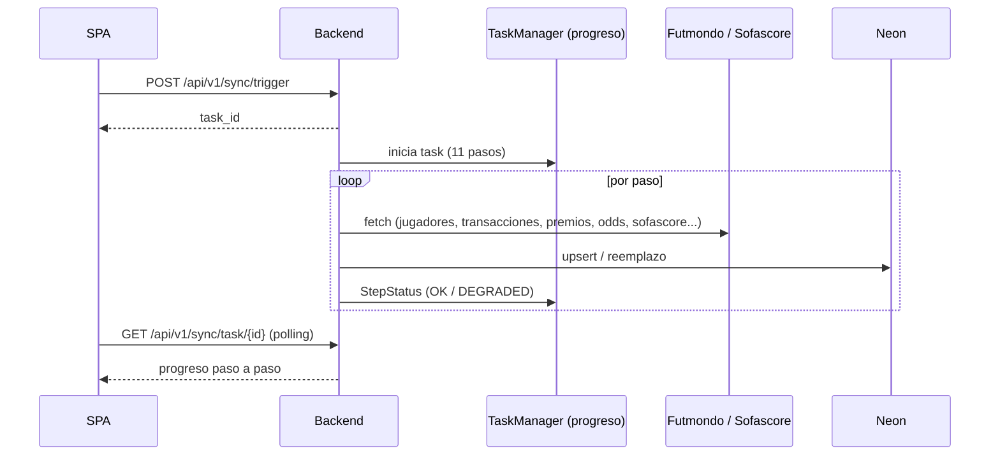

# Architecture — futmondo-analytics

## Architecture Analysis

### System Overview

Sistema de dos aplicaciones desplegadas en Fly.io (región `cdg`) delante de una
base de datos Neon PostgreSQL (Frankfurt, tier free):

- **Frontend** `futmondo-app` — SPA/PWA Angular servida por nginx; sirve el bundle
  Angular y hace reverse proxy de `/api/*` y `/auth/*` al backend.
- **Backend** `futmondo-api` — FastAPI (uvicorn) con lógica de dominio, sync de
  datos e integraciones externas.

### Architectural Style

**Monolito modular por paquete** con descomposición DDD interna en curso. Evidencia:
backend único FastAPI que agrupa routers, servicios de dominio y adaptadores; los
antiguos god-files (`data_manager_v2.py`, `data_sync_service.py`) se están
descomponiendo en submódulos DDD uniformes `<responsabilidad>/{application,
infrastructure,domain}` con puertos e inversión de dependencias (`analytics`,
`assistant`, `data_manager/**`, `sync/**`). El frontend es una SPA Angular con
componentes standalone, signals y rutas lazy. No hay microservicios: un solo
despliegue por lado. Las tareas programadas (`cron`) son máquinas Fly one-shot, no
servicios de larga vida.

### Component Relationships

```mermaid
graph TD
  Browser["iPhone / Browser (PWA)"]
  Nginx["futmondo-app (nginx + Angular SPA)"]
  API["futmondo-api (FastAPI)"]
  Auth["Auth / JWT + AuthMiddleware"]
  Domain["Domain Services (prizes, analytics, assistant, data_manager/**)"]
  Sync["Data Sync (data_sync_service + sync/**)"]
  DB[("Neon PostgreSQL")]
  Futmondo["API Futmondo"]
  Sofascore["API Sofascore (curl_cffi)"]
  AI["Gemini / Groq"]
  Cron["Fly one-shot crons (daily-sync, sofascore-sync)"]

  Browser --> Nginx
  Nginx -->|/api/*, /auth/*| API
  API --> Auth
  API --> Domain
  API --> Sync
  Domain --> DB
  Sync --> DB
  Sync --> Futmondo
  Sync --> Sofascore
  Domain --> AI
  Auth --> Futmondo
  Cron --> API
```

Texto fallback: el navegador habla con nginx (frontend), que hace proxy a FastAPI.
FastAPI aplica auth JWT (AuthMiddleware), delega en servicios de dominio y en el
sync de datos; ambos persisten en Neon PostgreSQL. El sync llama a Futmondo y
Sofascore; el dominio llama a los proveedores de IA. Los crons Fly one-shot
disparan el sync programado.

### Interaction Diagrams

#### Flujo Calculadora (proyección de balance)

```mermaid
sequenceDiagram
  participant U as Usuario (SPA)
  participant C as CalculatorComponent
  participant R as RosterService
  participant M as /api/v1/market/today
  participant B as Backend (FastAPI)
  U->>C: abre /calculator (authGuard)
  C->>R: getMyRoster()
  C->>M: GET market/today (balance, active_bids_total)
  C->>R: getOnSale()
  R->>B: HTTP (Bearer JWT)
  M->>B: HTTP (Bearer JWT)
  B-->>C: roster + market + onSale
  C->>C: computed() selectedTotal, onSaleTotal
  C->>C: futureBalance = balance + selectedTotal + onSaleTotal - activeBidsTotal
  U->>C: sellPlayers()
  C->>B: POST /api/v1/roster/sell
```

Texto fallback: la Calculadora carga en paralelo plantilla, mercado y jugadores en
venta; calcula totales con `computed()` de signals y proyecta `futureBalance`;
`sellPlayers()` envía la venta a `POST /api/v1/roster/sell`.

#### Flujo Finanzas por usuario (cálculo de premios)

```mermaid
sequenceDiagram
  participant Cron as Fly cron / sync
  participant S as DataSyncService.sync_prizes()
  participant Calc as prizes/calculator.calculate_round_prizes()
  participant W as prizes/team_prizes_writer.replace_team_prizes()
  participant DB as team_prizes (Neon)
  participant PF as GET /api/v1/player-finances/
  participant UI as Pantalla finances (SPA)
  Cron->>S: dispara sync de premios
  S->>Calc: reglas BR1.1-BR3.2 (función pura, sin I/O)
  Calc-->>S: premios por equipo/ronda
  S->>W: replace_team_prizes() (reemplazo atómico)
  W->>DB: escritura transaccional
  UI->>PF: GET player-finances (Bearer JWT)
  PF->>DB: lee team_prizes (single source of truth)
  PF-->>UI: budget + transaction_profit + ranking + mvp + dream_team + points + net_adjustment
```

Texto fallback: el sync calcula premios con la función pura
`calculate_round_prizes()` y los persiste atómicamente con `replace_team_prizes()`
en `team_prizes`; el endpoint `GET /api/v1/player-finances/` lee esa tabla como
única fuente de verdad y agrega las finanzas por usuario para la pantalla
`finances`.

#### Flujo Sync asíncrono

```mermaid
sequenceDiagram
  participant U as SPA
  participant B as Backend
  participant T as TaskManager (progreso)
  participant Ext as Futmondo / Sofascore
  participant DB as Neon
  U->>B: POST /api/v1/sync/trigger
  B-->>U: task_id
  B->>T: inicia task (11 pasos)
  loop por paso
    B->>Ext: fetch (jugadores, transacciones, premios, odds, sofascore...)
    B->>DB: upsert / reemplazo
    B->>T: StepStatus (OK / DEGRADED)
  end
  U->>B: GET /api/v1/sync/task/{id} (polling)
  B-->>U: progreso paso a paso
```

Texto fallback: el frontend lanza el sync (`POST sync/trigger`) y recibe un
`task_id`; el backend ejecuta 11 pasos contra Futmondo/Sofascore, actualiza Neon y
reporta estado por paso (OK/DEGRADED); el frontend hace polling de
`GET sync/task/{id}`.

### Data Flow

Datos externos (Futmondo/Sofascore) → sync → Neon PostgreSQL → servicios de dominio
→ routers `/api/v1/*` → SPA. El dinero de premio fluye por un canal propio:
`calculate_round_prizes()` (puro) → `replace_team_prizes()` (atómico) → `team_prizes`
→ `player-finances`. Ver `api-documentation.md` para contratos.

### Key Design Decisions

- **`team_prizes` como única fuente de verdad del dinero de premio**, poblada por
  función pura + escritor transaccional atómico. Alternativa descartada: calcular
  premios en el router/consulta (acoplaría cálculo y lectura, reintroduciría estado
  mixto). Trade-off: una escritura atómica extra a cambio de consistencia e
  idempotencia del reemplazo.
- **Descomposición DDD del god-file sobre extensión in situ**. Alternativa:
  seguir ampliando `data_manager_v2.py`. Rechazada por mandato afirmado y por el
  coste de mantenibilidad; se preserva comportamiento byte-a-byte moviendo deuda de
  lint verbatim a adaptadores (`per-file-ignores`). Ver `code-quality-assessment.md`.
- **Proyección lineal en la Calculadora** (`value + change * días`). Alternativa:
  modelo no lineal/estadístico. Trade-off: simplicidad y testabilidad frente a
  precisión; es un planificador, no un predictor.

### Improvement Opportunities

- La Calculadora frontend **no** consume hoy `GET /api/v1/player-finances/`; si la
  mejora busca cálculo financiero/de premios en la Calculadora, ese endpoint y los
  módulos `prizes/` son el punto de integración natural **tras una capa estrecha
  testeable** (no ampliar god-files ni SQL-en-router).
- `calculator.component.ts` carece de spec; characterization-first antes de
  extender (ver `code-quality-assessment.md`).

## Sources

- `developer-scan.md`: Handoff Summary (flujo Calculadora, `player_finances.py`,
  `prizes/*`), APIs Discovered, Packages Found.
- `README.md`: diagrama de producción, stack, flujo de sync.
