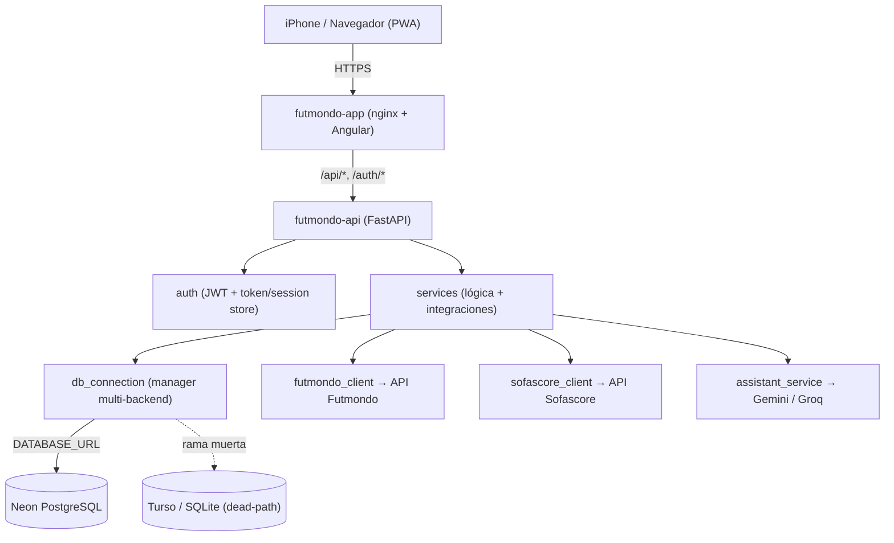
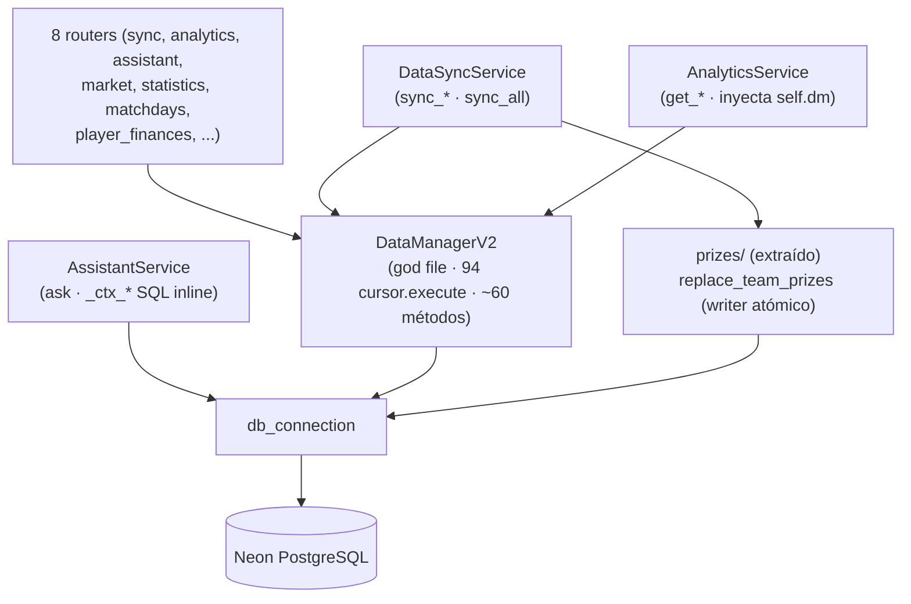
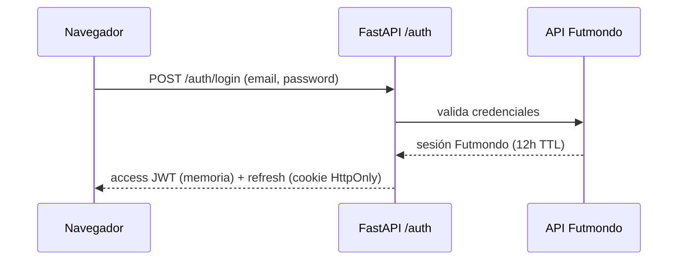
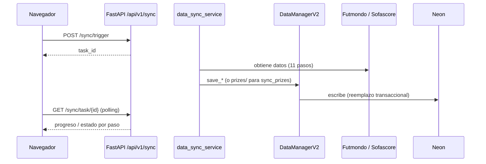
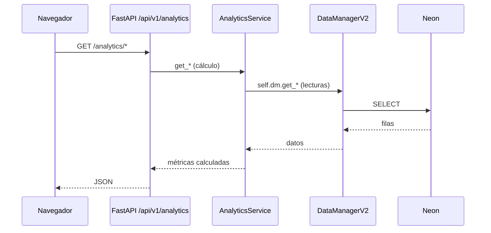

# Arquitectura — Futmondo Analytics

## Visión general del sistema

Sistema web de dos aplicaciones desplegadas por separado en Fly.io (región
`cdg`): un **frontend** Angular 22 (PWA servida por nginx) y un **backend**
FastAPI (Python 3.12), con **Neon PostgreSQL** (Frankfurt, tier free) como
base de datos. El backend integra APIs externas (Futmondo, Sofascore,
Gemini/Groq). Auth por JWT (access token en memoria del navegador + refresh
token en cookie HttpOnly).

## Estilo arquitectónico

**Monolito modular** en el backend (un único proceso FastAPI con subpaquetes
`core`/`services`/`api`/`auth`/`stores`/`security`/`models`) desplegado como
un servicio, más un SPA independiente. Evidencia: un solo `main.py` monta los
24 routers; los servicios comparten proceso y acceso directo a BD vía
`db_connection`. No hay límites de despliegue por dominio (no microservicios).

**Smell brownfield (foco FR13)**: la capa de servicios contiene god files
(`data_manager_v2.py` 3692 líneas, `data_sync_service.py` 1955,
`assistant_service.py` 1158, `analytics_service.py` 828) con SQL crudo inline
(anti-patrón SQL-en-servicio). `DataManagerV2` es un **hub estrella**: 8
routers + sync + analytics dependen de él. La descomposición extrae
repositorios por agregado tras fachadas delgadas, preservando la superficie
pública. Deuda registrada; regla afirmada de NO ampliarlos. Detalle de seams
en `code-structure.md`.

## Relaciones entre componentes

```mermaid
graph TD
  Browser["iPhone / Navegador (PWA)"] -->|HTTPS| FE["futmondo-app (nginx + Angular)"]
  FE -->|/api/*, /auth/*| BE["futmondo-api (FastAPI)"]
  BE --> Auth["auth (JWT + token/session store)"]
  BE --> Svc["services (lógica + integraciones)"]
  Svc --> DBC["db_connection (manager multi-backend)"]
  DBC -->|DATABASE_URL| Neon[("Neon PostgreSQL")]
  DBC -.rama muerta.-> Turso[("Turso / SQLite (dead-path)")]
  Svc --> FM["futmondo_client → API Futmondo"]
  Svc --> SS["sofascore_client → API Sofascore"]
  Svc --> AI["assistant_service → Gemini / Groq"]
```

**Fallback en texto**: el navegador habla HTTPS con `futmondo-app` (nginx +
Angular), que proxya `/api/*` y `/auth/*` a `futmondo-api` (FastAPI). El
backend usa `auth` (JWT), `services` (lógica de negocio e integraciones) y,
a través de `db_connection`, resuelve la conexión de BD: en producción a
**Neon (DATABASE_URL)**; las ramas **Turso/SQLite** existen en código pero
están muertas en operación. Los servicios llaman a las APIs externas Futmondo,
Sofascore y Gemini/Groq.

### Acoplamiento de la capa de servicios (foco FR13)

```mermaid
graph TD
  R8["8 routers (sync, analytics, assistant,\nmarket, statistics, matchdays,\nplayer_finances, ...)"] --> DM["DataManagerV2\n(god file · 94 cursor.execute · ~60 métodos)"]
  Sync["DataSyncService\n(sync_* · sync_all)"] --> DM
  Analytics["AnalyticsService\n(get_* · inyecta self.dm)"] --> DM
  Assistant["AssistantService\n(ask · _ctx_* SQL inline)"] --> DBC["db_connection"]
  DM --> DBC
  Sync --> Prizes["prizes/ (extraído)\nreplace_team_prizes (writer atómico)"]
  Prizes --> DBC
  DBC --> Neon[("Neon PostgreSQL")]
```

**Fallback en texto**: `DataManagerV2` es el hub estrella: los 8 routers, el
`DataSyncService` y el `AnalyticsService` (que lo inyecta como `self.dm`)
dependen de él, y él accede a BD por `db_connection`. `AssistantService` accede
a BD directo (SQL inline en `_ctx_*`). `sync_prizes` ya delega en el paquete
extraído `prizes/` (writer transaccional atómico `replace_team_prizes`) — el
patrón de referencia para la descomposición.

## Flujo de datos

Petición HTTP → `AuthMiddleware` (valida Bearer JWT salvo rutas públicas) →
router `/api/v1/*` → servicio de negocio → `db_connection` (Neon) y/o cliente
de integración externo → respuesta JSON. El sync es asíncrono: un endpoint
lanza la tarea (devuelve `task_id`), el estado se persiste vía `stores` y el
frontend hace polling del progreso.

## Interaction Diagrams — transacciones de negocio principales

### Login (autenticación contra Futmondo + emisión JWT)

```mermaid
sequenceDiagram
  participant U as Navegador
  participant API as FastAPI /auth
  participant FM as API Futmondo
  U->>API: POST /auth/login (email, password)
  API->>FM: valida credenciales
  FM-->>API: sesión Futmondo (12h TTL)
  API-->>U: access JWT (memoria) + refresh (cookie HttpOnly)
```

**Fallback**: el navegador envía credenciales a `/auth/login`; el backend las
valida contra la API de Futmondo, y si son correctas devuelve un access JWT
(en memoria, 1h) y un refresh token en cookie HttpOnly (30 días).

### Sync asíncrono (progreso por pasos)

```mermaid
sequenceDiagram
  participant U as Navegador
  participant API as FastAPI /api/v1/sync
  participant Svc as data_sync_service
  participant DM as DataManagerV2
  participant Ext as Futmondo / Sofascore
  participant DB as Neon
  U->>API: POST /sync/trigger
  API-->>U: task_id
  Svc->>Ext: obtiene datos (11 pasos)
  Svc->>DM: save_* (o prizes/ para sync_prizes)
  DM->>DB: escribe (reemplazo transaccional)
  U->>API: GET /sync/task/{id} (polling)
  API-->>U: progreso / estado por paso
```

**Fallback**: el usuario dispara `/sync/trigger` y recibe un `task_id`; el
`DataSyncService` recorre 11 pasos consultando Futmondo/Sofascore y escribiendo
vía `DataManagerV2` (o el paquete `prizes/` en `sync_prizes`) en Neon; el
frontend consulta `/sync/task/{id}` para el progreso. El estado de paso usa
`sync_step_status.py` (recuperable → `DEGRADED`, fatal → aborta limpio).

### Consulta analítica (delegación a DataManagerV2)

```mermaid
sequenceDiagram
  participant U as Navegador
  participant API as FastAPI /api/v1/analytics
  participant AS as AnalyticsService
  participant DM as DataManagerV2
  participant DB as Neon
  U->>API: GET /analytics/*
  API->>AS: get_* (cálculo)
  AS->>DM: self.dm.get_* (lecturas)
  DM->>DB: SELECT
  DB-->>DM: filas
  DM-->>AS: datos
  AS-->>API: métricas calculadas
  API-->>U: JSON
```

**Fallback**: los endpoints de analítica llaman a `AnalyticsService.get_*`,
que calcula a partir de lecturas obtenidas por inyección de `self.dm`
(`DataManagerV2`). Este seam de inyección ya está probado con un fake por
lambdas — el candidato de menor riesgo para la descomposición.

## Decisiones de diseño clave

- **Multi-backend de BD** (`db_connection`) — hoy solo Neon (PostgreSQL) vivo;
  el resto es dead-path (ver `code-quality-assessment.md`, FR14).
- **JWT dual** (access en memoria, refresh en cookie HttpOnly) por seguridad.
- **Excepciones de integración tipadas propagadas** (`integration_errors.py`,
  raíz `IntegrationError`) en lugar de `return None` silencioso.
- **Extracción por capa estrecha testeable + writer transaccional** (paquete
  `prizes/`) como patrón de descomposición de referencia (FR13).
- **Despliegue on-merge** a Fly.io con smoke `/health`.

## Oportunidades de mejora

Foco del intent activo (FR13): descomponer los god files de la capa de
servicios en repositorios por agregado tras fachadas delgadas, preservando
comportamiento y superficie pública (characterization-first). Deuda previa
(dead-path de BD, doble montaje `matchdays`, residuos versionados) documentada
en `code-quality-assessment.md`.
