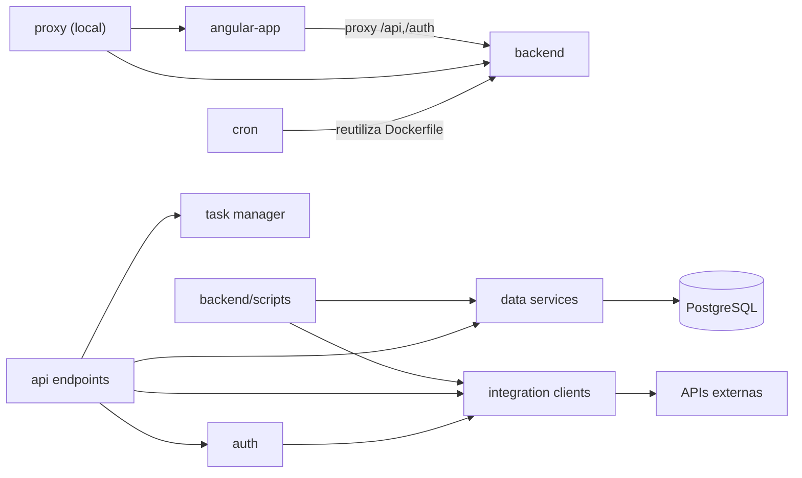

# Dependencias — Futmondo Analytics

> Reverse-engineering (escaneo FULL). Dependencias externas (paquetes y servicios
> de terceros) y dependencias internas cross-package.

## Dependencias externas — servicios de terceros

| Servicio | Uso | Componente que depende | Riesgo |
|----------|-----|------------------------|--------|
| API Futmondo (oficial) | Autenticación y datos del campeonato | `integration clients` (`futmondo_client`), `auth`, `cron` | Disponibilidad/rate limits; token de sesión en memoria por usuario |
| API Sofascore (no oficial) | Ratings de jugadores | `integration clients` (`sofascore_client`) | Baneo de IP (exit code 2 en `sofascore-sync.yml`); sin API key |
| Gemini (`google-genai`) | Chat del asistente | `data services` (`assistant_service`) | Cuota/coste; debe respetar tier gratuito |
| Groq (`groq`) | Fallback del asistente | `data services` (`assistant_service`) | Cuota/coste |
| Neon PostgreSQL | Persistencia productiva | `backend`, `cron`, `scripts` | Tier gratuito (regla coste 0€) |
| Fly.io | Hosting de las 3 apps | despliegue | Free allowance; `min_machines_running=1` |
| GitHub Actions | CI/CD y crons programados | pipelines | Minutos gratuitos |

## Dependencias externas — paquetes

- **Backend** (`requirements.txt`): FastAPI, uvicorn, pydantic, PyJWT,
  psycopg2-binary, curl_cffi, libsql-experimental, requests, python-dotenv,
  python-multipart, google-genai, groq, pytest, pytest-cov, httpx. Versiones en
  `technology-stack.md`.
- **Frontend** (`package.json`): Angular 22 (core/material/cdk/router/forms/
  service-worker), chart.js, ng2-charts, marked, rxjs, typescript; test con
  Karma + Jasmine.
- **Notas**: `libsql-experimental` es dependencia heredada (backend Turso ya no en
  ruta activa). No hay `pyproject.toml`/`setup.py`: las dependencias Python viven
  solo en `requirements.txt`.

## Dependencias internas cross-package

Fallback de texto: el frontend depende del backend en runtime (proxy). El `proxy`
local depende de backend y frontend. El `cron` reutiliza la imagen del backend.
Dentro del backend: los `api endpoints` dependen de `data services`,
`integration clients`, `task manager` y `auth`; `auth` depende de
`integration clients` (validación Futmondo); `data services` depende de
`PostgreSQL`; `integration clients` de las APIs externas. Los `backend/scripts`
dependen de `data services` e `integration clients`.

## Acoplamientos de riesgo

- **`data services` como hub**: los "god files" (`data_manager_v2`,
  `data_sync_service`) concentran el fan-in de endpoints y scripts → alto riesgo
  de cambio.
- **`task manager` in-memory**: acoplamiento implícito al ciclo de vida del
  proceso; reinicios Fly rompen tareas en curso.
- **Build**: frontend y backend son independientes en build; el acoplamiento es
  en runtime (HTTP) y en compose (`proxy`/`frontend` dependen de `backend`
  healthy).
