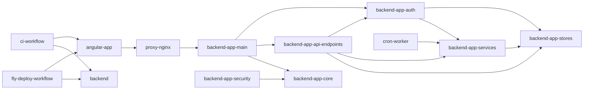

# Dependencias — futmondo-analytics

## Dependencias Externas

Las versiones concretas de librerías están en `technology-stack.md`; aquí se documentan los
servicios y relaciones de dependencia, no se repite la tabla de versiones.

### Servicios externos (runtime)

- **API Futmondo** — fuente autoritativa de datos de fantasy y destino de las pujas
  (`POST {base_url}/1/market/bid`). Consumida por `backend-app-services`
  (`futmondo_client.py`) con credenciales por usuario resueltas en `_helpers`. **El cálculo
  de premios (`sync_prizes`) depende fuertemente de esta API** (standings, rounds,
  round_ranking, dream_team, round_lineup, round_matches) con `time.sleep()` entre llamadas.
- **API Sofascore** — ratings de jugadores, consumida por `sofascore_client.py` vía
  `curl_cffi`.
- **Neon PostgreSQL** (Frankfurt, free) — persistencia productiva; usada por
  `backend-app-stores` y por `backend-app-auth` (SQL crudo directo). Aloja la tabla
  `team_prizes` (fuente de verdad de premios) y `user_championships` (config de premios).
  Fallback SQLite/Turso.

### Plataforma / build / entrega

- **Fly.io** — hosting de `futmondo-api` y `futmondo-app`; crons one-shot (disparan el sync
  que ejecuta `sync_prizes`).
- **GitHub Actions** — CI/CD (gitleaks, pytest, ng test, deploy). Ver
  `code-quality-assessment.md`.
- **npm registry** — dependencias del frontend (`@angular/*`, `vitest`, `jsdom`, `chart.js`,
  `ng2-charts`, `marked`). Restauradas con `npm ci` en ambos workflows.

## Dependencias del Frontend (intent activo)

Detalle de versiones en `technology-stack.md`. Relaciones de dependencia relevantes:

- **`angular-app` runtime** → `@angular/*` (^22.1.0), `chart.js`/`ng2-charts` (gráficos),
  `marked` (assistant), `rxjs`, `tslib`. Todas OSS, coste 0 €.
- **`angular-app` build/test** → `@angular/build` (^22.1.2, builder esbuild/vite),
  `@angular/cli` (^22.1.2), `@angular/compiler-cli` (^22.1.0), `vitest` (^4.0.8) + `jsdom`
  (^25.0.1) para `ng test` vía `@angular/build:unit-test`, `typescript` (~6.0.2), `prettier`
  (^3.8.1).
- **Dependencia de cobertura AUSENTE**: NO hay `@vitest/coverage-v8` (ni `istanbul`) en
  devDependencies — sin proveedor no se puede medir cobertura hoy. Añadirlo (OSS, coste 0 €)
  es un cambio de `package.json`/`package-lock.json` que debe verificarse contra el gate
  `npm ci` + `ng test` antes de pushear (mandato del proyecto para no romper CI).
- **Dependencias de ESLint DECLARADAS pero no instaladas**: `eslint.config.js` importa
  `angular-eslint`/`typescript-eslint`/`@eslint/js`, ausentes de devDependencies; el lint
  sólo funciona en advisory best-effort. Fuera del alcance de cobertura, pero afecta la
  superficie del gate.

## Dependencias de CI/CD (intent activo)

- **`ci.yml`** (PR→`main`) depende de: acción de gitleaks (BLOQUEANTE), Python 3.12 +
  `backend/requirements.txt` (`pytest --cov=app`), Node `'22'` + `npm ci` en `angular-app`
  (`ng test --watch=false` BLOQUEANTE). `ruff`, `pip-audit`, `ng lint`, `npm audit` advisory.
- **`fly-deploy.yml`** (push→`main`) depende de: gitleaks@v2 (BLOQUEANTE), `pytest -q` **sin
  `--cov`** (BLOQUEANTE), Node `'22'` + `npm ci` + `ng test --watch=false` (BLOQUEANTE); y de
  `flyctl` + tokens Fly.io para `deploy-backend`/`deploy-frontend` y el `smoke-test` a
  `/health`.
- **`daily-sync.yml` / `sofascore-sync.yml`** dependen de la imagen cron (`cron-worker`) y de
  `flyctl` para crear/ejecutar/destruir máquinas Fly one-shot.

## Dependencias Internas (cross-package)

Resumen del grafo (detalle por componente en `component-inventory.md`):

<!-- Text fallback: angular-app depende de proxy-nginx, que depende de backend-app-main. main depende de auth, api-endpoints y core. api-endpoints depende de auth, services y stores. auth depende de stores y services. services depende de stores. security depende de core. cron-worker depende de services. Los workflows ci-workflow y fly-deploy-workflow dependen del build/test de angular-app y del backend. -->

## Notas de Dependencias Relevantes al Área de Premios

- **Acoplamiento de escritura de premios**: la fórmula (`data_sync_service.sync_prizes`)
  acopla el cálculo a la API de Futmondo y a la BD (`team_prizes`, `user_championships`) en
  un mismo god-file, sin capa repositorio. La caracterización previa al refactor exige
  **dobles/fakes** de la API de Futmondo y de la capa de persistencia (patrón `conftest.py`,
  almacén en memoria) para test determinista y coste 0 €.
- **Acoplamiento de lectura**: `player_finances` y `balances` dependen de `team_prizes` vía
  `DataManagerV2` (`get_prizes_by_team`); `player_finances` además resuelve identidad por
  team_id/user_id/nombre (frágil, ver `code-quality-assessment.md`).
- **Coste 0 €**: cualquier dependencia nueva debe sostenerse en tiers gratuitos.

## Notas de Dependencias Relevantes a Intents Anteriores (security)

- **FR8**: `SSL_VERIFY=0` está declarado en `docker-compose.yml` pero ningún módulo Python lo
  consume (grep sobre `backend/**` = 0 usos); `verify=` en `futmondo_client.py` no lo lee. El
  flag es una dependencia de configuración huérfana y ausente de `backend/fly.toml [env]`.
- **FR9**: `backend-app-auth` depende directamente de Neon PostgreSQL con SQL crudo; el tipo
  de `expires_at` (aware en PostgreSQL vía `.isoformat()` con offset) es el que dispara el
  bug de precedencia. Evidencia en `code-quality-assessment.md`.
