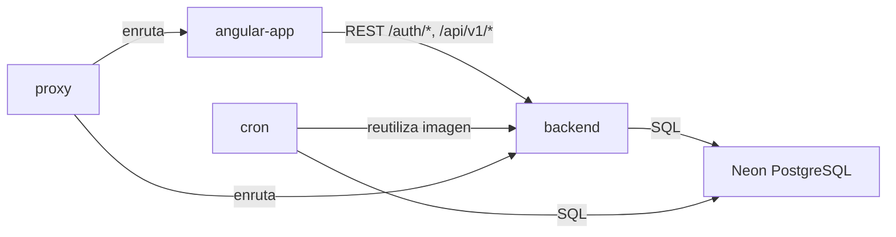
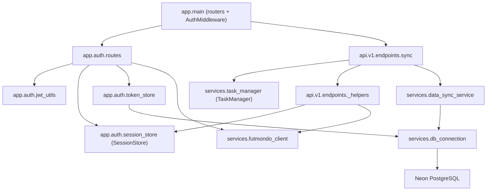

# Dependencies — Futmondo Analytics

> Artefacto CodeKB (architect). Base: `developer-scan.md`. Store STALE. Las versiones de paquetes se catalogan una sola vez en `technology-stack.md`; aquí se documentan **relaciones** de dependencia. Este run añade el detalle de dependencias internas del backend; la prosa del frontend se preserva.

## Dependencias externas (servicios y datos)

| Dependencia | Tipo | Consumidor | Notas |
|-------------|------|------------|-------|
| API Futmondo | Servicio externo | `backend`, `cron` | Autenticación y datos de campeonato; se usa la sesión Futmondo del usuario (`token`+`userid` en el cuerpo) |
| API Sofascore | Servicio externo | `backend`, `cron` | Ratings/tendencia vía `curl_cffi` |
| Proveedores IA (`google-genai`, `groq`) | Servicio externo | `backend` (`assistant_service`) | Assistant |
| Neon PostgreSQL | Datastore gestionado | `backend`, `cron` | Serverless, tier free; único almacén durable en uso |
| Fly.io | Plataforma de despliegue | `angular-app`, `backend`, `cron` | Free allowance |
| GitHub Actions | CI/CD | Repo | Tier free |

## Dependencias cruzadas internas (entre paquetes de despliegue)

<!-- Text fallback: angular-app depende de backend por REST (/auth/*, /api/v1/*). cron reutiliza la imagen del backend. proxy (local) enruta hacia angular-app y backend. backend y cron dependen de Neon PostgreSQL por SQL. -->

- **angular-app → backend**: acoplamiento por contrato HTTP (Bearer JWT). Única dependencia de código cruzada del frontend.
- **cron → backend**: acoplamiento por artefacto de build (comparten `backend/Dockerfile` y `scripts/sync_data.py`). Cambios en el backend afectan al cron.
- **proxy → {angular-app, backend}**: sólo enrutado local (docker-compose); no afecta a producción Fly.

## Dependencias internas del backend (verificado este run)

Grafo de módulos relevante al foco del intent (auth/sesión y sync):

<!-- Text fallback: app.main monta los routers y el AuthMiddleware, y depende de app.auth.routes y api.v1.endpoints.sync. auth.routes depende de jwt_utils (JWT), session_store (SessionStore, memoria), token_store (persistencia) y futmondo_client. _helpers depende de session_store y futmondo_client (de ahi el 403 si la sesion no existe). sync depende de task_manager (memoria), _helpers y data_sync_service. token_store y data_sync_service acceden a Neon a traves de db_connection. -->

- **Acoplamiento a estado en memoria**: `auth.routes` y `_helpers` dependen de `SessionStore`; `sync` depende de `TaskManager`. Ambos almacenes son singletons de proceso no durables → cualquier diseño de durabilidad toca estos bordes.
- **Acoplamiento al abstractor de datos**: todo acceso durable pasa por `db_connection` (sin ORM); un cambio de esquema (p. ej. persistir sesión) se hace con las migraciones ad-hoc de `token_store` o equivalente.
- **Imports diferidos / dinámicos**: `auth.routes` (`refresh`) usa `__import__(...)` para obtener `get_db` en runtime — acoplamiento oculto a `db_connection`.

## Deuda de dependencias (resumen; detalle en `code-quality-assessment.md`)

- `libsql-experimental==0.0.55` y `nixpacks.toml` (Railway, `python311`) — posibles restos heredados a confirmar (deploy actual Fly.io + Neon).
- Divergencia de runtime Python 3.12 (Docker) vs 3.11 (Nixpacks).
- **Preservado (frontend, intents previos)**: `punycode@1.4.1` transitivo eliminado tras la migración de Karma a Vitest (`DEP0040` resuelto); ESLint tooling referenciado pero no instalado en devDependencies del frontend.

## Referencias cruzadas

- Versiones exactas: `technology-stack.md`.
- Componentes que participan en cada relación: `component-inventory.md`.
