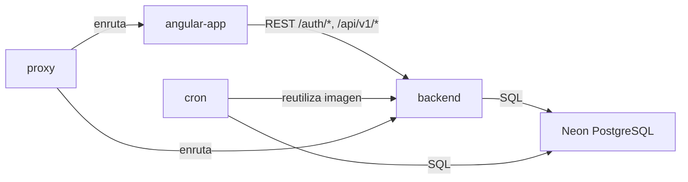

# Dependencies — Futmondo Analytics

> Artefacto CodeKB (architect). Full rescan sobre `./`. Base: `developer-scan.md`.
> Las versiones de paquetes se catalogan una sola vez en `technology-stack.md`; aquí se documentan **relaciones** de dependencia.

## Dependencias externas (servicios y datos)

| Dependencia | Tipo | Consumidor | Notas |
|-------------|------|------------|-------|
| API Futmondo | Servicio externo | `backend`, `cron` | Autenticación y datos de campeonato; se usa la sesión Futmondo del usuario |
| API Sofascore | Servicio externo | `backend`, `cron` | Ratings/tendencia vía `curl_cffi` |
| Proveedores IA (`google-genai`, `groq`) | Servicio externo | `backend` (`assistant_service`) | Assistant |
| Neon PostgreSQL | Datastore gestionado | `backend`, `cron` | Serverless, tier free |
| Fly.io | Plataforma de despliegue | `angular-app`, `backend`, `cron` | Free allowance |
| GitHub Actions | CI/CD | Repo | Tier free |

## Dependencias cruzadas internas (entre paquetes)

<!-- Text fallback: angular-app depende de backend por REST (/auth/*, /api/v1/*). cron reutiliza la imagen del backend. proxy (local) enruta hacia angular-app y backend. backend y cron dependen de Neon PostgreSQL por SQL. -->

- **angular-app → backend**: acoplamiento por contrato HTTP (Bearer JWT). Única dependencia de código cruzada del frontend.
- **cron → backend**: acoplamiento por artefacto de build (comparten `backend/Dockerfile` y `scripts/sync_data.py`). Cambios en el backend afectan al cron.
- **proxy → {angular-app, backend}**: sólo enrutado local (docker-compose); no afecta a producción Fly.

## Deuda de dependencias (resumen; detalle en `code-quality-assessment.md`)

- `punycode@1.4.1` transitivo en `angular-app/package-lock.json` (origen de `DEP0040`).
  **Nota de vigilancia (intent `260914-ci-tooling-mejoras`, FR2 / BR2.1):** la cadena
  transitiva concreta es `karma`/`karma-jasmine-html-reporter` → `dom-serialize@2.2.1`
  → `ent@2.2.2` → `punycode@1.4.1`, toda ella `dev: true` (tooling de test, no runtime).
  Por eso `npm ls punycode` sobre el árbol resuelto da vacío fuera del stack de Karma.
  **Resolución:** la retirada de las devDependencies de Karma en la migración a Vitest
  (mejora 4, FR4.2 / BR4.2) elimina `dom-serialize → ent → punycode` del árbol, con lo
  que el aviso `DEP0040` desaparece sin actualizar ninguna dependencia directa de runtime
  ni introducir coste. Si tras retirar Karma persistiera `DEP0040` por otra transitiva,
  registrar aquí la nueva cadena y la versión objetivo que la eliminaría.
- `libsql-experimental==0.0.55` y `nixpacks.toml` (Railway) — posibles restos heredados a confirmar.
- ESLint tooling referenciado pero no instalado en devDependencies del frontend.

## Referencias cruzadas

- Versiones exactas: `technology-stack.md`.
- Componentes que participan en cada relación: `component-inventory.md`.
