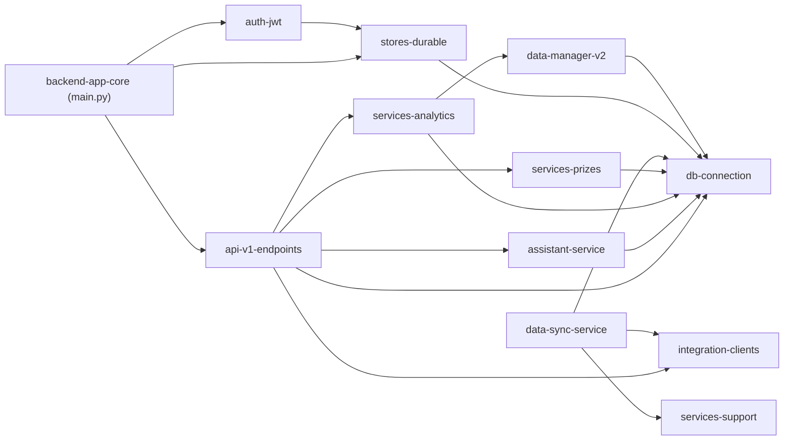

# Dependencies — futmondo-analytics

Versiones exactas en `technology-stack.md`; responsabilidades de componente en
`component-inventory.md`. Aquí se registra el grafo de dependencias.

## Dependencias externas (servicios/APIs)

- **Neon PostgreSQL** (Frankfurt, free) — persistencia; accedido vía
  `db-connection` (`psycopg2-binary`).
- **API Futmondo** — auth de usuario y datos de campeonato; vía
  `futmondo_client.py` (`requests`).
- **API Sofascore** — ratings/odds; vía `sofascore_client.py` (`curl_cffi`);
  error tipado `SofascoreIPBanError`.
- **LLM Groq** (`openai/gpt-oss-120b`) — primario del asistente (`groq`).
- **LLM Gemini** (`google-genai`) — **fallback** del asistente.
- **Fly.io** / **GitHub Actions** — plataforma de deploy y CI (tier free).

## Dependencias externas (paquetes)

Backend: `fastapi`, `uvicorn`, `pydantic`, `psycopg2-binary`, `curl_cffi`,
`PyJWT`, `requests`, `google-genai`, `groq`, `python-dotenv`,
`python-multipart` (+ test: `pytest`, `pytest-cov`, `httpx`). Sin lockfile en
backend (pip + `requirements.txt` con pins). Frontend: Angular 22 + Material 22,
Chart.js/ng2-charts, `@vitest/coverage-v8`, gestionado con `npm ci` sobre
`package-lock.json`.

## Dependencias internas cross-package (backend)

Grafo (A → B = "A depende de B"):

```mermaid
graph LR
  Core["backend-app-core (main.py)"] --> Endpoints["api-v1-endpoints"]
  Core --> Auth["auth-jwt"]
  Core --> Stores["stores-durable"]
  Endpoints --> Assistant["assistant-service"]
  Endpoints --> Analytics["services-analytics"]
  Endpoints --> Prizes["services-prizes"]
  Endpoints --> Clients["integration-clients"]
  Endpoints --> DB["db-connection"]
  Assistant --> DB
  Analytics --> DManager["data-manager-v2"]
  Analytics --> DB
  Prizes --> DB
  Sync["data-sync-service"] --> Clients
  Sync --> DB
  Sync --> Support["services-support"]
  Auth --> Stores
  Stores --> DB
  DManager --> DB
```

Fallback de texto: `backend-app-core` monta `api-v1-endpoints`, inicializa
`auth-jwt` y `stores-durable`. Los endpoints dependen de `assistant-service`,
`services-analytics`, `services-prizes`, `integration-clients` y `db-connection`.
`services-analytics` lee de `data-manager-v2` (vía adaptador) y de
`db-connection`. `data-sync-service` depende de `integration-clients`,
`db-connection` y `services-support`. Todo lo que persiste depende de
`db-connection`.

## Acoplamientos notables (deuda)

- SQL crudo embebido en los god-files (`assistant-service`, `data-manager-v2`,
  `data-sync-service`) acopla la lógica al esquema implícito; la Oleada 1
  (`services-analytics`) rompe ese acoplamiento tras un `Protocol` + adaptador.
- El esquema de varias tablas se crea en caliente (`CREATE TABLE IF NOT EXISTS`),
  atando componentes al esquema sin migraciones (detalle en
  `code-quality-assessment.md`).

## Frontend → backend

`frontend-angular-app` depende de `api-v1-endpoints` vía HTTP a través del proxy
nginx (`/api/*`, `/auth/*`). El frontend está fuera del alcance de cambio del
intent activo.
