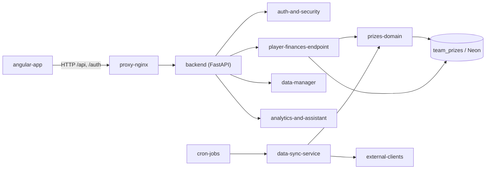

# Dependencies — futmondo-analytics

## External Dependencies

### Runtime services

- **Neon PostgreSQL** (Frankfurt, tier free) — persistencia, vía `DATABASE_URL`.
- **API Futmondo** — datos de campeonato + autenticación (`futmondo_client.py`,
  auth por usuario, credenciales cifradas con `FUTMONDO_CRED_KEY`).
- **API Sofascore** — ratings/rendimiento (`sofascore_client.py` vía `curl_cffi`).
- **Gemini / Groq** — asistente IA (`google-genai`, `groq`).
- **Fly.io** (región `cdg`) — hosting de ambas apps + crons one-shot.
- **GitHub Actions** — CI/CD.

Todas sostenibles en tiers gratuitos (coste 0 €).

### Library dependencies (versiones)

Versiones concretas de frontend y backend inventariadas en `technology-stack.md`
(evitar duplicación). Resumen de pinning: backend `requirements.txt` pinneado a
`==`; frontend con `vitest`/`@vitest/coverage-v8` en pin exacto `4.1.11` y resto en
rangos `^`/`~` idiomáticos de Angular.

## Internal Cross-Package Dependencies

```mermaid
graph LR
  FE["angular-app"] -->|HTTP /api, /auth| NG["proxy-nginx"]
  NG --> BE["backend (FastAPI)"]
  BE --> AUTH["auth-and-security"]
  BE --> PF["player-finances-endpoint"]
  PF --> PRIZES["prizes-domain"]
  SYNC["data-sync-service"] --> PRIZES
  SYNC --> CLIENTS["external-clients"]
  BE --> DM["data-manager"]
  BE --> AA["analytics-and-assistant"]
  CRON["cron-jobs"] --> SYNC
  PRIZES --> DB[("team_prizes / Neon")]
  PF --> DB
```

Texto fallback: `angular-app` llama vía nginx a `backend`; `backend` depende de
`auth-and-security`, `player-finances-endpoint`, `data-manager` y
`analytics-and-assistant`. `player-finances-endpoint` y `data-sync-service`
dependen de `prizes-domain`, que escribe `team_prizes`; `player-finances-endpoint`
lee esa misma tabla. `data-sync-service` usa `external-clients`; `cron-jobs`
dispara el sync.

### Dependencias clave para el intent

- `calculator-component` → `rosterService` + `/api/v1/market/today` (**no** depende
  de `player-finances-endpoint` hoy).
- `player-finances-endpoint` → `prizes-domain` vía la tabla `team_prizes` (única
  fuente de verdad). Punto de integración natural si la mejora añade cálculo
  financiero a la Calculadora, tras una capa estrecha testeable.

## Sources

- `developer-scan.md`: Frameworks & Libraries, APIs Discovered, Handoff Summary.
- Nombres de componente verbatim en `component-inventory.md`; versiones en
  `technology-stack.md`.
