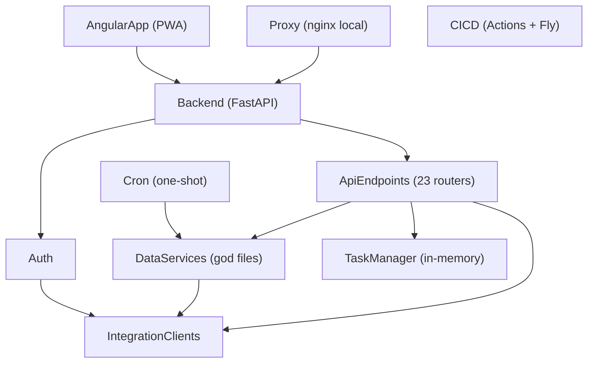

# Catálogo de Componentes — futmondo-analytics (arquitectura actual + mapa de mejoras)

> Intent de análisis: este catálogo refleja los componentes REALES del proyecto
> (no se crean componentes nuevos) y anota, por componente, qué requisitos de
> mejora (FR de `requirements.md`) le afectan, para que sirva de mapa "dónde toca
> cada mejora" al abrir futuros intents. Fuente: `component-inventory.md` y
> `architecture.md` del codekb. [component-inventory] [architecture] [requirements]

## Part A — Catálogo (machine-readable)

```yaml
components:
  - name: AngularApp
    summary: Frontend PWA (SPA + service worker) con 17 features; incluye nginx que proxya /api y /auth en producción.
    behaviour: >
      Presenta presupuesto, mercado, finanzas, evolución, estadísticas y asistente;
      valida min/max de puja en el cliente; guarda access token en memoria y consume
      refresh vía cookie HttpOnly. Cobertura de test efectivamente ~0 (skipTests global).
    responsibilities:
      - UI/UX y navegación de la aplicación
      - Validación de entrada en cliente (min/max de puja)
      - Recuperación de sesión al refrescar (splash)
    depends_on:
      - component: Backend
        interaction: consume /api/v1/* y /auth/* vía proxy nginx
        style: sync
    dependents: []
    external_dependencies:
      - name: Service Worker / navegador
        kind: other
        purpose: PWA, cache de assets
    entities: []
    improvements:            # FRs que afectan a este componente (no es campo estándar; anotación del análisis)
      - FR10   # cobertura de tests frontend / skipTests
      - FR6    # validación de price también en backend (el cliente ya valida)

  - name: Backend
    summary: API FastAPI (Python 3.12), monolito por capas con 23 routers y AuthMiddleware central.
    behaviour: >
      Orquesta autenticación, sincronización, analítica, mercado y asistente.
      Punto de entrada de todas las mejoras de servidor. Manejo de errores demasiado
      amplio (159 except Exception) concentrado aquí.
    responsibilities:
      - Exponer la API REST y aplicar el middleware de auth
      - Coordinar los subsistemas internos
    depends_on:
      - component: Auth
        interaction: verificación de JWT y sesión por request
        style: sync
      - component: ApiEndpoints
        interaction: montaje de routers
        style: sync
    dependents:
      - component: AngularApp
        interaction: sirve la API
      - component: Proxy
        interaction: enruta /api y /auth al Backend (solo local)
    external_dependencies:
      - name: PostgreSQL (Neon)
        kind: database
        purpose: persistencia productiva
    entities: []
    improvements:
      - FR3    # manejo de errores explícito (reduce except Exception)
      - FR14   # podar multi-backend BD + constantes hardcodeadas
      - FR15   # doble montaje de rutas /matchdays

  - name: Auth
    summary: Subsistema de autenticación (login Futmondo, JWT, refresh tokens, sesiones).
    behaviour: >
      Login valida contra Futmondo y emite JWT (access 60 min + refresh 30 días HttpOnly).
      SessionStore guarda la sesión Futmondo por usuario EN MEMORIA, incluidas las
      credenciales en claro. token_store persiste refresh tokens; posible bug de
      expiración (naive/aware) en is_refresh_token_valid.
    responsibilities:
      - Emisión/verificación de JWT
      - Gestión de refresh tokens y sesiones Futmondo
    depends_on:
      - component: IntegrationClients
        interaction: valida credenciales vía FutmondoClient
        style: sync
    dependents:
      - component: Backend
        interaction: middleware y dependencias de auth
    external_dependencies:
      - name: PostgreSQL (Neon)
        kind: database
        purpose: tabla de usuarios y refresh tokens
    entities:
      - name: RefreshToken
        identifier: token_hash
        attributes: [user_id, token_hash, expires_at]
      - name: FutmondoSession
        identifier: user_id
        attributes: [user_id, client, email, password]
    improvements:
      - FR1    # durabilidad de la sesión (parte sesión)
      - FR5    # no guardar credenciales en claro
      - FR9    # bug de expiración de refresh token (a verificar)

  - name: DataServices
    summary: Lógica de negocio pesada y acceso a datos (god files).
    behaviour: >
      data_manager_v2.py (166 KB), data_sync_service.py (84 KB), analytics_service.py,
      assistant_service.py, photo_service.py. Concentran el riesgo de cambio; intestables
      sin fakes. Orquestan los 11 pasos de sync.
    responsibilities:
      - Acceso y transformación de datos
      - Orquestación de la sincronización y analítica
      - Incluye los scripts one-shot de backend/scripts (sync_data.py, exportadores), consolidados aquí por compartir la lógica de datos/sync
    depends_on:
      - component: IntegrationClients
        interaction: obtener datos de Futmondo/Sofascore
        style: sync
    dependents:
      - component: ApiEndpoints
        interaction: invocados por los routers
      - component: Cron
        interaction: reutiliza la lógica de sync (scripts/sync_data.py)
    external_dependencies:
      - name: PostgreSQL (Neon)
        kind: database
        purpose: lectura/escritura de datos del campeonato
      - name: Gemini / Groq (asistente IA)
        kind: third-party-api
        purpose: chat del asistente (google-genai + fallback groq)
    entities: []
    improvements:
      - FR13   # descomponer god files (planificar aparte)
      - FR3    # errores explícitos en pasos de sync

  - name: IntegrationClients
    summary: Clientes de integración externa (Futmondo, Sofascore).
    behaviour: >
      futmondo_client.py (requests.Session, endpoints heterogéneos) y sofascore_client.py
      (curl_cffi impersonate=chrome, throttle 750 ms, sin API key). Sofascore es frágil
      (baneo de IP). El reemplazo de la caché Sofascore hace DELETE antes de repoblar
      (no transaccional).
    responsibilities:
      - Comunicación con las APIs externas
      - Gestión de throttling e impersonación TLS
    depends_on: []
    dependents:
      - component: Auth
        interaction: validación de credenciales
      - component: DataServices
        interaction: obtención de datos
      - component: ApiEndpoints
        interaction: proxy de pujas y datos de mercado
    external_dependencies:
      - name: API Futmondo
        kind: third-party-api
        purpose: datos del campeonato y pujas
      - name: API Sofascore
        kind: third-party-api
        purpose: ratings de jugadores
    entities:
      - name: SofascoreCacheEntry
        identifier: player_id
        attributes: [player_id, rating, payload]
    improvements:
      - FR2    # reemplazo transaccional de la caché Sofascore
      - FR4    # robustez de las integraciones externas

  - name: ApiEndpoints
    summary: 23 routers por dominio bajo /api/v1/*.
    behaviour: >
      Incluye sync (trigger/polling), sofascore_sync, market (puja sin validación de
      rango en backend), reset_db/populate (destructivos tras ENABLE_DB_ADMIN), photos
      (posible exposición sin auth), assistant.
    responsibilities:
      - Exponer operaciones por dominio
      - Aplicar validación de entrada (hoy insuficiente en market)
    depends_on:
      - component: DataServices
        interaction: lógica de negocio
        style: sync
      - component: TaskManager
        interaction: seguimiento de tareas de sync
        style: sync
      - component: IntegrationClients
        interaction: proxy de pujas y datos
        style: sync
    dependents:
      - component: Backend
        interaction: montados en main.py
    external_dependencies: []
    entities: []
    improvements:
      - FR6    # validar price en backend
      - FR7    # verificar exposición de /photos
      - FR18   # verificar guarda ENABLE_DB_ADMIN de endpoints destructivos
      - FR15   # doble montaje /matchdays

  - name: TaskManager
    summary: Gestor de tareas de sync en background (estado in-memory).
    behaviour: >
      create/mark_running/update_progress/mark_completed/mark_failed, dedupe por
      campeonato, expiración >10 min. Estado singleton EN MEMORIA — se pierde en
      reinicios de la máquina Fly.
    responsibilities:
      - Seguimiento del progreso de las tareas de sync
    depends_on: []
    dependents:
      - component: ApiEndpoints
        interaction: consultado por sync trigger/polling
    external_dependencies: []
    entities:
      - name: SyncTask
        identifier: task_id
        attributes: [task_id, championship_id, status, progress, started_at]
    improvements:
      - FR1    # durabilidad del estado de sync

  - name: Cron
    summary: Proceso one-shot (Fly.io futmondo-cron) que refresca datos sin usuario.
    behaviour: >
      Ejecuta python scripts/sync_data.py reutilizando la imagen del backend; refresco
      programado multi-championship.
    responsibilities:
      - Sincronización programada de datos
    depends_on:
      - component: DataServices
        interaction: reutiliza la lógica de sync
        style: sync
    dependents: []
    external_dependencies:
      - name: PostgreSQL (Neon)
        kind: database
        purpose: escritura de datos refrescados
      - name: API Futmondo
        kind: third-party-api
        purpose: origen de datos
    entities: []
    improvements:
      - FR16   # revisar patrón de llamadas y coste dentro de tiers gratuitos

  - name: Proxy
    summary: nginx reverse proxy (solo docker-compose local).
    behaviour: >
      Enruta al frontend y backend en local; en producción su rol lo cumple el nginx
      embebido en el frontend. docker-compose fija SSL_VERIFY=0 en el backend local.
    responsibilities:
      - Enrutado local de peticiones
    depends_on:
      - component: Backend
        interaction: proxy /api y /auth
        style: sync
    dependents: []
    external_dependencies: []
    entities: []
    improvements:
      - FR8    # confirmar que SSL_VERIFY=0 no llega a producción

  - name: CICD
    summary: Área transversal de integración y despliegue (GitHub Actions + Fly.io).
    behaviour: >
      4 workflows: ci.yml (gitleaks/pytest/ng test bloqueantes; lint/audits advisory),
      fly-deploy.yml (verify → deploy → smoke /health), daily-sync.yml, sofascore-sync.yml.
      El gate de tests pasa con cobertura ~0.
    responsibilities:
      - Verificación en PR y despliegue en push a main
    depends_on: []
    dependents: []
    external_dependencies:
      - name: GitHub Actions
        kind: other
        purpose: CI/CD (tier gratuito)
      - name: Fly.io
        kind: other
        purpose: despliegue
    entities: []
    improvements:
      - FR11   # piso de cobertura backend
      - FR12   # linters/audits advisory → bloqueante escalonado
      - FR17   # endurecer pipeline de despliegue (verify efectivo + rollback)
```

## Part B — Vista humana

### Diagrama de componentes



<!-- Text fallback: AngularApp llama a Backend; Backend usa Auth y monta ApiEndpoints; Auth valida vía IntegrationClients; DataServices usa IntegrationClients; ApiEndpoints llaman a DataServices, TaskManager e IntegrationClients; Cron reutiliza DataServices; Proxy (local) enruta a Backend. CICD es transversal (sin llamadas de runtime). -->

### Resumen de componentes

| Component | Purpose | Depends On | Dependents | Entities Owned |
|-----------|---------|------------|------------|----------------|
| AngularApp | Frontend PWA | Backend | — | — |
| Backend | API FastAPI (monolito por capas) | Auth, ApiEndpoints | AngularApp, Proxy | — |
| Auth | Autenticación JWT + sesiones | IntegrationClients | Backend | RefreshToken, FutmondoSession |
| DataServices | Lógica de negocio y datos (god files) | IntegrationClients | ApiEndpoints, Cron | — |
| IntegrationClients | Clientes Futmondo/Sofascore | — | Auth, DataServices, ApiEndpoints | SofascoreCacheEntry |
| ApiEndpoints | 23 routers por dominio | DataServices, TaskManager, IntegrationClients | Backend | — |
| TaskManager | Tareas de sync (in-memory) | — | ApiEndpoints | SyncTask |
| Cron | Sync programada | DataServices | — | — |
| Proxy | nginx local | Backend | — | — |
| CICD | CI/CD transversal | — | — | — |

### Propiedad de entidades

| Entity | Owning Component | Identifier | Attributes | References |
|--------|------------------|------------|------------|------------|
| RefreshToken | Auth | token_hash | user_id, token_hash, expires_at | — |
| FutmondoSession | Auth | user_id | user_id, client, email, password | — |
| SofascoreCacheEntry | IntegrationClients | player_id | player_id, rating, payload | — |
| SyncTask | TaskManager | task_id | task_id, championship_id, status, progress, started_at | — |

### Dependencias externas

| Component | Dependency | Kind | Purpose |
|-----------|------------|------|---------|
| Backend | PostgreSQL (Neon) | database | persistencia productiva |
| Auth | PostgreSQL (Neon) | database | usuarios y refresh tokens |
| DataServices | PostgreSQL (Neon) | database | datos del campeonato |
| DataServices | Gemini / Groq (asistente IA) | third-party-api | chat del asistente |
| IntegrationClients | API Futmondo | third-party-api | datos y pujas |
| IntegrationClients | API Sofascore | third-party-api | ratings |
| Cron | PostgreSQL (Neon), API Futmondo | database / third-party-api | refresco programado |
| CICD | GitHub Actions, Fly.io | other | CI/CD y despliegue (tiers gratuitos) |

### Mapa de mejoras por componente

| Component | Requisitos de mejora (FR) |
|-----------|---------------------------|
| AngularApp | FR6 (validación cliente), FR10 (tests frontend) |
| Backend | FR3, FR14, FR15 |
| Auth | FR1 (sesión), FR5, FR9 |
| DataServices | FR13 (god files), FR3 |
| IntegrationClients | FR2, FR4 |
| ApiEndpoints | FR6, FR7, FR18, FR15 |
| TaskManager | FR1 (estado de sync) |
| Cron | FR16 |
| Proxy | FR8 |
| CICD (transversal) | FR11, FR12, FR17 |

### Rationale

| Component | Por qué es un bloque separado |
|-----------|-------------------------------|
| AngularApp | Ciclo de vida y despliegue independientes (SPA/PWA); distinta tecnología. |
| Backend | Proceso desplegable propio; orquesta el resto. |
| Auth | Concern de seguridad con datos y lógica propios (tokens, sesiones). |
| DataServices | Distinto ritmo de cambio y concentración de lógica pesada; candidato a descomposición. |
| IntegrationClients | Aísla dependencias externas frágiles (ACL de facto frente a Futmondo/Sofascore). |
| ApiEndpoints | Superficie de API por dominio; frontera de validación de entrada. |
| TaskManager | Estado de tareas con ciclo de vida propio; hoy no durable. |
| Cron | Desplegable independiente (job programado sin usuario). |
| Proxy | Configuración de enrutado, no lógica; solo local. |
| CICD | Concern transversal de verificación y despliegue. |

Alternativas rechazadas y decisiones de fondo: ver `decisions.md`.

> Nota de coherencia: las aristas `depends_on`/`dependents` se han verificado
> simétricas; Cron reutiliza la imagen del Backend pero en runtime accede a
> DataServices/BD/Futmondo directamente, por lo que no declara dependencia de
> runtime con Backend.

## Assumptions & Open Questions

None.
