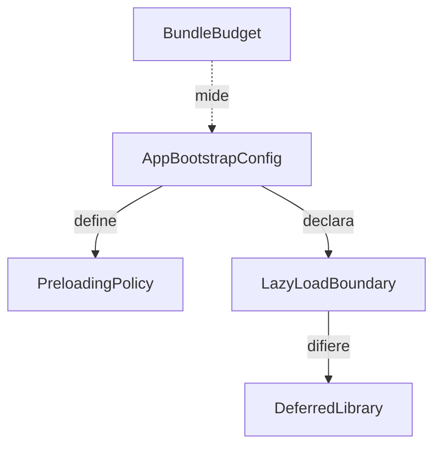
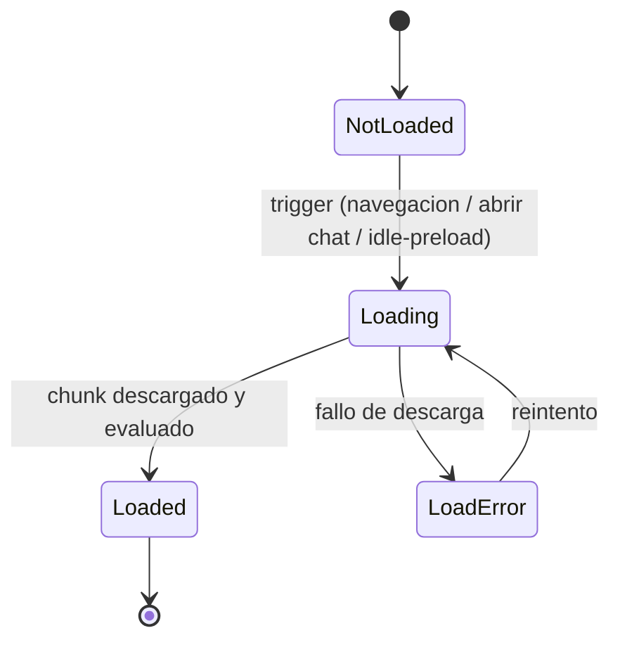

# Functional Spec — Optimización del bundle inicial (frontend Angular)

> Stage 3.1 Functional Design · Intent `260914-bundle-optimization` · scope refactor · Minimal.
> Fuente de verdad para los **flujos de carga** y las **transiciones de estado de carga**. Vistas derivadas: diagrama ER (de `entities.md`) y resumen de reglas (de `rules.md`).
> Sin cambio funcional, coste 0 €.

## Sources

- `requirements.md` — FR1–FR4, NFR1–NFR4.
- `entities.md` — modelo de entidades de configuración/carga (fuente de verdad de datos).
- `rules.md` — reglas `BRx.y` (fuente de verdad de la lógica).
- `codekb/futmondo-analytics/architecture.md` — subgrafo del bundle inicial y flujos existentes (login, puja, sync) que NO cambian.

## Diagrama de entidades (derivado de entities.md)

<!-- Text fallback: AppBootstrapConfig define una PreloadingPolicy y declara varias LazyLoadBoundary. Cada LazyLoadBoundary difiere una o mas DeferredLibrary (chart.js, ng2-charts, marked). BundleBudget mide el resultado (chunk inicial) de la configuracion de AppBootstrapConfig. -->

## Flujos de carga (workflows — fuente de verdad)

### WF1 — Arranque de la aplicación (bundle inicial reducido)

1. `main.ts` ejecuta `bootstrapApplication(App, appConfig)`.
2. `AppBootstrapConfig` se evalúa **sin** registrar Chart.js de forma global (BR1.1) y **sin** importar el chat/`marked` de forma estática (BR2.1).
3. El chunk inicial contiene solo: el shell (App + Material del chrome, que sigue eager y legítimo), routing lazy, y la configuración; NO contiene chart.js, ng2-charts ni marked (BR1.2, BR2.2).
4. Tras estabilizar, la `PreloadingPolicy` en modo `delayed-idle` espera inactividad antes de precargar chunks lazy (BR3.1); no precarga inmediatamente.

### WF2 — Abrir el chat del asistente (carga diferida de marked)

1. El usuario pulsa el FAB del asistente (`AssistantFabComponent`, eager).
2. La app carga bajo demanda `AssistantChatComponent` y su dependencia `marked` (frontera `assistant-chat`, BR2.1).
3. El chat se renderiza y procesa Markdown con el mismo saneo/lógica que hoy (BR2.3).
4. Cierres posteriores no descargan el chunk (ya cargado); reaperturas son inmediatas.

### WF3 — Navegar a una vista de gráficos (carga diferida de Chart.js)

1. El usuario navega a `features/evolution` o `features/stats` (rutas lazy).
2. Al cargarse la ruta, se registra Chart.js/ng2-charts a nivel de esa ruta/componente (BR1.1) y se carga bajo demanda (frontera `feature-evolution`/`feature-stats`).
3. El gráfico se renderiza igual que antes (BR1.3).

### WF4 — Precarga con retardo tras inactividad

1. La app arranca y estabiliza (WF1).
2. La `PreloadingPolicy` detecta inactividad durante `idleDelay` (valor concreto a decidir en implementación con medición).
3. Transcurrida la inactividad, precarga los chunks lazy en segundo plano (BR3.1), reduciendo el pico de transferencia inmediato respecto a `PreloadAllModules` (NFR4), sin engordar el chunk inicial.

### WF5 — Restaurar el budget (orden de trabajo)

1. Se completan WF1–WF3 (recorte de cargas eager: BR1.*, BR2.*, BR3.*).
2. Solo entonces se fija en `angular.json` `maximumError: 1MB` y `maximumWarning: ~900kB` (BR4.1, BR4.3).
3. El build de producción se ejecuta y debe pasar con esos budgets (BR4.2, NFR1).
4. Verificación de no regresión: suite (`ng test`/vitest) verde + comprobación manual de gráficos y chat (BR5.1, NFR2).

## Transiciones de estado de carga (state machine)

Estado de una `DeferredLibrary` / frontera de carga a lo largo del ciclo de vida de la sesión:

<!-- Text fallback: Una dependencia diferida empieza en NotLoaded. Un trigger (navegacion a ruta de graficos, abrir el chat, o precarga por inactividad) la pasa a Loading. Si el chunk se descarga y evalua bien, pasa a Loaded (estado final de la sesion). Si la descarga falla, pasa a LoadError, desde donde puede reintentarse (vuelve a Loading). -->

Notas de comportamiento (sin cambio funcional):
- **NotLoaded → Loading** es la única diferencia observable frente al comportamiento actual: antes ya estaba `Loaded` en el arranque. La transición añade una latencia mínima en el primer uso de cada frontera (aceptado en requirements).
- **LoadError**: si la carga diferida de un chunk lazy falla (p. ej. red), el manejo de error debe ser al menos tan robusto como el actual del routing lazy de Angular; no se degrada la robustez existente.

## Resumen de reglas (derivado de rules.md)

| ID | Resumen |
|----|---------|
| BR1.1–BR1.3 | Chart.js/ng2-charts: registro lazy, fuera del inicial, gráficos siguen OK |
| BR2.1–BR2.3 | Chat/marked: carga bajo demanda, fuera del inicial, chat sigue OK |
| BR3.1–BR3.3 | Precarga con retardo, sin dependencias de pago, navegación OK |
| BR4.1–BR4.3 | Restaurar budget 1MB + warning <1MB, build pasa, recortar antes de restaurar |
| BR5.1–BR5.2 | Suite verde + verificación manual; no sustituir librerías |

## Assumptions & Open Questions

### Assumptions
- `[assumption]` Recortar las tres cargas eager (charts, marked) más la precarga con retardo es suficiente para dejar el chunk inicial < 1 MB. Si no, haría falta un recorte adicional (a decidir en construcción con la medición del build).

### Open Questions
- El valor concreto de `idleDelay` de la precarga se decide en implementación con medición (no bloquea el diseño).
