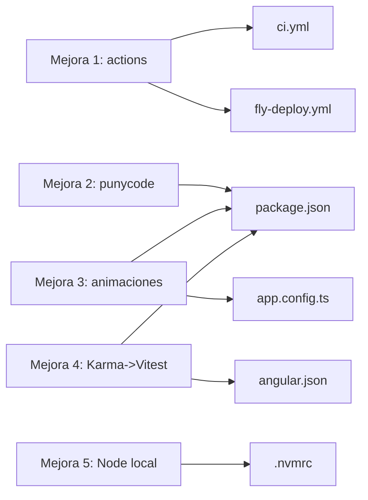
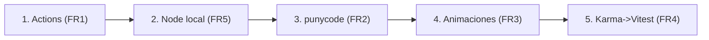

# Functional Specification — Mejoras de CI/Tooling

> Etapa Functional Design (Construction) · Intent `260914-ci-tooling-mejoras`.
> Fuente de verdad de los **flujos de aplicación** de cada mejora. Deriva de `requirements.md` (FR1-FR6), `entities.md` y `rules.md`.
> Este intent no tiene entidades de dominio ni state machines de negocio; las "workflows" aquí son las secuencias de aplicación y verificación de cada mejora técnica.

## Vista de configuración (derivada de entities.md)

<!-- Text fallback: Mejora 1 (actions) modifica ci.yml y fly-deploy.yml. Mejora 2 (punycode) modifica package.json (deps transitivas). Mejora 3 (animaciones) afecta a app.config.ts y package.json (decisión: conservar). Mejora 4 (Karma->Vitest) modifica angular.json y package.json (devDependencies). Mejora 5 (Node local) crea .nvmrc. -->

## Resumen de reglas (derivado de rules.md)

Ver `rules.md` para el detalle. En síntesis: BR1.x (actions a Node 24, sin flag inseguro), BR2.1 (punycode eliminado o vigilado), BR3.x (sin migración, conservar provider por Material, documentar), BR4.x (runner vitest, sin restos Karma, no regresión, verificación pre-push), BR5.x (.nvmrc + README), BR6.x (no regresión, secuencia por riesgo, coste 0€).

## Flujos de aplicación (source of truth)

### Flujo 1 — Actualización de GitHub Actions (FR1, BR1.x)

1. Inventariar las referencias `uses:` en `ci.yml` y `fly-deploy.yml`.
2. Identificar las que no usan Node 24. Estado verificado: `actions/setup-node@v4` en ambos workflows es el objetivo principal; `checkout@v5`, `setup-python@v5`, `gitleaks-action@v2` ya cumplen.
3. Subir `actions/setup-node@v4` → última major estable (v5) por tag de major.
4. Revisar `superfly/flyctl-actions/setup-flyctl@master` (fijar a tag estable si procede) y `browser-actions/setup-chrome@v1`.
5. Confirmar ausencia de `ACTIONS_ALLOW_USE_UNSECURE_NODE_VERSION` (BR1.2 — ya se cumple).
6. **Verificación**: ejecutar los workflows (PR/push); comprobar que no aparece el aviso "Node 20 is being deprecated" y que `fly-deploy.yml` sigue desplegando (BR6.1).

### Flujo 2 — punycode DEP0040 (FR2, BR2.1)

1. Localizar qué dependencias transitivas arrastran `punycode` (p. ej. `npm ls punycode` en el frontend y equivalente en backend si aplica).
2. Actualizar las dependencias directas que las arrastran hasta la última versión en tier gratuito.
3. Re-ejecutar build/CI y comprobar si el aviso DEP0040 desaparece.
4. **Bifurcación (BR2.1)**: si persiste por una transitiva sin versión libre de `punycode`, registrar nota de vigilancia (cadena transitiva concreta + versión objetivo) en el CodeKB `dependencies.md` (`aidlc/spaces/default/codekb/futmondo-analytics/dependencies.md`).
5. **Verificación**: aviso ausente, o presente con nota de vigilancia; sin efecto funcional.

### Flujo 3 — Animaciones Angular 22 (FR3, BR3.x)

1. **Verificación de uso** (hecha): `grep` de imports/triggers de `@angular/animations` en `angular-app/src` = 0 resultados. No hay animaciones propias de la API antigua.
2. **Decisión**: no hay migración (BR3.1). Conservar `provideAnimationsAsync()` en `app.config.ts` y la dependencia `@angular/animations` porque Angular Material (37 ficheros) depende del sistema de animaciones (BR3.2).
3. **Documentar** el acoplamiento Angular Material ↔ sistema de animaciones y dejar una observación de vigilancia para revisar si versiones futuras de Angular/Material cambian este acoplamiento o publican guía de migración (BR3.3). La documentación de esta observación es el entregable de la mejora 3 en este intent.
4. **Verificación**: la salida de build/test del frontend no contiene avisos de deprecación de `@angular/animations` (BR3.4); Material sigue funcionando.

### Flujo 4 — Karma → Vitest (FR4, BR4.x) — mayor riesgo, va al final

1. **Línea base (BR4.3)**: ejecutar `ng test` con el runner actual (Karma) y registrar que la suite está en verde (conjunto de tests que pasan).
2. Cambiar en `angular.json` el builder de test `@angular/build:unit-test` de `runner: karma` a `runner: vitest`.
3. Ajustar dependencias: retirar `karma.conf.js` y las devDependencies de Karma (`karma`, `karma-chrome-launcher`, `karma-coverage`, `karma-jasmine`, `karma-jasmine-html-reporter`). Evaluar `jasmine-core`/`@types/jasmine` (retirar si Vitest no los usa; conservar si algún spec los importa).
4. Ejecutar `ng test` con Vitest y comparar contra la línea base: ningún test que pasaba antes debe fallar (BR4.3, no regresión).
5. Considerar (fuera del criterio mínimo) simplificar los pasos de CI que instalan Chrome headless / usan `--browsers=ChromeHeadless`, ya que Vitest no requiere navegador por defecto — solo si no rompe el gate.
6. **Pre-push (BR4.4)**: verificar `npm ci` + `ng test` en local (o revisar el lock) antes de pushear.
7. **Verificación**: suite en verde con Vitest en local y CI; sin restos de Karma; el gate de CI pasa (BR6.1).

### Flujo 5 — Versión de Node local (FR5, BR5.x)

1. Determinar la versión objetivo: `>=22.22.3` (o la LTS que usa CI; CI usa Node `22`).
2. Crear `.nvmrc` en la raíz del repo con esa versión.
3. Documentar en README el uso de `nvm use` y la versión fijada (BR5.2).
4. **Verificación**: `nvm use` en la raíz deja Node en la versión declarada y desaparece el aviso `EBADENGINE` al instalar/usar los paquetes de Angular 22.

## Secuencia global (FR6, BR6.2)

<!-- Text fallback: Orden por riesgo creciente: 1) Actions, 2) Node local, 3) punycode, 4) animaciones, 5) Karma->Vitest (la de mayor riesgo, al final). -->

Criterio transversal (BR6.1): tras cada paso, la suite de tests existente permanece en verde y `fly-deploy.yml` sigue desplegando. Todo bajo coste 0€ (BR6.3).

## State machine

No aplica: ninguna de las mejoras introduce una entidad con ciclo de vida de estados. El "estado" de cada mejora es binario (pendiente → aplicada y verificada) y se gobierna por sus reglas de verificación anteriores.

## Escenarios de negocio (happy / unhappy)

- **Happy path**: cada mejora se aplica en orden, su verificación pasa, la suite queda verde y el despliegue sigue operativo.
- **Unhappy — regresión de tests (Karma→Vitest)**: si tras migrar algún test que pasaba falla, se trata como regresión (BR4.3) y no se acepta; se corrige o se revierte el cambio de runner.
- **Unhappy — aviso persistente (punycode)**: si el aviso DEP0040 no puede eliminarse sin coste, se documenta la transitiva responsable (BR2.1) en lugar de forzar una actualización con coste.
- **Unhappy — Material degradado (animaciones)**: escenario evitado por diseño al conservar el provider (BR3.2); si alguien retirara el provider, la UX de Material (ripples/overlays/menús) se degradaría.

## Referencias cruzadas

- Entidades de configuración: `entities.md`.
- Reglas técnicas verificables (BRx.y): `rules.md`.
- Trazabilidad FR→BR: `traceability.json`.
- Alcance de UI (sin cambios de componentes): `frontend-components.md`.
