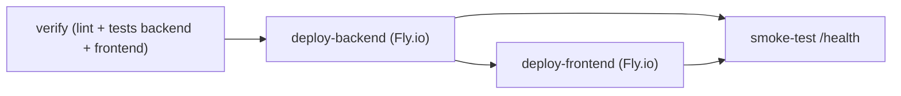

# Configuración de CD — Mejoras de CI/Tooling

> Etapa Deployment Pipeline (Operation) · Intent `260914-ci-tooling-mejoras` · Scope `refactor` · Brownfield.
> Documenta el pipeline de CD **existente** reflejando los cambios de las mejoras. No modifica la estrategia de despliegue.

## Pipeline de CD actual

Definido en `.github/workflows/fly-deploy.yml`, se dispara en `push` a `main` (y `workflow_dispatch`). Modelo trunk-based: deploy on merge a `main`.

<!-- Text fallback: el job verify (tests backend pytest + frontend Vitest) gatea los deploys via needs. deploy-backend despliega el backend a Fly.io; deploy-frontend depende de deploy-backend; smoke-test verifica /health del backend tras ambos deploys. -->

## Jobs

| Job | Descripción | Dependencia |
|-----|-------------|-------------|
| `verify` | Lint + tests bloqueantes (backend pytest, frontend `ng test` con **Vitest**) | — |
| `deploy-backend` | `flyctl deploy` del backend a Fly.io | `needs: verify` |
| `deploy-frontend` | `flyctl deploy` del frontend a Fly.io | `needs: deploy-backend` |
| `smoke-test` | `curl` a `/health` del backend (5 reintentos, 200 OK) | `needs: [deploy-backend, deploy-frontend]` |

## Cambios introducidos por este intent (mejoras 1 y 4)

- **Mejora 1 (FR1)**: `actions/setup-node@v4` → `@v5` (runtime Node 24) en el job `verify`. Sin `ACTIONS_ALLOW_USE_UNSECURE_NODE_VERSION` (NFR4).
- **Mejora 4 (FR4)**: el paso de tests del frontend en `verify` pasó de `ng test --watch=false --browsers=ChromeHeadless` (Karma) a `ng test --watch=false` (**Vitest**); se retiró el paso `browser-actions/setup-chrome@v1`, ya que Vitest no requiere navegador.

## Objetivos de despliegue (Fly.io)

| Componente | App | Región | Config |
|------------|-----|--------|--------|
| Frontend (Angular + nginx) | `futmondo-app` | cdg (París) | `angular-app/fly.toml`, health check `/` |
| Backend (FastAPI) | `futmondo-api` | (ver `backend/fly.toml`) | health check `/health` |

## Secretos requeridos (Fly.io / GitHub Actions)

- `FLY_API_TOKEN` (GitHub secret) — despliegue a Fly.io.
- `DATABASE_URL`, `JWT_SECRET` (Fly secrets del backend). No hardcodeados; gestionados como secretos (regla de seguridad de construcción).

## Coste

Todo en tier gratuito: Fly.io free allowance, GitHub Actions free, Neon free (NFR1, coste 0€).
