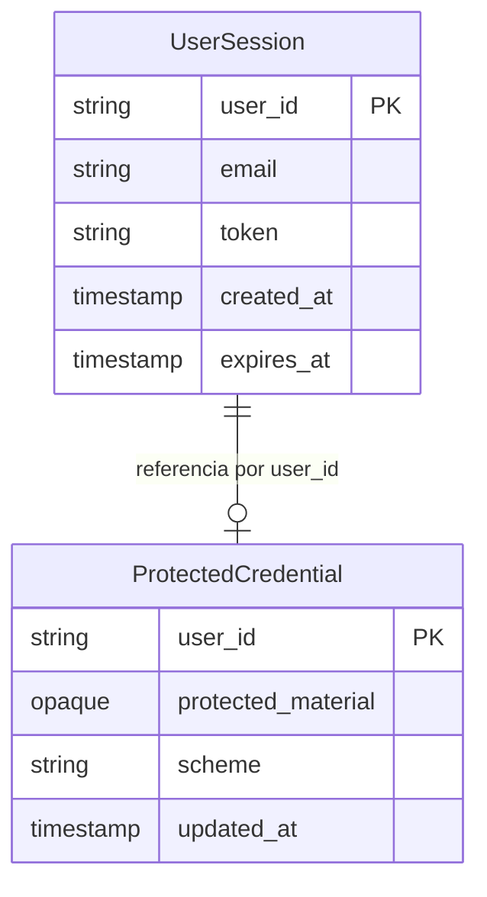

# Functional Spec — u1-durable-session

> Diseño funcional (Construction). Fuente de verdad de **workflows** y **máquina de estados**
> de la sesión durable. Incluye vistas derivadas: diagrama entidad-relación (derivado de
> `entities.md`) y resumen de reglas (derivado de `rules.md`). Técnicamente agnóstico.

## Sources

- entities.md (UserSession, ProtectedCredential) [scope]
- rules.md (BR1.1–BR1.6) [scope]
- requirements.md (FR1.1/1.2/1.3, FR5.1), contract-summary.md (C1) [scope]
- functional-design-questions.md (Q3-A máquina de estados, Q5-A errores) [Q3] [Q5]

## Máquina de estados de la sesión (fuente de verdad)

Estados observables de la sesión Futmondo de un usuario:

- `active` — sesión válida en vigor (dentro del TTL).
- `expired` — persistida pero `now > expires_at` (BR1.1); se trata como ausente.
- `absent` — no persistida (nunca creada, purgada, o perdida — aunque ahora es durable).
- `rehydrating` — `ensureSession` está intentando reconstruir la sesión.
- `unrecoverable` — no hay medio de re-auth o el re-auth falló ⇒ 401 accionable (BR1.3).

```mermaid
stateDiagram-v2
  [*] --> active: login (persiste sesión + credencial)
  active --> expired: now > expires_at (BR1.1)
  active --> absent: (proceso reiniciado; caché vacío, BD consultada)
  expired --> rehydrating: ensureSession
  absent --> rehydrating: ensureSession (1er uso / refresh)
  rehydrating --> active: can_reauthenticate && re-auth Futmondo OK (FR1.2)
  rehydrating --> unrecoverable: None / re-auth falla (FR1.3)
  unrecoverable --> [*]: 401 accionable (re-login del usuario)
  active --> [*]: logout
```

<!-- Text fallback: Tras el login la sesión está active y se persiste junto con la credencial protegida. Pasa a expired cuando now supera expires_at (TTL 12h, BR1.1), o se considera absent si el proceso se reinició y el caché está vacío. Desde expired o absent, ensureSession (disparado por /auth/refresh o por el primer uso del cliente Futmondo) pasa a rehydrating. Si can_reauthenticate es cierto y el re-auth contra Futmondo tiene éxito, vuelve a active (FR1.2); si resolve devuelve None o el re-auth falla, pasa a unrecoverable y el backend responde 401 accionable pidiendo re-login (FR1.3). logout termina la sesión. -->

## Workflows (fuente de verdad)

### WF1 — Login (persistencia de sesión y credencial)

1. El usuario envía email + password a `/auth/login`.
2. El backend valida contra la API Futmondo (cliente existente) y obtiene `token` + `user_id`.
3. `CredentialProtection.protect(user_id, password)` almacena el medio de re-auth protegido
   (nunca el password en claro, BR1.4); fija `scheme`.
4. `SessionRepository` hace upsert de `UserSession` (una fila por `user_id`, `expires_at`=+12h, BR1.1).
5. El caché `SessionStore` se puebla (best-effort, BR1.5).
6. Se emite el access token + refresh cookie (comportamiento existente).

### WF2 — Rehidratación en `/auth/refresh` (FR1.2/FR1.3)

1. Llega `POST /auth/refresh` con la cookie de refresh; se renueva el JWT (comportamiento existente).
2. Además, se invoca `SessionService.ensureSession(user_id)` (BR1.6, idempotente BR1.2).
3. Si la sesión está `active` (caché o BD) → no se hace nada más.
4. Si `expired`/`absent` → `rehydrating`: `can_reauthenticate` → `resolve` → re-auth Futmondo →
   `active` (FR1.2), o → `unrecoverable` (FR1.3).

### WF3 — Rehidratación en el primer uso del cliente Futmondo (FR1.2/FR1.3)

1. Una petición a `/api/v1/*` con Bearer válido llega a `FutmondoClientAccessor`
   (`_helpers.get_user_futmondo_client`).
2. Antes de construir el cliente, se invoca `ensureSession(user_id)` (BR1.6).
3. `active` → se construye el cliente y sigue la petición.
4. `rehydrating` → `active` (FR1.2) → se construye el cliente; o → `unrecoverable` ⇒ **401
   accionable** en lugar del **403 opaco** actual (FR1.3, elimina la deuda central del intent).

### WF4 — Purga perezosa de sesión expirada

1. Al leer una `UserSession` con `now > expires_at` (BR1.1), se trata como ausente y se elimina
   de forma perezosa (sin job de limpieza; coste 0 €); el flujo continúa como en `absent`.

## Casos de error y concurrencia (BR1.2, BR1.3, BR1.6; Q5-A)

- **Fallo de descifrado/almacén de credencial:** `CredentialProtection` lanza una excepción
  tipada del dominio (no `except: pass`); `SessionService` la traduce a un error accionable sin
  filtrar el secreto (BR1.4). No hay reintentos internos (BR1.6).
- **Re-auth fallido (credenciales ya inválidas en Futmondo):** estado `unrecoverable` → 401
  accionable (BR1.3).
- **Concurrencia (dos peticiones rehidratando el mismo usuario):** el lock por `user_id` (BR1.1)
  serializa; la segunda reutiliza la sesión ya reconstruida (idempotencia, BR1.2).
- **Discrepancia caché↔BD:** gana la BD (BR1.5).

## Vista derivada — diagrama entidad-relación (de entities.md)

<!-- Text fallback: UserSession (PK user_id; email, token, created_at, expires_at) referencia opcionalmente (0..1) a ProtectedCredential (PK user_id; protected_material opaco, scheme, updated_at) por user_id. La sesión no accede al contenido de la credencial; solo CredentialProtection lo hace. -->

## Vista derivada — resumen de reglas (de rules.md)

| ID | Regla | Fuente |
|----|-------|--------|
| BR1.1 | TTL absoluto 12h + locks por usuario | FR1.1, C4 |
| BR1.2 | `ensureSession` idempotente | FR1.2 |
| BR1.3 | Reconstrucción condicional; si no, 401 accionable | FR1.2, FR1.3 |
| BR1.4 | Nunca contraseña en claro | FR5.1, NFR1 |
| BR1.5 | BD autoridad; caché best-effort | NFR5 |
| BR1.6 | Disparadores refresh + primer uso; sin reintentos internos | FR1.2, ADR-005 |
