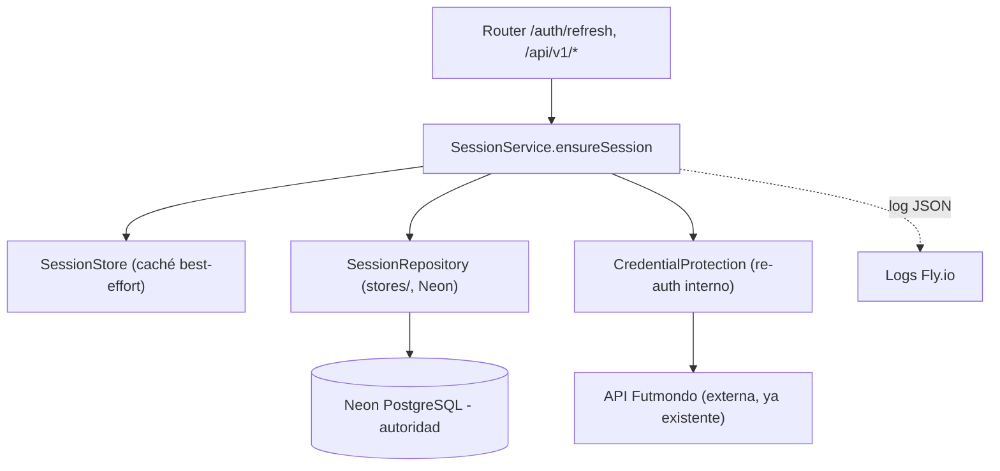

# Logical Components — u1-durable-session

> Etapa NFR Design (Construction). Vista a nivel de componente de dónde aplican los patrones NFR:
> fronteras de servicio, dominios de fallo, radio de impacto y aislamiento. Puente hacia
> Infrastructure Design. Es diseño lógico, no código.

## Sources

- inception/domain-design (CredentialProtection, SessionRepository, SessionService, SessionStore) [scope]
- functional-design/functional-spec.md (WF1–WF4; máquina de estados) [scope]
- inception/contract-design/contract-summary.md (C1 in-proc; ninguna API externa nueva) [scope]
- nfr-design-questions.md (Q1–Q6) [Q1] [Q2] [Q3] [Q4] [Q5] [Q6]
- Los cinco diseños NFR de esta etapa (performance/security/scalability/reliability/observability) [scope]

## Inventario de componentes lógicos

Todos los componentes viven **dentro de un único proceso** (`futmondo-api`, FastAPI). No hay servicio
nuevo desplegable ni frontera de red nueva (contract-summary: ninguna API externa nueva).

| Componente | Responsabilidad | Toca la credencial | Patrones NFR aplicados |
|------------|-----------------|--------------------|------------------------|
| `SessionService` | Orquesta `ensureSession` (WF2/WF3); máquina de estados; idempotencia (BR1.2) | No | Reliability (rehidratación, degradación 401), Performance (idempotencia) |
| `CredentialProtection` | `protect`/`resolve`/`can_reauthenticate`; re-auth interno (Q2-A) | **Sí (única)** | Security (frontera de confianza, handle opaco, sin plaintext) |
| `SessionRepository` (capa `stores/`) | Acceso a `UserSession`/`ProtectedCredential` en Neon; lock `FOR UPDATE`; DELETE perezoso | Indirecto (persiste handle) | Scalability (BD autoridad), Reliability (lock cross-instancia), Performance (≤1 op BD) |
| `SessionStore` (caché) | Caché en memoria best-effort (BR1.5) | No | Performance (cache-aside, 0 ops en hit) |
| Punto de log estructurado | Emite eventos de sesión JSON con correlation-id | No (prohibido) | Observability (NFR-OBS.1), Security (nunca secretos) |

<!-- Text fallback: Los routers existentes (/auth/refresh y /api/v1/*) llaman a SessionService.ensureSession. SessionService consulta primero la caché best-effort SessionStore, y como autoridad el SessionRepository (capa stores/) sobre Neon PostgreSQL. Cuando hace falta reconstruir, delega en CredentialProtection, que re-autentica internamente contra la API Futmondo externa y devuelve una sesión ya lista o None. La autoridad de estado y concurrencia es Neon. SessionService emite logs JSON estructurados hacia los logs de Fly.io, nunca con la credencial. -->

## Fronteras de servicio y aislamiento

- **Frontera de seguridad (la crítica):** `CredentialProtection` es el **único** componente que toca
  material sensible (Q2-A). El re-auth ocurre dentro de él; el secreto no cruza a `SessionService`
  ni a los routers. Aislar aquí minimiza el radio de exposición de la credencial.
- **Frontera de persistencia:** `SessionRepository` es la única puerta a la BD para el estado de
  sesión (capa `stores/` estrecha). Corrige el patrón brownfield de SQL-en-router; concentra el lock
  `FOR UPDATE` y el DELETE perezoso.
- **Frontera de caché:** `SessionStore` es best-effort y no autoritativo; su fallo o vaciado degrada
  a 1 lectura de BD, no a error.

## Dominios de fallo y radio de impacto

| Dominio de fallo | Qué falla | Radio de impacto | Mitigación |
|------------------|-----------|------------------|------------|
| API Futmondo caída/lenta | Re-auth transitorio falla | Solo usuarios que rehidratan en ese momento | Error tipado, no destruye handle (Q4-A); el usuario reintenta |
| Credencial inválida | `resolve` = `None` | Un usuario | `unrecoverable` → 401 accionable (NFR5.3) |
| Neon no responde | Lectura/escritura de sesión | Todos (dependencia ya existente) | Error tipado y visible; no silencioso |
| Caché vaciada (reinicio) | `SessionStore` vacío | Ninguno funcional | Rehidratación desde BD (NFR5.1) |
| Fallo de almacén de credencial | `protect`/`resolve` lanza | Un usuario | Excepción tipada (BR1.4), sin filtrar secreto |

## Recursos compartidos

- **Neon PostgreSQL** (`db_connection`): compartido con el resto del backend. Esta unidad añade una
  tabla de sesión de ~1 fila por usuario; impacto de capacidad despreciable (dentro del tier free).
- **API Futmondo:** dependencia externa compartida; ya usada hoy. El re-auth añade llamadas solo en
  rehidratación (como máximo 1 por reinicio y usuario, NFR2.2).
- **Logs de Fly.io:** canal compartido de observabilidad; se añaden eventos de sesión sin PII sensible.

## Nota para Infrastructure Design

No se requieren servicios de infraestructura nuevos: sin servicios Fly.io nuevos, sin caché externo,
sin réplicas. La única superficie de infra tocada es (1) la tabla de sesión en la BD Neon ya
provisionada y (2) **una variable de secreto nueva en Fly.io, `FUTMONDO_CRED_KEY`**, que cifra el
handle de re-auth en reposo (ver security-design). Es una `secret` de Fly.io (coste 0€, sin servicio
nuevo), gestionada como los demás secretos productivos. Coste 0€ (NFR3) preservado.
