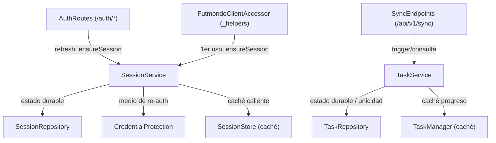

# Component Catalogue — Durabilidad del estado y credenciales (FR1/FR5)

> Etapa Domain Design (Inception). Bloques **lógicos de software** (código que
> escribimos) para hacer durable la sesión Futmondo y las tareas de sync, y
> aislar el tratamiento de credenciales. No fija topología de despliegue, stack
> ni patrones NFR (eso llega en Units Generation / NFR / Infrastructure).
> El bloque `yaml` es la fuente de verdad; las vistas humanas se derivan de él.

## Sources

- requirements.md — FR1.1–FR1.6, FR5.1–FR5.2, NFR1–NFR5, C1–C5 [scope]
- codekb: architecture.md, component-inventory.md — `SessionStore`, `TaskManager`, `token_store`, `db_connection`, `_helpers`, `auth/routes`, `api/v1/sync` [desc]
- team-practices.md — capa de persistencia estrecha (`stores/`), sin ampliar SQL-en-router ni god-files [scope]
- project.md — NEVER contraseña en claro (ni memoria ni BD); coste 0 € [scope]
- domain-design-questions.md — Q1–Q6 confirmadas [Q1] [Q2] [Q3] [Q4] [Q5] [Q6]

## Component Catalogue (source of truth)

```yaml
components:
  - name: SessionService
    summary: Lógica de dominio de la sesión Futmondo (TTL, locks, rehidratación idempotente).
    behaviour: >
      Posee la operación idempotente ensureSession(user_id): busca la sesión (caché
      SessionStore → SessionRepository); si falta y CredentialProtection ofrece un medio
      de re-autenticación, reconstruye la sesión Futmondo de forma transparente (FR1.2);
      si no puede reconstruir, señala un error claro y accionable para 401 (FR1.3) en
      lugar del 403 opaco actual. Preserva el TTL de 12h y la semántica de locks por
      usuario (FR1.1). Invocada desde /auth/refresh y desde el primer uso del cliente
      Futmondo, de modo que la rehidratación es idempotente venga de donde venga (Q2).
      No almacena la contraseña en claro (delega en CredentialProtection).
    responsibilities:
      - Rehidratación idempotente de la sesión Futmondo tras reinicio (FR1.2/FR1.3)
      - Aplicación del TTL de 12h y de los locks de concurrencia por usuario (FR1.1/C4)
      - Decidir 401 accionable cuando no hay medio de reconstruir la sesión (FR1.3)
    depends_on:
      - component: SessionRepository
        interaction: leer/escribir el estado durable de la sesión (fuente de verdad)
        style: sync
      - component: CredentialProtection
        interaction: obtener/validar el medio de re-autenticación para reconstruir la sesión
        style: sync
      - component: SessionStore
        interaction: caché de proceso best-effort del camino caliente de sesión
        style: sync
    dependents:
      - component: AuthRoutes
        interaction: /auth/refresh dispara ensureSession para rehidratar temprano
      - component: FutmondoClientAccessor
        interaction: primer uso del cliente Futmondo dispara ensureSession
      - component: SessionStore
        interaction: el caché es poblado/invalidado por el servicio (no llama de vuelta)
    external_dependencies: []
    entities: []

  - name: SessionRepository
    summary: Persistencia durable de la sesión Futmondo en Neon vía db_connection.
    behaviour: >
      Fuente de verdad de la sesión Futmondo por usuario. Lee/escribe UserSession en
      Neon PostgreSQL a través del abstractor db_connection existente, tras una capa de
      persistencia estrecha (patrón stores/), sin ampliar el SQL-en-router ni los
      god-files (C3). No asume instancia única (NFR5). Guarda una referencia a la
      credencial protegida, nunca el password en claro (FR5.1).
    responsibilities:
      - Persistir y recuperar la entidad UserSession de forma durable (FR1.1)
      - Ser la fuente de verdad de la sesión frente al caché en memoria (Q5/Q6)
    depends_on: []
    dependents:
      - component: SessionService
        interaction: acceso durable a la sesión
    external_dependencies:
      - name: Neon PostgreSQL
        kind: database
        purpose: almacenamiento durable de la sesión (vía db_connection)
    entities:
      - name: UserSession
        identifier: user_id
        attributes: [user_id, email, token, expires_at, created_at]
        references:
          - entity: ProtectedCredential
            owned_by: CredentialProtection
            relationship: cada UserSession referencia una ProtectedCredential del mismo usuario

  - name: TaskService
    summary: Lógica de dominio de las tareas de sync (unicidad, idempotencia, interrupción por reinicio).
    behaviour: >
      Posee las reglas de las tareas de sync sobre el estado persistido: rechaza (409)
      lanzar una tarea cuando ya hay una activa según la BD, salvo que la previa esté
      marcada como interrumpida-por-reinicio, en cuyo caso permite relanzarla (FR1.6);
      al arrancar el proceso, marca como interrumpida-por-reinicio cualquier tarea que
      quedara "en curso" (FR1.5, no se reanuda automáticamente). La unicidad y la
      concurrencia se arbitran contra el estado persistido, no contra un lock en memoria
      (NFR5/Q6). Expone el estado consultable tras un reinicio (FR1.4).
    responsibilities:
      - Garantizar "una sola tarea activa por usuario" contra estado persistido (FR1.6)
      - Marcar tareas en curso como interrumpidas-por-reinicio al arrancar (FR1.5)
      - Exponer el estado de tarea consultable tras reinicio (FR1.4)
    depends_on:
      - component: TaskRepository
        interaction: leer/escribir el estado durable de las tareas (fuente de verdad)
        style: sync
      - component: TaskManager
        interaction: caché de proceso best-effort del progreso de tareas
        style: sync
    dependents:
      - component: SyncEndpoints
        interaction: trigger/consulta de tareas de sync
      - component: TaskManager
        interaction: el caché es poblado/invalidado por el servicio (no llama de vuelta)
    external_dependencies: []
    entities: []

  - name: TaskRepository
    summary: Persistencia durable del estado de las tareas de sync en Neon vía db_connection.
    behaviour: >
      Fuente de verdad del estado/progreso de las tareas de sync. Lee/escribe SyncTask
      en Neon PostgreSQL a través de db_connection, tras la capa de persistencia estrecha
      (C3). Soporta la evaluación de "tarea activa" para la unicidad (FR1.6) sin asumir
      instancia única (NFR5). Una tarea es consultable tras un reinicio (FR1.4).
    responsibilities:
      - Persistir y recuperar la entidad SyncTask de forma durable (FR1.4)
      - Ser la autoridad de concurrencia para "una activa" (FR1.6/Q6)
    depends_on: []
    dependents:
      - component: TaskService
        interaction: acceso durable al estado de las tareas
    external_dependencies:
      - name: Neon PostgreSQL
        kind: database
        purpose: almacenamiento durable del estado de tareas (vía db_connection)
    entities:
      - name: SyncTask
        identifier: task_id
        attributes: [task_id, user_id, status, progress, interrupted_by_restart, created_at, updated_at]
        references: []

  - name: CredentialProtection
    summary: Bloque de seguridad dueño de proteger la credencial Futmondo (frontera de FR5).
    behaviour: >
      Aísla el tratamiento de la credencial Futmondo tras una interfaz estrecha (proteger
      / resolver medio de re-autenticación / indicar si es posible re-autenticar). El
      mecanismo fino de FR5.2 — no persistir la contraseña (re-auth) o cifrarla en reposo
      con clave gestionada como secret de Fly.io — se decide en Functional/NFR design; la
      frontera del componente queda aislada aquí para no comprometer esa elección. Regla
      dura: la contraseña Futmondo nunca se almacena en claro, ni en memoria ni en BD
      (FR5.1, project.md).
    responsibilities:
      - Proteger la credencial Futmondo sin exponer el password en claro (FR5.1)
      - Ofrecer (o denegar) un medio de re-autenticación para la rehidratación de sesión (FR1.2/FR5.2)
    depends_on: []
    dependents:
      - component: SessionService
        interaction: consulta si hay medio de re-auth para reconstruir la sesión
    external_dependencies:
      - name: Neon PostgreSQL
        kind: database
        purpose: almacenar el material de credencial protegido (nunca el password en claro), si el diseño fino opta por persistirlo
    entities:
      - name: ProtectedCredential
        identifier: user_id
        attributes: [user_id, protected_material, scheme, updated_at]
        references: []

  - name: SessionStore
    summary: Caché de proceso en memoria de la sesión Futmondo (rol degradado; ya no autoritativo).
    behaviour: >
      Se conserva como caché best-effort del camino caliente de sesión delante de
      SessionService (lectura: memoria → BD; escritura: BD + memoria). Deja de ser la
      fuente de verdad y deja de guardar el password en claro: solo mantiene la referencia
      a la credencial protegida. Minimiza cambios en los llamadores (auth/routes, _helpers)
      y protege la latencia del camino de sesión (NFR2/Q5). Nunca es la autoridad de
      concurrencia (Q6).
    responsibilities:
      - Cachear en proceso la sesión activa para el camino caliente (NFR2)
    depends_on: []
    dependents:
      - component: SessionService
        interaction: lectura rápida de la sesión antes de ir a BD; poblado/invalidado por el servicio
    external_dependencies: []
    entities: []

  - name: TaskManager
    summary: Caché de proceso en memoria del progreso de tareas de sync (rol degradado; ya no autoritativo).
    behaviour: >
      Se conserva como caché best-effort del progreso de tareas delante de TaskService.
      Deja de ser la fuente de verdad; la autoridad de "una activa" y del estado durable
      reside en TaskRepository/BD (Q6). El polling de progreso puede servirse desde memoria
      cuando esté disponible y caer a BD tras un reinicio.
    responsibilities:
      - Cachear en proceso el progreso de la tarea para el polling
    depends_on: []
    dependents:
      - component: TaskService
        interaction: lectura rápida del progreso antes de ir a BD; poblado/invalidado por el servicio
    external_dependencies: []
    entities: []

  - name: AuthRoutes
    summary: Rutas de autenticación existentes (login/refresh/logout) — punto de disparo de rehidratación.
    behaviour: >
      Componente existente (app/auth/routes.py). En /auth/refresh, además de renovar el
      JWT, dispara SessionService.ensureSession para rehidratar la sesión Futmondo cuando
      sea posible (Q2). No posee lógica de dominio de sesión; solo la invoca.
    responsibilities:
      - Emitir/renovar JWT y gestionar la cookie de refresh (comportamiento existente)
      - Disparar la rehidratación idempotente de sesión en /auth/refresh (FR1.2)
    depends_on:
      - component: SessionService
        interaction: rehidratar la sesión Futmondo en el refresh
        style: sync
    dependents: []
    external_dependencies:
      - name: API Futmondo
        kind: third-party-api
        purpose: validación de credenciales en el login (comportamiento existente)
    entities: []

  - name: FutmondoClientAccessor
    summary: Acceso al cliente Futmondo por usuario (_helpers.get_user_futmondo_client) — punto de disparo.
    behaviour: >
      Componente existente (_helpers.get_user_futmondo_client). Deja de devolver 403 opaco
      cuando falta la sesión: delega en SessionService.ensureSession, que intenta reconstruir
      la sesión (FR1.2) o produce el error accionable para 401 (FR1.3). No posee la lógica de
      reconstrucción; solo la invoca.
    responsibilities:
      - Obtener un cliente Futmondo autenticado por usuario para /api/v1/*
      - Disparar la rehidratación idempotente en el primer uso tras reinicio (FR1.2/FR1.3)
    depends_on:
      - component: SessionService
        interaction: asegurar/reconstruir la sesión antes de construir el cliente
        style: sync
    dependents: []
    external_dependencies:
      - name: API Futmondo
        kind: third-party-api
        purpose: llamadas de dominio con la sesión del usuario (comportamiento existente)
    entities: []

  - name: SyncEndpoints
    summary: Endpoints de sync existentes (trigger + polling) — punto de disparo de tareas.
    behaviour: >
      Componente existente (app/api/v1/endpoints/sync.py). trigger delega en TaskService,
      que aplica la unicidad 409 contra estado persistido (FR1.6); el polling task/{id} lee
      el estado (caché → BD), consultable tras reinicio (FR1.4). No posee la lógica de
      dominio de tareas; solo la invoca.
    responsibilities:
      - Exponer POST trigger y GET task/{id} (comportamiento existente)
      - Delegar unicidad e idempotencia en TaskService (FR1.6/FR1.4)
    depends_on:
      - component: TaskService
        interaction: crear tarea (con unicidad) y consultar progreso
        style: sync
    dependents: []
    external_dependencies: []
    entities: []
```

## Component Diagram



<!-- Text fallback: AuthRoutes (/auth/refresh) y FutmondoClientAccessor (_helpers.get_user_futmondo_client) invocan SessionService.ensureSession para rehidratar la sesión. SessionService depende de SessionRepository (estado durable en Neon), CredentialProtection (medio de re-auth) y SessionStore (caché de proceso, dirección única: el servicio lee/escribe el caché, el caché no llama de vuelta). SyncEndpoints (/api/v1/sync) invoca TaskService, que depende de TaskRepository (estado durable y autoridad de unicidad) y de TaskManager (caché de progreso, dirección única). Los almacenes en memoria (SessionStore, TaskManager) son caché best-effort poblados/invalidados por su servicio; la BD es la fuente de verdad y el árbitro de concurrencia. -->

## Component Summary

| Component | Purpose | Depends On | Dependents | Entities Owned |
|-----------|---------|------------|------------|----------------|
| SessionService | Lógica de sesión Futmondo (TTL, locks, rehidratación idempotente) | SessionRepository, CredentialProtection, SessionStore | AuthRoutes, FutmondoClientAccessor | — |
| SessionRepository | Persistencia durable de la sesión (Neon), fuente de verdad | — | SessionService | UserSession |
| TaskService | Lógica de tareas de sync (unicidad, idempotencia, interrupción) | TaskRepository, TaskManager | SyncEndpoints | — |
| TaskRepository | Persistencia durable de tareas (Neon), autoridad de unicidad | — | TaskService | SyncTask |
| CredentialProtection | Frontera de seguridad de la credencial Futmondo (FR5) | — | SessionService | ProtectedCredential |
| SessionStore | Caché de proceso de la sesión (rol degradado) | SessionService | SessionService | — |
| TaskManager | Caché de proceso del progreso de tareas (rol degradado) | TaskService | TaskService | — |
| AuthRoutes | Rutas de auth existentes; dispara rehidratación en refresh | SessionService | — | — |
| FutmondoClientAccessor | Acceso al cliente Futmondo; dispara rehidratación en 1er uso | SessionService | — | — |
| SyncEndpoints | Endpoints de sync existentes (trigger/polling) | TaskService | — | — |

## Entity Ownership

| Entity | Owning Component | Identifier | Attributes | References |
|--------|------------------|------------|------------|------------|
| UserSession | SessionRepository | user_id | user_id, email, token, expires_at, created_at | ProtectedCredential (owned_by CredentialProtection): cada sesión referencia una credencial protegida del mismo usuario |
| SyncTask | TaskRepository | task_id | task_id, user_id, status, progress, interrupted_by_restart, created_at, updated_at | — |
| ProtectedCredential | CredentialProtection | user_id | user_id, protected_material, scheme, updated_at | — |

## External Dependencies

| Component | Dependency | Kind | Purpose |
|-----------|------------|------|---------|
| SessionRepository | Neon PostgreSQL | database | Almacenamiento durable de la sesión (vía db_connection) |
| TaskRepository | Neon PostgreSQL | database | Almacenamiento durable del estado de tareas (vía db_connection) |
| CredentialProtection | Neon PostgreSQL | database | Material de credencial protegido (nunca password en claro), si el diseño fino persiste |
| AuthRoutes | API Futmondo | third-party-api | Validación de credenciales en login (existente) |
| FutmondoClientAccessor | API Futmondo | third-party-api | Llamadas de dominio con la sesión del usuario (existente) |

## Rationale

| Component | Por qué es un bloque separado |
|-----------|-------------------------------|
| SessionService | Concern distinto (lógica de dominio: TTL, locks, reconstrucción) con change rate ligado a reglas de negocio; separado del SQL/tabla que cambia con el esquema (Q1-C). |
| SessionRepository | Data ownership propio (UserSession) y lifecycle ligado al esquema de BD; capa estrecha `stores/` exigida por C3. Fuente de verdad (Q5/Q6). |
| TaskService | Reglas de unicidad/idempotencia/interrupción cambian por razones distintas al almacenamiento; concern separado (Q1-C). |
| TaskRepository | Data ownership propio (SyncTask) y autoridad de concurrencia contra BD (NFR5/Q6); capa estrecha (C3). |
| CredentialProtection | Frontera de seguridad crítica (FR5.1, regla dura). Aislarla permite diferir la elección fina FR5.2 sin mover fronteras (design for change; make the implicit explicit) (Q3-A/Q4-B). |
| SessionStore / TaskManager | Se conservan como caché de proceso para preservar comportamiento observable (C5) y latencia (NFR2), pero con rol degradado: nunca autoritativos (Q5-A/Q6-A). |
| AuthRoutes / FutmondoClientAccessor / SyncEndpoints | Componentes existentes que solo cambian para *disparar* la lógica de los servicios; no absorben lógica de dominio (evita el patrón SQL/lógica-en-router prohibido por C3). |

**Modelado del caché y de la referencia de credencial (consistencia del grafo):**

- El caché de proceso se modela con **dirección única**: `SessionService`/`TaskService`
  dependen de (`depends_on`) su caché (`SessionStore`/`TaskManager`) porque el servicio
  lee/escribe el caché; el caché **no** llama de vuelta al servicio (es poblado/invalidado
  por él). Así el grafo permanece **acíclico** y las relaciones `depends_on`/`dependents`
  son simétricas, sin necesidad de declarar un ciclo deliberado.
- La relación `UserSession → ProtectedCredential` es una **referencia de entidad**
  (`references.entity`), no una arista de llamada de componente. Por eso `SessionRepository`
  **no** aparece en `CredentialProtection.dependents`: el único consumidor por llamada de
  `CredentialProtection` es `SessionService` (que consulta el medio de re-auth).

**Alternatives Rejected (decomposición):**

- **`StateStore` genérico único (Q1-B):** rechazado — acopla dos dominios (sesión y tareas) que cambian por razones diferentes; smell de baja cohesión. Detalle en ADR-001.
- **Repositorios sin fachada de servicio (Q1-A):** viable pero deja sin hogar la lógica de reconstrucción/idempotencia, que tendería a filtrarse a los routers (contra C3). Detalle en ADR-001.
- **Credencial sin componente propio (Q3-B):** rechazado — diluye la responsabilidad de seguridad crítica dentro del repositorio de sesión, difícil de auditar y de evolucionar. Detalle en ADR-003.
- **Sustituir los almacenes en memoria por acceso directo a BD (Q5-B):** rechazado — degrada el camino caliente de sesión (NFR2) y complica preservar el comportamiento observable exigido por C5. Detalle en ADR-004.
- **Locks de concurrencia en memoria de proceso (Q6-B):** rechazado — no coordina multi-instancia ni sobrevive a reinicio (NFR5). Detalle en ADR-005.
