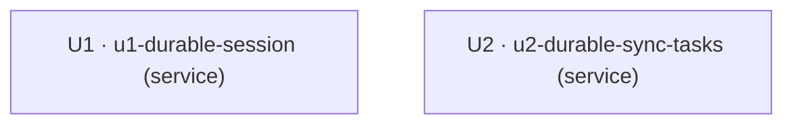

# Unit of Work — Dependency DAG

> Topología entre unidades (solo dependencias). NO elige orden de implementación ni
> camino crítico — eso es Delivery Planning (2.9). El bloque `yaml` es la fuente
> de verdad para el fan-out; la prosa lo refleja.

## Sources

- unit-of-work.md (U1, U2) [scope]
- units-generation-questions.md (Q3-B, Q4-A) [Q3] [Q4]

## DAG de dependencias

Dos unidades **independientes**: no hay arista entre ellas. Ambas comparten únicamente
el abstractor `db_connection` preexistente (no es una unidad de este intent), por lo que
no existe dependencia de construcción entre U1 y U2.

```
U1 (u1-durable-session)      [depends_on: —]
U2 (u2-durable-sync-tasks)   [depends_on: —]
```



<!-- Text fallback: El DAG tiene dos nodos, U1 (u1-durable-session) y U2 (u2-durable-sync-tasks), sin aristas entre ellos: son unidades independientes que pueden construirse en paralelo. Comparten solo el abstractor db_connection preexistente, que no es una unidad de este intent. -->

## Integration points

- **Entre U1 y U2**: ninguno de dominio. Solo comparten el abstractor de acceso a datos
  `db_connection` (preexistente) y el proceso `futmondo-api` donde ambas se embeben.
- **Intra-U1 (no es arista del DAG)**: `SessionService` consume la interfaz de
  `CredentialProtection` (`protect`/`resolve`/`canReauthenticate`); se formaliza en
  Contract Design (2.8).

## Parallel development opportunities

- **{U1, U2}**: sin dependencia entre sí — pueden construirse en paralelo. Existen
  múltiples ordenaciones topológicas válidas (U1→U2, U2→U1, o simultáneas). La elección
  económica del orden la hace Delivery Planning (2.9).

## Machine-readable edge block

```yaml
units:
  - name: u1-durable-session
    kind: service
    depends_on: []
  - name: u2-durable-sync-tasks
    kind: service
    depends_on: []
```
