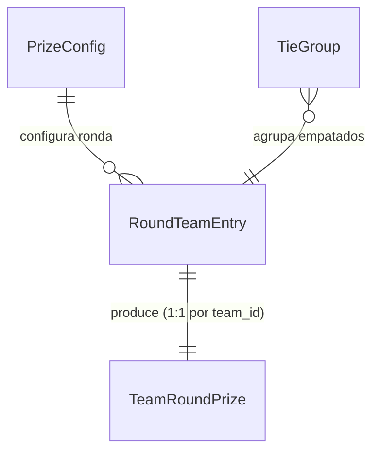

# Functional Design — Especificación funcional (matchday-prizes-calc)

Fuente de verdad de los **workflows** del cálculo de premios. Las vistas ER y de
reglas son derivadas (`entities.md` y `rules.md` son la fuente de verdad de datos
y reglas).

## Workflow: cálculo del premio de una ronda (PrizeCalculator)

Entrada: `PrizeConfig` + lista de `RoundTeamEntry` (con `round_points`) + señales
de gating (`is_closed`, `round_fully_played`, `is_advanced_pseudo_round`).
Salida: lista de `TeamRoundPrize` (uno por equipo).

1. Calcular `points_prize` para cada equipo (BR1.1) — siempre.
2. Determinar `award_round_prizes = is_closed AND round_fully_played AND NOT is_advanced_pseudo_round` (BR1.2). Si es falso: `ranking_prize = mvp_prize = dream_team_prize = 0` para todos; ir al paso 7.
3. Determinar el conjunto premiable: equipos con `round_points > 0`, limitados por `users_to_rank` (BR2.1). Ordenarlos por `round_points` (desc para 'top', el orden que corresponda al modo) asignando posiciones contiguas 1..M.
4. Calcular el premio base por posición `prize(pos)` (BR2.2) para cada posición premiada.
5. **Agrupar por empate** (BR3.1): agrupar los premiables por `round_points`. Cada grupo de N equipos ocupa posiciones contiguas `p..p+N-1`.
6. **Reparto equitativo** (BR3.1/BR3.2): para cada grupo, `sum_positions = Σ prize(pos)` sobre sus N posiciones; `ranking_prize` de cada miembro = `round(sum_positions / N)`. Un grupo de N=1 recibe `prize(p)` exacto.
7. Calcular `mvp_prize` y `dream_team_prize` según gating (BR1.2) y devolver un `TeamRoundPrize` por equipo con `display_position`.

### Ejemplo (jornada 5, campeonato 592416daa3a2dd871a7a9956)

Con `ranking_mode = flop`: dos equipos empatan ocupando 3ª (`prize=1.285.714`) y
4ª (`prize=1.714.286`). Grupo N=2, `sum_positions = 3.000.000` → cada uno
`round(3.000.000/2) = 1.500.000`.

**Mapeo cálculo→persistencia (R-03)**: el cálculo puro produce `display_position`
en `TeamRoundPrize`; el orquestador lo persiste como `position` en la fila
`team_prizes`. Es un renombrado de campo en el borde de persistencia, fuera del
cálculo puro.

## Máquina de estados

No hay entidad con ciclo de vida propio en esta unidad: el cálculo es una
transformación pura sin estado persistente. La única transición relevante es la
del gating de ronda (no-premiable → premiable) que gobierna BR1.2, no una
máquina de estados de entidad.

## Vista ER (derivada de entities.md)

Fallback en texto: `PrizeConfig` configura la ronda; cada `RoundTeamEntry`
produce un `TeamRoundPrize` (1:1 por `team_id`); un `TieGroup` agrupa los
`RoundTeamEntry` con los mismos puntos.

## Vista de reglas (derivada de rules.md)

| ID | Resumen |
|---|---|
| BR1.1 | points_prize siempre |
| BR1.2 | ranking/MVP/dream-team solo con ronda completa |
| BR2.1 | elegibilidad de ranking |
| BR2.2 | premio por posición (flop/top) |
| BR3.1 | reparto equitativo ante empates |
| BR3.2 | redondeo por parte (±1 aceptado) |

## Escenarios de negocio

- **Sin empates**: cada equipo premiable recibe el premio de su posición (BR2.2); sin cambio respecto al comportamiento actual.
- **2 empatados**: suma de sus 2 posiciones / 2 (ejemplo jornada 5).
- **3 empatados**: suma de sus 3 posiciones / 3 (posible resto por redondeo, OQ1).
- **Ronda no completa** (partidos aplazados): solo points_prize; ranking/MVP/dream-team = 0.
- **Equipo con 0 puntos**: fuera del reparto de ranking (ranking_prize = 0).

## Assumptions & Open Questions

OQ1: reparto exacto del resto en división no entera — pendiente (round() por parte).
