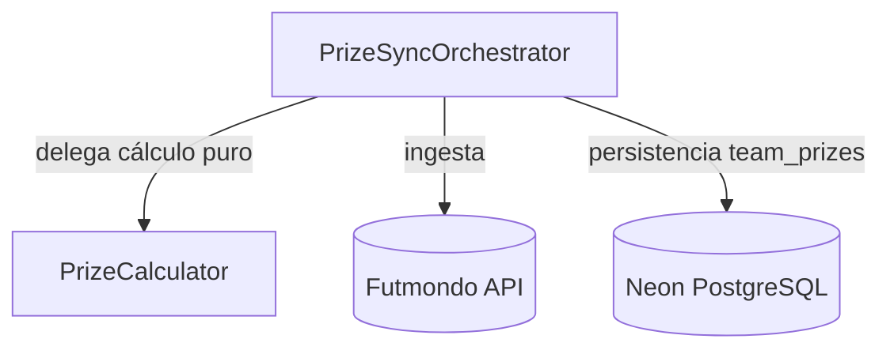

# Domain Design — Componentes (matchday-prizes-calc)


## Sources

- `requirements.md` (FR1–FR3, NFR1–NFR5) — regla de reparto equitativo del
  premio de ranking ante empates; extracción a función pura (FR1, NFR4).
- RE: `architecture.md`, `component-inventory.md` — el flujo de premios está en
  `data_sync_service.py::sync_prizes` (productor de `team_prizes`); los routers
  solo leen/suman.
- `team-practices.md` — separación cálculo-puro / ingesta / persistencia; no
  engordar god-files; naming desambiguador `*_points` / `*_prize`.

## Part A — Catálogo (machine-readable)

```yaml
components:
  - name: PrizeCalculator
    summary: Cálculo puro de los términos del premio de una jornada (sin I/O ni SQL).
    behaviour: >
      Dada la lista de equipos de una ronda con sus puntos de jornada y la
      configuración de premios del campeonato (money_per_ranking, ranking_mode
      flop/top, users_to_rank, money_per_point, mvp_bonus, dream_team_bonus) y
      las señales de gating (round_fully_played, is_advanced_pseudo_round),
      calcula por equipo: points_prize (siempre), y — solo cuando la ronda
      premia — ranking_prize, mvp_prize y dream_team_prize. REGLA NUEVA (FR1):
      agrupa los equipos premiables por puntos de jornada; para cada grupo de N
      empatados que ocupa N posiciones contiguas, suma los ranking_prize de esas
      N posiciones y reparte a partes iguales (round() por parte). Un grupo de
      un solo equipo recibe exactamente el premio de su posición (sin regresión).
      Función pura y determinista: mismas entradas → mismas salidas, sin red,
      sin sleep, sin base de datos.
    responsibilities:
      - Calcular los términos del premio por equipo de una jornada
      - Agrupar empatados por puntos y repartir el premio de ranking equitativamente (FR1)
      - Aplicar el gating de ronda completa a ranking/MVP/dream-team (FR3.1)
    depends_on: []
    dependents:
      - component: PrizeSyncOrchestrator
        interaction: recibe los importes calculados por equipo para persistirlos
    external_dependencies: []
    entities:
      - name: TeamRoundPrize
        identifier: (championship_id, team_id, matchday)
        attributes: [ranking_prize, mvp_prize, points_prize, dream_team_prize, display_position]
        references:
          - entity: TeamPrizeRow
            owned_by: PrizeSyncOrchestrator
            relationship: "cada TeamRoundPrize calculado se persiste como una fila TeamPrizeRow"

  - name: PrizeSyncOrchestrator
    summary: Orquesta el sync de premios (ingesta desde la API + cálculo + persistencia).
    behaviour: >
      Es el rol reducido de sync_prizes tras la extracción (Q1=A): obtiene la
      configuración del campeonato y los datos de ronda desde la API Futmondo
      (I/O con time.sleep), invoca PrizeCalculator con datos ya materializados, y
      persiste el resultado en team_prizes (UPSERT ON CONFLICT + limpieza
      defensiva DELETE ... NOT IN). NO contiene la fórmula del premio: solo
      orquesta ingesta → cálculo puro → persistencia. No engorda el god-file con
      lógica de cálculo nueva (NFR4).
    responsibilities:
      - Ingesta de configuración y rondas desde la API Futmondo
      - Invocar PrizeCalculator con datos ya obtenidos
      - Persistir los premios calculados en team_prizes (UPSERT + DELETE...NOT IN)
      - Recalcular retroactivamente todas las rondas en cada sync (FR3.2)
    depends_on:
      - component: PrizeCalculator
        interaction: delega el cálculo puro de los términos del premio
        style: sync
    dependents: []
    external_dependencies:
      - name: Futmondo API
        kind: third-party-api
        purpose: obtener ranking de ronda, configuración y alineaciones
      - name: Neon PostgreSQL
        kind: database
        purpose: persistir y limpiar la tabla team_prizes
    entities:
      - name: TeamPrizeRow
        identifier: (championship_id, team_id, matchday)
        attributes: [ranking_prize, mvp_prize, points_prize, dream_team_prize, position]
```

## Part B — Vista humana

### Diagrama de componentes



Texto alternativo (fallback): `PrizeSyncOrchestrator` depende de
`PrizeCalculator` (cálculo puro, síncrono) y usa dos dependencias externas: la
API de Futmondo (ingesta) y Neon PostgreSQL (persistencia de `team_prizes`).
`PrizeCalculator` no depende de nada.

### Resumen de componentes

| Component | Purpose | Depends On | Dependents | Entities Owned |
|---|---|---|---|---|
| PrizeCalculator | Cálculo puro de los términos del premio (incl. reparto ante empates) | — | PrizeSyncOrchestrator | TeamRoundPrize |
| PrizeSyncOrchestrator | Orquesta ingesta + cálculo + persistencia del sync de premios | PrizeCalculator | — | TeamPrizeRow |

### Propiedad de entidades

| Entity | Owning Component | Identifier | Attributes | References |
|---|---|---|---|---|
| TeamRoundPrize | PrizeCalculator | (championship_id, team_id, matchday) | ranking_prize, mvp_prize, points_prize, dream_team_prize, display_position | TeamPrizeRow (PrizeSyncOrchestrator) |
| TeamPrizeRow | PrizeSyncOrchestrator | (championship_id, team_id, matchday) | ranking_prize, mvp_prize, points_prize, dream_team_prize, position | — |

### Dependencias externas

| Component | Dependency | Kind | Purpose |
|---|---|---|---|
| PrizeSyncOrchestrator | Futmondo API | third-party-api | Ingesta de ranking, configuración y alineaciones |
| PrizeSyncOrchestrator | Neon PostgreSQL | database | Persistencia/limpieza de team_prizes |

### Rationale

| Component | Por qué es un building block separado |
|---|---|
| PrizeCalculator | Concern distinto (cálculo puro) y **razón de cambio distinta** (reglas de negocio del premio) frente a I/O y SQL; su pureza es lo que lo hace testeable a coste 0 € (NFR1/NFR3) y es el requisito FR1/NFR4. |
| PrizeSyncOrchestrator | Rol ya existente (`sync_prizes`) reducido a orquestación; mantiene ingesta y persistencia (I/O y SQL) fuera del cálculo, sin engordar el god-file. |

**Alternatives Rejected**: corregir el cálculo *in situ* dentro de `sync_prizes`
sin extraer (Q1=B) — rechazado por el usuario (Q1=A) porque deja la fórmula sin
frontera testeable y engorda el god-file. Ver ADR-001 en `decisions.md`.

## Assumptions & Open Questions

None.
