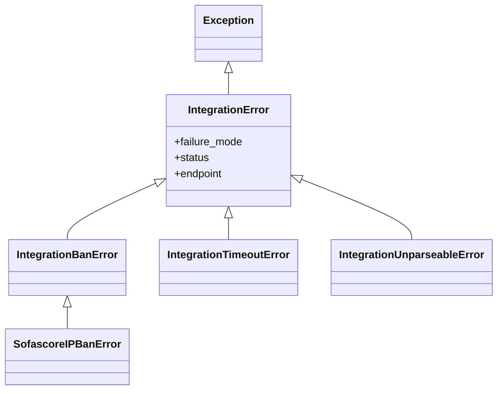

# Functional Spec — U1 `u1-error-layer`

Fuente de verdad de los flujos de comportamiento de la capa de errores. Las
vistas de jerarquía (mermaid) y de reglas son derivadas de `entities.md` /
`rules.md`.

## Workflow: clasificación y enrutado de un fallo de integración

Este es el comportamiento que U1 habilita y U2 consume (aquí solo se especifica;
U2 lo cablea):

1. Un cliente de integración detecta un fallo esperado.
2. El cliente lanza el subtipo tipado correspondiente de `IntegrationError`
   (baneo → `IntegrationBanError`; timeout → `IntegrationTimeoutError`;
   no parseable → `IntegrationUnparseableError`), con contexto no sensible
   (`failure_mode`, `status?`, `endpoint?`) y sin credenciales (BR1.4).
3. El consumidor (la ruta de sync, en U2) captura por la raíz `IntegrationError`
   y enruta según el subtipo:
   - **recuperable** (timeout / no parseable): marca el paso `DEGRADED` vía
     `sync_step_status.record_degraded_step` y CONTINÚA (BR1.2, BR1.3).
   - **fatal** (baneo, o fallo en punto de escritura tras commit): PROPAGA;
     aborta limpio sin dejar datos a medias (BR1.1, BR1.5).

## Workflow: endurecimiento de una captura amplia de la primera oleada

Para cada captura amplia de arranque (`main.py`), migraciones (`scripts/migrate_*`)
o `db_connection.py`:

1. Caracterizar primero: un spec congela el comportamiento observable actual.
2. Reclasificar: distinguir recuperable (loguear/degradar y seguir) de fatal
   (propagar y abortar limpio), preservando el `rollback()` + `raise` correcto ya
   presente en las transacciones de `db_connection.py` (BR1.6).
3. No ampliar estructura ni reescribir; cambio quirúrgico.

## Vista derivada: jerarquía de excepciones (de `entities.md`)

Fallback de texto: `Exception` → `IntegrationError` (raíz) → `IntegrationBanError`
(fatal, del que hereda el `SofascoreIPBanError` existente), `IntegrationTimeoutError`
(recuperable), `IntegrationUnparseableError` (recuperable).

## Vista derivada: resumen de reglas (de `rules.md`)

| ID | Clasificación / efecto |
|---|---|
| BR1.1 | baneo → fatal, propagar |
| BR1.2 | timeout → recuperable, degradar |
| BR1.3 | no parseable → recuperable, degradar |
| BR1.4 | sin credenciales en la excepción |
| BR1.5 | fallo tras commit → fatal, sin datos a medias |
| BR1.6 | reclasificar sin romper transacciones |

## Assumptions & Open Questions

None.
