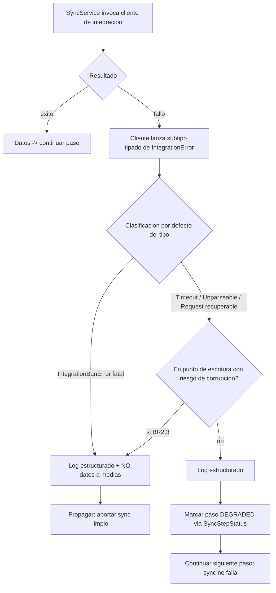
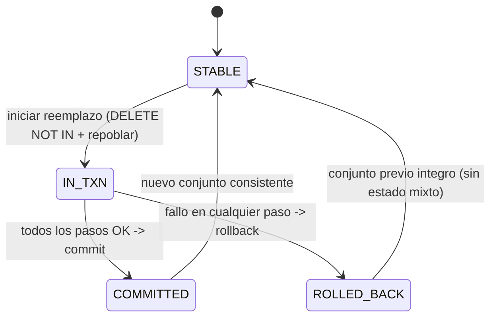
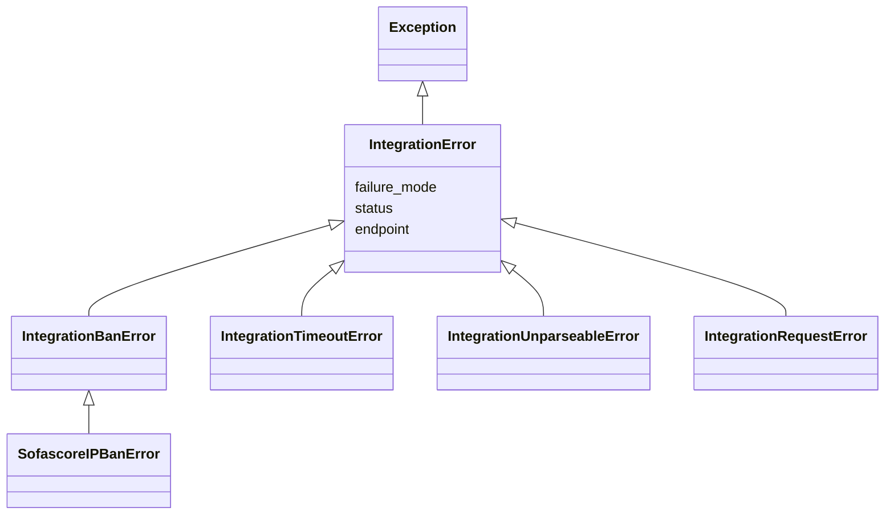

# Functional Specification — u2-integrations (Integraciones)

Especificación de comportamiento de la unidad `u2-integrations`: los workflows
de fallo de las integraciones externas (Sofascore, Futmondo) y su traducción en
estado del sync, y la máquina de estados del punto de escritura `team_prizes`.
Esta es la **fuente de verdad de workflows y máquinas de estado**; las vistas ER
y de reglas al final son **derivadas** (`entities.md` y `rules.md` son la fuente
de verdad de datos y reglas respectivamente).

Consume: `unit-of-work.md`, `requirements.md`, `components.md`,
`contract-summary.md`. Intervención acotada y aditiva: sólo se endurecen
capturas y contratos existentes; NO se amplían los god-files.

---

## 1. Workflow — Paso de sync que consume una integración externa

Aplica a cada paso del sync que invoca `FutmondoClient` o `SofascoreClient` a
través de `SyncService`. Cubre BR1.1, BR1.2, BR2.1, BR2.2, BR3.1, BR3.2, BR4.1.

1. `SyncService` invoca el cliente de integración para el paso (p. ej. sofascore,
   transacciones, plantillas).
2. El cliente contacta el proveedor externo.
   - Éxito → devuelve los datos; el paso continúa normal.
   - Fallo → el cliente lanza un subtipo tipado de `IntegrationError` (nunca
     `None`): baneo/403 → `IntegrationBanError` (fatal); timeout →
     `IntegrationTimeoutError` (recuperable); respuesta no parseable →
     `IntegrationUnparseableError` (recuperable); error de conexión/petición
     (`RequestException`) → `IntegrationRequestError` (recuperable por defecto).
     [BR1.1, BR1.2, BR2.1]
3. `SyncService` captura en orden explícito, antes del `except Exception`:
   - `except IntegrationBanError` (y cualquier fatal) → **rama fatal**: emite log
     estructurado (BR4.1), NO escribe datos a medias, y propaga la excepción para
     abortar limpio el sync. [BR2.2, BR3.2]
   - `except (IntegrationTimeoutError, IntegrationUnparseableError, IntegrationRequestError)`
     (recuperables por defecto) → **rama recuperable**: aplica la elevación
     contextual (BR2.3) — SI el fallo ocurre en/antes de un punto de escritura
     donde continuar dejaría datos a medias, se trata como **fatal** (abortar
     limpio, sin escritura parcial; ver §3); en caso contrario emite log
     estructurado (BR4.1), marca el paso `DEGRADED` vía
     `SyncStepStatus.record_degraded_step(...)` y CONTINÚA con el siguiente paso;
     el sync termina sin error. [BR2.2, BR2.3, BR3.1]
   - `except Exception` → red de seguridad final (no reemplaza a las ramas
     tipadas).
4. El logging (paso fatal o recuperable) lleva `sync_step`, `reason`,
   `failure_mode`, `status?`, `endpoint?`, `task_id`, y **nunca** password/token.
   [BR4.1, BR4.2]

### Diagrama de flujo (paso de sync)

<!-- Text fallback: SyncService invoca al cliente. Si hay exito, continua el paso.
Si falla, el cliente lanza un subtipo tipado de IntegrationError. La clasificacion
por defecto viene del tipo: IntegrationBanError es fatal (log + sin datos a medias,
se propaga y aborta limpio). Timeout/Unparseable/Request son recuperables por
defecto, pero si ocurren en un punto de escritura con riesgo de corrupcion se
elevan a fatal (BR2.3); en caso contrario: log, marca el paso DEGRADED via
SyncStepStatus y continua, el sync no falla. -->

---

## 2. Workflow — Cambio de contrato de `FutmondoClient._make_request` (migración segura)

Precede a la migración; cubre BR1.1 y BR6.1 (FR4.2, FR4.3).

1. Caracterizar el comportamiento actual de `_make_request` con dobles/fakes en
   memoria (sin red, sin credenciales reales): hoy traga
   `Timeout`/`RequestException`/`JSONDecodeError` y devuelve `None`.
2. Entregar un **inventario verificable de llamadores** de `_make_request`.
3. Clasificar los llamadores en:
   - **Núcleo** = `_make_request` + los llamadores donde un `None` no detectado
     **corrompe datos** → se migran en este intent.
   - **Resto** = queda como **deuda registrada** (fuera de alcance de U2).
4. Migrar el núcleo: `_make_request` deja de devolver `None` y lanza subtipos
   tipados (`except <Typed>: raise` antes del `except Exception`). Los llamadores
   del núcleo se adaptan a la excepción tipada.
5. La suite existente permanece en verde en cada paso (NFR4). Sin retry/backoff
   (fuera de alcance).

---

## 3. Máquina de estados — Reemplazo atómico de `team_prizes` (no-corrupción)

Endurece el punto de escritura existente (`DELETE FROM team_prizes ... NOT IN
(...)` + repoblado). Cubre BR5.1, BR5.2 (NFR2). NO amplía el god-file: se
envuelve la operación existente en una transacción única.

Estados: `STABLE` → `IN_TXN` → (`COMMITTED` | `ROLLED_BACK`).

1. `STABLE`: `team_prizes` refleja el conjunto de premios previo, consistente.
2. Inicio del reemplazo → `IN_TXN`: se abre una transacción única que contiene el
   `DELETE ... NOT IN (...)` y el repoblado.
   - Todos los pasos OK → `commit` → `COMMITTED` → vuelve a `STABLE` con el nuevo
     conjunto.
   - Cualquier paso falla (incluida una excepción fatal de integración aguas
     arriba que impide completar) → `rollback` → `ROLLED_BACK` → vuelve a
     `STABLE` con el conjunto **previo íntegro** (nunca estado mixto). [BR5.1]
3. Verificación (BR5.2): un spec fuerza el fallo dentro de la transacción y
   asvera que el estado resultante es consistente (el conjunto previo se
   conserva), no a medias.

### Diagrama de estados (`team_prizes`)

<!-- Text fallback: team_prizes empieza STABLE. El reemplazo entra en IN_TXN (una
sola transaccion con el DELETE NOT IN y el repoblado). Si todo va bien: commit ->
COMMITTED -> STABLE con el nuevo conjunto. Si algo falla: rollback -> ROLLED_BACK
-> STABLE con el conjunto previo integro. Nunca queda a medias. -->

---

## 4. Puntos de integración y contratos honrados

- **Frontera U1↔U2 (Contrato 1):** U2 lanza/captura los tipos de
  `integration_errors` (U1). Cambio aditivo; `SyncService` captura por la raíz
  `IntegrationError`.
- **Sofascore (Contrato 2):** 403 → fatal (`IntegrationBanError`, extiende el
  `SofascoreIPBanError` existente); 404 (recurso ausente) → **sin datos, no es
  fallo** (no lanza excepción tipada ni marca `DEGRADED`; BR1.2); timeout/no
  parseable → recuperable; rate-limiting preventivo se mantiene.
- **Futmondo (Contrato 3):** login/getters heterogéneos; nunca loguear/propagar
  credenciales. Modos de fallo:
  - `timeout` → `IntegrationTimeoutError` (recuperable).
  - `json_decode_error` (respuesta no parseable) → `IntegrationUnparseableError`
    (recuperable).
  - `request_exception` (error de conexión/petición) → `IntegrationRequestError`,
    **recuperable salvo que corrompa datos aguas abajo**: recuperable en general,
    pero **fatal** si alcanza un punto de escritura con riesgo de corrupción
    (BR2.3).
  - `write_point_failure` (p. ej. en `team_prizes`) → **fatal**: abortar limpio,
    sin datos a medias (NFR2, §3).

---

## 5. Vista derivada — Diagrama de entidades (fuente: `entities.md`)

No hay entidades de dominio nuevas. La vista estructural es la jerarquía de
excepciones (fuente de verdad: `entities.md`):

Clasificación por subtipo (fuente: `entities.md`): `IntegrationBanError` fatal;
`IntegrationTimeoutError`, `IntegrationUnparseableError` recuperables;
`IntegrationRequestError` recuperable por defecto, elevable a fatal en punto de
escritura (EC-CTX / BR2.3). `SofascoreIPBanError` hereda de `IntegrationBanError`.

<!-- Text fallback: IntegrationError hereda de Exception y lleva failure_mode,
status y endpoint. De IntegrationError heredan IntegrationBanError (fatal),
IntegrationTimeoutError (recuperable), IntegrationUnparseableError (recuperable) e
IntegrationRequestError (recuperable por defecto, fatal en punto de escritura).
SofascoreIPBanError hereda de IntegrationBanError. -->

---

## 6. Vista derivada — Resumen de reglas (fuente: `rules.md`)

| Regla | Enunciado | Fuente |
|---|---|---|
| BR1.1 | `FutmondoClient` no devuelve `None`; lanza subtipo tipado (incl. `request_exception`) | FR4.2 |
| BR1.2 | `SofascoreClient` 403 → `IntegrationBanError`; 404 → sin datos (no fallo); hereda de la raíz | FR4.1, FR4.4, FR4.5 |
| BR2.1 | El subtipo da la clasificación recuperable/fatal por defecto | FR3.2.1, FR4.1 |
| BR2.3 | Recuperable en punto de escritura con riesgo de corrupción → se eleva a fatal | FR4.4, NFR2 |
| BR2.2 | Dos ramas `except` (fatal, recuperable) antes del genérico | FR3.2.1, FR4.4 |
| BR3.1 | Recuperable → `DEGRADED` + continuar | FR3.2.1, FR4.4 |
| BR3.2 | Fatal → propagar, sin datos a medias | FR3.2.1, NFR2 |
| BR4.1 | Log estructurado con modo de fallo + contexto no sensible | NFR1 |
| BR4.2 | Nunca credenciales en excepción/log | NFR3 |
| BR5.1 | Reemplazo `team_prizes` transaccional atómico | NFR2 |
| BR5.2 | No-corrupción verificable por spec de efecto | NFR2 |
| BR6.1 | Inventario + caracterización de `_make_request` antes de migrar | FR4.3 |
| BR7.1 | Documentar contratos/modos de fallo de Sofascore y Futmondo | FR4.5 |

## Assumptions & Open Questions

- El conjunto exacto núcleo-vs-deuda de llamadores de `_make_request` se fija con
  el inventario verificable en code-generation (FR4.3, BR6.1); no bloquea este
  diseño.
