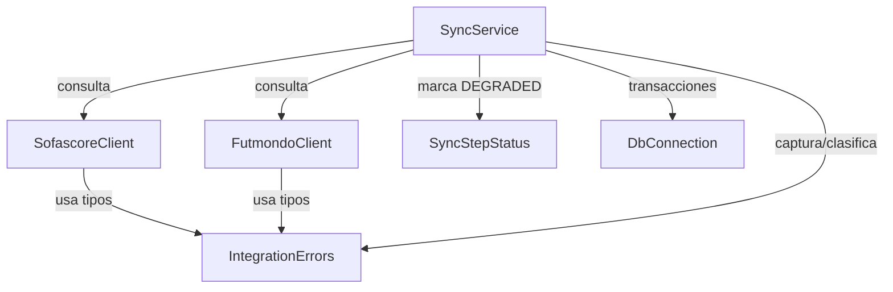

# Component Catalogue — Fiabilidad backend (FR3.2 + FR4)

Bloques lógicos de este intent. Un componente nuevo (`IntegrationErrors`) y
modificaciones acotadas a componentes existentes (sin ampliar estructuralmente
los god-files). Las excepciones tipadas llevan la clasificación recuperable/fatal;
el punto de captura de la ruta de sync la traduce en acción.

## Part A — Catálogo (machine-readable)

```yaml
components:
  - name: IntegrationErrors
    summary: Módulo de definiciones puro con la jerarquía de excepciones de integración.
    behaviour: >
      Define la raíz común IntegrationError y subtipos por modo de fallo
      (baneo/403, timeout, respuesta heterogénea o no parseable). Sin lógica de
      decisión ni dependencias: solo tipos. El tipo de excepción codifica la
      clasificación recuperable/fatal; quien la captura decide la acción. Ningún
      mensaje/repr/exc_info incluye password ni token (NFR3).
    responsibilities:
      - Declarar IntegrationError (raíz) y sus subtipos por modo de fallo.
    depends_on: []
    dependents:
      - component: SofascoreClient
        interaction: lanza subtipos de IntegrationError ante 403/baneo y fallos
      - component: FutmondoClient
        interaction: lanza subtipos de IntegrationError en vez de devolver None
      - component: SyncService
        interaction: captura y clasifica IntegrationError (recuperable/fatal)
    external_dependencies: []
    entities: []

  - name: SofascoreClient
    summary: Cliente de la API no oficial de Sofascore (curl_cffi).
    behaviour: >
      Ya distingue el baneo de IP (403) y lo propaga (FR2.1). Se alinea al patrón
      común: sus excepciones pasan a heredar de IntegrationError; rate-limiting
      preventivo se mantiene.
    responsibilities:
      - Consultar Sofascore y señalar el baneo/fallo como excepción tipada.
    depends_on:
      - component: IntegrationErrors
        interaction: usa los tipos de excepción de integración
        style: sync
    dependents:
      - component: SyncService
        interaction: SyncService invoca el cliente durante el paso sofascore
    external_dependencies:
      - name: Sofascore API
        kind: third-party-api
        purpose: ratings/estadísticas de jugadores (no oficial)
    entities: []

  - name: FutmondoClient
    summary: Cliente de la API de Futmondo (endpoints heterogéneos).
    behaviour: >
      Deja de tragar Timeout/RequestException/JSONDecodeError devolviendo None;
      pasa a lanzar excepciones tipadas por modo de fallo, propagadas, con
      `except <Typed>: raise` antes del `except Exception`. Nunca incluye
      password/token en el mensaje/repr/exc_info (NFR3).
    responsibilities:
      - Autenticar y consultar Futmondo; señalar el fallo como excepción tipada.
    depends_on:
      - component: IntegrationErrors
        interaction: usa los tipos de excepción de integración
        style: sync
    dependents:
      - component: SyncService
        interaction: SyncService invoca el cliente en los pasos que consumen Futmondo
    external_dependencies:
      - name: Futmondo API
        kind: third-party-api
        purpose: datos de campeonato, transacciones, plantillas, credenciales de usuario
    entities: []

  - name: SyncService
    summary: Componente de sincronización existente (ruta de sync). NO se amplía estructuralmente.
    behaviour: >
      En el punto de captura, clasifica la excepción de integración: recuperable →
      marca el paso DEGRADED vía SyncStepStatus y continúa; fatal → deja propagar
      sin escribir datos a medias (patrón de reemplazo transaccional atómico en el
      punto de corrupción team_prizes). Emite log estructurado del modo de fallo
      con contexto no sensible (NFR1). Solo se endurecen capturas existentes.
    responsibilities:
      - Orquestar los pasos de sync y traducir el fallo de integración en acción.
    depends_on:
      - component: SofascoreClient
        interaction: consulta ratings en el paso sofascore
        style: sync
      - component: FutmondoClient
        interaction: consulta datos de campeonato/transacciones
        style: sync
      - component: SyncStepStatus
        interaction: marca pasos DEGRADED (recuperable)
        style: sync
      - component: IntegrationErrors
        interaction: captura y clasifica los tipos de fallo
        style: sync
    dependents: []
    external_dependencies:
      - name: Neon PostgreSQL
        kind: database
        purpose: persistencia de datos de campeonato / caché
    entities: []

  - name: SyncStepStatus
    summary: Helper estrecho existente (FR3.1) para degradación observable de pasos.
    behaviour: >
      Expone StepStatus.DEGRADED y record_degraded_step(sink, task_id, step,
      reason, extra) sobre un ProgressSink. Reusado por FR4; no se modifica su
      contrato (extensión estrecha solo si hace falta un campo de razón tipado).
    responsibilities:
      - Registrar un paso como DEGRADED sin re-lanzar (recuperable).
    depends_on: []
    dependents:
      - component: SyncService
        interaction: llama a record_degraded_step ante fallo recuperable
    external_dependencies: []
    entities: []

  - name: DbConnection
    summary: Capa de conexión/transacción de BD existente (db_connection.py).
    behaviour: >
      Ya hace rollback()+raise en transacciones. Se endurecen sus capturas
      amplias de arranque/init distinguiendo recuperable de fatal; sin cambiar la
      semántica transaccional correcta ya presente.
    responsibilities:
      - Proveer conexión y transacciones a la BD; fallar limpio (fatal) sin corromper.
    depends_on: []
    dependents:
      - component: SyncService
        interaction: usa conexiones/transacciones durante el sync
    external_dependencies:
      - name: Neon PostgreSQL
        kind: database
        purpose: motor de base de datos
    entities: []
```

## Part B — Vista humana

### Component Diagram



Texto fallback: `IntegrationErrors` no depende de nada (módulo de tipos hoja).
`SofascoreClient` y `FutmondoClient` dependen de `IntegrationErrors`.
`SyncService` depende de `IntegrationErrors`, `SofascoreClient`,
`FutmondoClient`, `SyncStepStatus` y `DbConnection`. Grafo acíclico.

### Component Summary

| Component | Purpose | Depends On | Dependents | Entities Owned |
|---|---|---|---|---|
| IntegrationErrors | Jerarquía de excepciones de integración (nuevo) | — | SofascoreClient, FutmondoClient, SyncService | — |
| SofascoreClient | Cliente Sofascore (mod.) | IntegrationErrors | SyncService | — |
| FutmondoClient | Cliente Futmondo (mod.) | IntegrationErrors | SyncService | — |
| SyncService | Ruta de sync: clasifica fallo→acción (mod., no ampliado) | SofascoreClient, FutmondoClient, SyncStepStatus, IntegrationErrors, DbConnection | — | — |
| SyncStepStatus | Degradación observable de pasos (reuso FR3.1) | — | SyncService | — |
| DbConnection | Conexión/transacciones BD (mod.) | — | SyncService | — |

### Entity Ownership

Ninguna entidad de dominio nueva. Este intent es de fiabilidad (comportamiento
de error/estado), no de datos: las entidades existentes (campeonato,
transacciones, premios) no cambian de forma ni de dueño.

### External Dependencies

| Component | Dependency | Kind | Purpose |
|---|---|---|---|
| SofascoreClient | Sofascore API | third-party-api | ratings/estadísticas (no oficial) |
| FutmondoClient | Futmondo API | third-party-api | datos de campeonato, credenciales de usuario |
| SyncService | Neon PostgreSQL | database | persistencia/caché |
| DbConnection | Neon PostgreSQL | database | motor de BD |

### Rationale

| Component | Por qué es un bloque separado |
|---|---|
| IntegrationErrors | Concern distinto (tipos de fallo), ritmo de cambio distinto, sin dependencias → alta cohesión y testeabilidad; evita acoplar clientes entre sí |
| SofascoreClient / FutmondoClient | Componentes existentes; cada uno encapsula una integración externa con su propia forma de fallo |
| SyncService | Componente existente que orquesta; dueño de la traducción fallo→acción por tener el contexto del paso |
| SyncStepStatus | Helper existente (FR3.1) reusado; ya es la superficie canónica de degradación |
| DbConnection | Componente existente; límite de integridad transaccional |

**Alternatives Rejected**: incluir un helper de clasificación recuperable/fatal
dentro de `integration_errors` (Q1-B / Q2-B) se rechazó para no acoplar el módulo
de tipos con la lógica de sync; la clasificación vive donde está el contexto (el
punto de captura), y el tipo de excepción ya codifica recuperable vs fatal.

## Assumptions & Open Questions

None.
