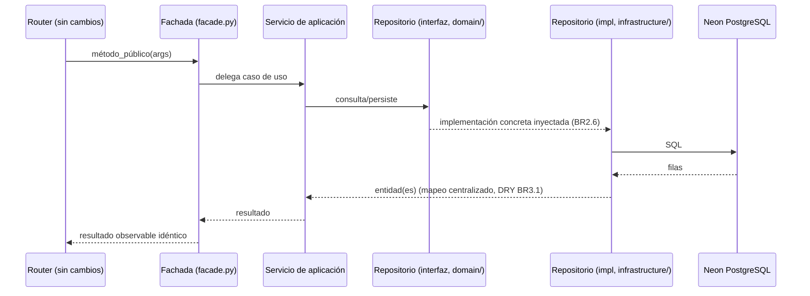
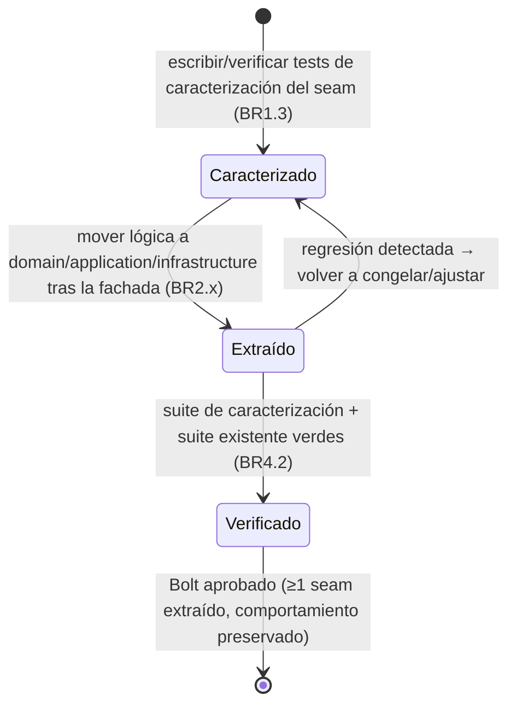
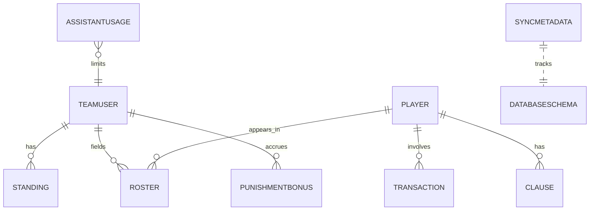

# Especificación Funcional — Descomposición DDD de los god files (FR13)

> Intent `260927-god-files-refactor`, unidad única, scope `refactor`, depth Minimal. Conversation language: Spanish.
>
> Fuente de verdad de **flujos y transiciones** de la descomposición: mapa de seams por bounded context, orden de oleadas y flujo de delegación fachada→aplicación→repositorio. Las vistas ER (derivada de `entities.md`) y el resumen de reglas (derivado de `rules.md`) se incluyen por legibilidad. No hay UI en este intent (backend puro), por lo que `frontend-components.md` no aplica.

## Sources

- `inception/requirements-analysis/requirements.md` — FR1–FR4, NFR1–NFR4.
- `entities.md` (agregados, source of truth de datos), `rules.md` (BRx.y, source of truth de reglas).
- `codekb/futmondo-analytics/code-structure.md`, `code-quality-assessment.md` — anatomía y seams reales.

## Arquitectura objetivo (por bounded context)

Cada god file se descompone en un bounded context con tres capas DDD y una fachada que preserva la superficie pública:

```
backend/app/services/<contexto>/
├── __init__.py            # re-exporta la fachada con el nombre original (import paths intactos)
├── facade.py              # application service delgado: métodos públicos preservados que delegan
├── domain/                # entidades/agregados/value objects + interfaces de repositorio (Protocol/ABC)
├── application/           # servicios de caso de uso (orquestan; dependen de interfaces)
└── infrastructure/        # implementaciones de repositorio (único lugar con SQL crudo)
```

Regla estructural (BR2.1–BR2.5): `domain/` no importa `infrastructure/` ni framework; el SQL vive solo en `infrastructure/`; `application/` depende de la interfaz (DIP); la fachada solo delega.

### Patrón puerto/adaptador entre oleadas (resuelve la dependencia de secuenciación)

Los contextos consumidores (`analytics`, `sync`, `assistant`) NO dependen de los repositorios de `data_manager` mientras este no se haya refactorizado (Oleada 4). Cada contexto consumidor define su **propio puerto** (interfaz en su `domain/`) que expresa solo lo que necesita, e implementa en su oleada un **adaptador sobre la fachada `DataManagerV2` ACTUAL**. Cuando la Oleada 4 extrae los repositorios reales de `data_manager`, cada adaptador se reapunta a ellos sin tocar la lógica del contexto consumidor. Esto invierte la dependencia (DIP) desde la primera oleada sin acoplar el orden.

## Flujo de delegación (workflow — source of truth)

Petición de un router (sin cambios) → método público de la fachada → servicio de aplicación → repositorio (interfaz) → implementación de repositorio (SQL) → BD. El resultado observable es idéntico al pre-refactor (BR1.1, BR1.2).


Texto alternativo: el router llama a la fachada exactamente como hoy; la fachada delega en el servicio de aplicación, que usa la interfaz de repositorio; la implementación concreta (inyectada) ejecuta el SQL contra Neon y devuelve entidades mapeadas; el resultado que recibe el router es idéntico al actual.

## Máquina de estados — ciclo de vida de un Bolt de descomposición


Texto alternativo: un Bolt pasa de Caracterizado (tests que congelan el comportamiento) a Extraído (código movido tras la fachada) a Verificado (todas las suites verdes); si aparece regresión, vuelve a Caracterizado; se aprueba cuando hay ≥1 seam extraído sin cambio observable.

## Plan de oleadas (orden por riesgo creciente — BR4.1)

### Oleada 1 — `analytics/` (menor riesgo; valida el patrón DDD end-to-end)
- **Por qué primero**: ya delega en `self.dm`, solo 2 `cursor.execute`, 6/10 `get_*` con test directo (seam de inyección probado).
- **Seams**: separar helpers de resolución (`_safe_*`, `_resolve_*`, `_build_team_lookup`) de los cálculos `get_*`; el consumo de datos pasa de `self.dm` directo a un **puerto consumidor propio del contexto analytics** (interfaz `AnalyticsDataPort` en `analytics/domain/`), implementado en esta oleada por un **adaptador sobre la fachada `DataManagerV2` ACTUAL** (`analytics/infrastructure/DataManagerAnalyticsAdapter`). Así analytics invierte su dependencia (DIP) SIN esperar a la Oleada 4: no consume repositorios de `data_manager` (que aún no existen), sino su propio puerto. Cuando la Oleada 4 extraiga los repositorios de `data_manager`, el adaptador se reapunta a ellos sin tocar la lógica de analytics. Esto resuelve la dependencia de secuenciación entre oleadas.
- **Superficie preservada**: `AnalyticsService.get_*` (10 métodos).
- **Caracterización (just-enough, BR1.3)**: extender `test_analytics_service.py` a los 4 `get_*` sin test directo antes de mover.

### Oleada 2 — `assistant/` (cobertura directa cero)
- **Seams claros**: `AssistantUsageTracker` (agregado propio), capa factual (`_try_factual_answer`/`_factual_*`), `ContextBuilder` (`_build_context`/`_ctx_*` con 42 `cursor.execute` → repositorios), guardrails (`_check_guardrails`, módulo puro). `ask()` queda como orquestador.
- **Superficie preservada**: `get_assistant_service()`, `async ask(...)`.
- **Caracterización (just-enough)**: congelar guardrails/factual/context/tracker antes de cada seam (hoy sin test).

### Oleada 3 — `sync/` (parcial de efecto)
- **Seams**: un módulo/servicio de aplicación por dominio de sync (transactions, clauses, punishments, dream_teams, performance, rosters, rankings, players, odds, prizes) coordinados por `sync_all` delgado; `sync_prizes` ya delega en `prizes/` (patrón a replicar). Reemplazos de conjunto → repositorios con escritura atómica (BR3.2).
- **Superficie preservada**: `sync_*` (10) + `sync_all()`.
- **Caracterización (just-enough)**: la de efecto (DEGRADED/fatal, prizes atómico) ya existe; añadir por dominio antes de trocear.

### Oleada 4 — `data_manager/` (núcleo, mayor riesgo)
- **Por qué al final**: hub de 8 routers + sync + analytics; cobertura directa ~cero; 94 `cursor.execute`.
- **Seams**: los **8 agregados** de `entities.md` → un repositorio por agregado (SRP, BR2.4); `_init_database`/DDL → `SchemaInitializer` aislado (NO cuenta como agregado). Total: 8 repositorios + 1 servicio de esquema.
- **Superficie preservada**: `DataManagerV2.*` (los **51 métodos públicos** reales; ver `preserved_methods` por agregado en `entities.md`). Los privados de soporte se reubican como detalle de implementación.
- **Caracterización (AMPLIA, BR1.3 / FR3.1)**: congelar la superficie pública del god file antes del primer movimiento, con `_FakeInMemoryDB` de `conftest.py`.
- **Nota de sub-Bolts**: por tamaño, esta oleada puede requerir sub-Bolts por grupo de agregado (open question de requirements.md); se decide en delivery-planning.

## Vista entidad-relación (derivada de entities.md — la YAML allí es la fuente de verdad)


Texto alternativo: el agregado TeamUser (equipo + usuario propietario) tiene standings, rosters y castigos/bonos; los jugadores participan en transacciones, cláusulas y rosters; los metadatos de sync y el esquema son de infraestructura; el uso del asistente se limita por TeamUser. (No existe un agregado USER independiente: la identidad de usuario es un value object dentro de TeamUser, ver entities.md.)

## Resumen de reglas (derivado de rules.md)

- **Preservación (BR1.x)**: firma/efecto observable intactos; repositorio ≡ SQL previo; caracterización antes de mover (amplia para data_manager).
- **DDD/SOLID (BR2.x)**: domain sin infra; SQL solo en repositorios; application depende de interfaces (DIP); un repositorio por agregado (SRP); fachada solo delega; inyección por constructor (OCP).
- **DRY/atomicidad (BR3.x)**: mapeo fila→entidad centralizado; reemplazos transaccionales atómicos.
- **Secuenciación (BR4.x)**: orden por riesgo; cierre de Bolt = suites verdes + ≥1 seam.

## Escenarios de negocio (equivalencia observable)

- **Happy path**: un endpoint analytics/market/sync devuelve el mismo resultado antes y después de la extracción → verificado por caracterización (BR1.1).
- **Unhappy path**: un fallo de integración o de datos produce el mismo modo de fallo observable (excepción tipada / paso DEGRADED) que hoy → no se altera el contrato de fallo (NFR2).
- **Concurrencia/atomicidad**: un reemplazo de conjunto interrumpido no deja estado a medias (BR3.2), como el patrón `prizes/` ya caracterizado.
