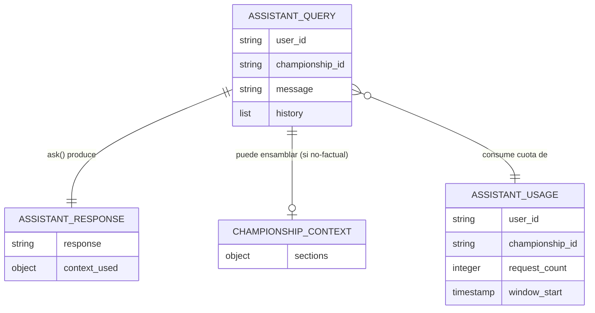

# Functional Spec — unidad `assistant`

Especificación de comportamiento de la descomposición DDD de `assistant_service.py`. Es la
**fuente de verdad de workflows y máquinas de estado**. Refactor sin cambio de comportamiento
observable: el workflow descrito es el que el god-file ACTUAL ejecuta; los tests de
caracterización (FR6) lo congelan antes de mover cada seam.

## Arquitectura de la unidad (paquete `assistant/`)

Replica el patrón DDD de la Oleada 1 (`analytics/`):

- `assistant/__init__.py` — re-exporta la fachada.
- `assistant/facade.py` — `AssistantService`: fachada delgada que preserva la superficie
  pública (`get_assistant_service()` singleton + `async ask(...)`), solo delega. Inyección por
  constructor con default (ports reales en producción; dobles en test — NFR4.1).
- `assistant/domain/ports.py` — `AssistantReadPort` (factual + contexto, solo lectura) y
  `AssistantUsagePort` (uso, lectura+escritura) + `LLMPort` (`complete(...)`). `Protocol`
  estructurales consumer-owned, **sin SQL ni framework**.
- `assistant/domain/guardrails.py` — módulo **puro** (regex/strings): `check_guardrails`,
  `ALLOWED_KEYWORDS`, `BLOCKED_PATTERNS`, `GUARDRAIL_RESPONSE`.
- `assistant/application/` — lógica pura de la capa factual y del ContextBuilder sobre los ports.
- `assistant/infrastructure/` — adaptadores con el ÚNICO SQL crudo (`db.adapt_params` + `?`),
  el adaptador de uso (con `CREATE TABLE IF NOT EXISTS assistant_usage` idempotente) y el
  adaptador de LLM (encapsula el fallback Groq→Gemini).
- `backend/app/services/assistant_service.py` — **shim de re-export** (import histórico intacto).

## Workflow: `ask(user_id, championship_id, message, history)` — secuencia numerada

Fuente de verdad del flujo. Cada paso nombra su regla (`BRx.y`) y su modo de degradación
observable; los tests de caracterización aseveran CADA rama (Q6=A, FR6.2).

1. **Guardrails** — `check_guardrails(message)` (módulo puro).
   - 1a. IF `message` coincide con `BLOCKED_PATTERNS` → devolver `GUARDRAIL_RESPONSE` y
     **terminar** (no factual, no LLM, no consumo de cuota). [BR1.1]
   - 1b. ELSE continuar. [BR1.2]
2. **Cuota (uso)** — comprobar cuota vía `AssistantUsagePort` (`can_make_request`).
   - Se preserva el comportamiento observable actual del tracker (permitir/limitar). [BR4.1]
   - *Nota de secuencia:* el orden exacto entre guardrails y comprobación de cuota se congela
     tal como está hoy por caracterización; no se reordena en el refactor.
3. **Factual** — `try_factual_answer(message)` sobre `AssistantReadPort`.
   - 3a. IF hay coincidencia factual (`FACTUAL_PATTERNS`) → producir respuesta desde datos
     (vía port), registrar consumo [BR4.2], devolver `AssistantResponse`, **sin invocar LLM**. [BR2.1, BR2.2]
   - 3b. ELSE continuar a contexto+LLM. 
4. **Contexto** — `build_context(...)` ensambla `ChampionshipContext` leyendo vía
   `AssistantReadPort` (concentra la mayoría de los ~42 accesos a datos; ahora en el adaptador). [BR3.1, BR3.2]
   - **Degradación (FR6.2):** IF una lectura de contexto/mercado lanza excepción → **degradar
     sin romper**, preservando EXACTAMENTE el efecto observable del `except Exception` actual
     alrededor de esas lecturas (p. ej. omitir la sección afectada / devolver contexto vacío o
     parcial, según el código actual), sin propagar un fallo nuevo. [BR3.3]
5. **LLM** — `LLMPort.complete(prompt_con_contexto)`; el adaptador intenta Groq y, si falla,
   cae a Gemini. [BR5.1, BR5.2]
   - **Degradación (FR6.2):** IF la llamada LLM lanza excepción → **degradar sin romper**,
     preservando EXACTAMENTE el efecto observable del `except Exception` actual (no propagar un
     fallo nuevo). [BR5.3] Las excepciones no llevan credenciales/tokens. [BR5.4]
6. **Registro de consumo** — registrar el uso de la petición servida vía `AssistantUsagePort`
   (`record_usage`), preservando el momento y el efecto actuales. [BR4.2]
7. **Respuesta** — devolver `AssistantResponse` (`response` + `context_used`) con **contrato
   idéntico** al actual. [BR6.1]

> La persistencia de la conversación (`assistant_conversations`) la hace el **endpoint**
> `assistant.py` (fuera de `ask()`), y queda fuera de alcance (OOS7): el workflow de `ask()`
> no la incluye ni la mueve.

## Máquina de estados: `AssistantUsage` (ventana de cuota)

Lifecycle observable del agregado de uso (comportamiento actual preservado):

- **NoWindow** → (primera petición del usuario/campeonato) → **WindowOpen** (`window_start` =
  ahora, `request_count` = 1).
- **WindowOpen** → (petición dentro de la ventana y bajo el límite) → **WindowOpen**
  (`request_count`++). [BR4.2]
- **WindowOpen** → (petición dentro de la ventana y en el límite) → **Throttled** (se limita
  según el comportamiento actual). [BR4.1]
- **WindowOpen / Throttled** → (expira la ventana) → **WindowOpen** (ventana nueva reiniciada).

El detalle exacto del límite y del tamaño de ventana es el del código actual y se **congela por
caracterización** (FR6); este intent no lo cambia.

## Diagrama entidad-relación (derivado de `entities.md`)

`entities.md` es la fuente de verdad; este diagrama es una vista derivada.

Fallback de texto: una `AssistantQuery` (entrada de `ask()`) produce siempre una
`AssistantResponse` (salida); si no hay respuesta factual, se ensambla un `ChampionshipContext`
(solo lectura) para el LLM; cada `AssistantQuery` consume cuota de un `AssistantUsage`
(agregado con persistencia). Solo `AssistantUsage` persiste; el resto son value objects
efímeros.

## Resumen de reglas (derivado de `rules.md`)

`rules.md` es la fuente de verdad. Vista resumida:

- **Guardrails (BR1.x):** bloqueado→`GUARDRAIL_RESPONSE`; permitido→continúa; módulo puro.
- **Factual (BR2.x):** coincidencia→respuesta desde datos sin LLM; solo lee vía `AssistantReadPort`.
- **Contexto (BR3.x):** sin factual→`ContextBuilder`+LLM; SQL solo en el adaptador; fallo de
  lectura de contexto/mercado degrada sin romper (BR3.3).
- **Uso (BR4.x):** comprobar cuota→servir→registrar; persistencia vía `AssistantUsagePort`;
  `CREATE TABLE` idempotente en el adapter.
- **LLM (BR5.x):** Groq→fallback Gemini (encapsulado en el adaptador); fallo degrada sin romper;
  sin credenciales en excepciones.
- **Contrato (BR6.1):** superficie pública idéntica + shim de re-export.

## Escenarios de negocio (rutas de `ask()`)

- **Mensaje bloqueado (unhappy):** guardrail corta → `GUARDRAIL_RESPONSE`. [BR1.1]
- **Pregunta factual (happy):** guardrail permite → factual acierta → respuesta desde datos,
  sin LLM. [BR1.2, BR2.1]
- **Pregunta generativa (happy):** sin factual → contexto ensamblado → LLM (Groq) responde. [BR3.1, BR5.1]
- **Groq caído (degradación):** LLM cae a Gemini y responde. [BR5.1]
- **LLM totalmente caído (degradación):** `except Exception` degrada con el efecto observable
  actual, sin romper la petición. [BR5.3]
- **Lectura de contexto/mercado fallida (degradación):** el `except Exception` alrededor de la
  lectura degrada (omite sección / contexto parcial) con el efecto observable actual, sin
  abortar `ask()`. [BR3.3]
- **Cuota agotada (unhappy):** el tracker limita según el comportamiento actual. [BR4.1]
