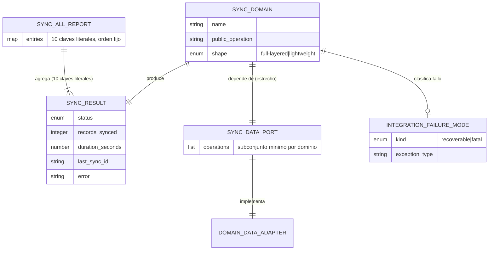

# Functional Spec — Descomposición DDD de `data_sync_service.py`

> Fuente de verdad de **workflows** y **máquinas de estados**. Las vistas de
> entidades (diagrama ER) y de reglas al final son **derivadas** de `entities.md`
> y `rules.md` (esos ficheros son la fuente de verdad de su contenido).
> Etapa de diseño, refactor backend-only: sin cambio de comportamiento observable.

## Workflow 1 — Coordinación de `sync_all()` (preservado)

Comportamiento observable a congelar (BR3.1, FR5.2). `sync_all()` queda como
coordinador delgado que invoca los 10 `sync_*` en orden fijo y agrega bajo las 10
claves literales.

1. `sync_all()` registra inicio.
2. Invoca `sync_players_full()` PRIMERO (los demás dominios dependen de los
   registros de jugador por FK) → clave `players`.
3. Invoca en orden: `sync_transactions()` → `transactions`; `sync_clauses()` →
   `clauses`; `sync_punishments_bonuses()` → `punishments_bonuses`;
   `sync_dream_teams_mvps()` → `dream_teams`; `sync_player_performance()` →
   `player_performance`; `sync_rosters()` → `rosters`; `sync_round_rankings()` →
   `team_standings`; `sync_match_odds()` → `match_odds`; `sync_prizes()` →
   `prizes`.
4. Cada invocación devuelve un `SyncResult`; se insertan en el dict en ese orden.
5. Devuelve el `SyncAllReport` (dict de 10 claves literales, orden de inserción
   preservado).

Invariante: el orden y las 10 claves literales son parte del contrato observable
(BR3.1). `sync_all()` no contiene lógica de dominio; solo coordina (BR1.2).

## Workflow 2 — Operación `sync_<domain>` genérica tras la extracción

Estructura objetivo de cada `sync_*` tras la descomposición. El facade delega; el
orquestador de aplicación del dominio orquesta ingesta → cálculo → persistencia.

1. **Facade** (`DataSyncService.sync_<domain>()`): delega en el orquestador del
   módulo del dominio, sin lógica propia (BR1.2). Devuelve su `SyncResult` tal cual.
2. **Orquestador de aplicación** (dominio):
   a. Inicia temporizador (`duration_seconds`) y logging del dominio.
   b. **Ingesta**: llama al cliente externo inyectado (`FutmondoClient`/Sofascore)
      dentro de un `try` que captura `Integration*Error` (BR4.1). Aplica el
      throttling `time.sleep()` entre páginas/llamadas donde hoy existe.
   c. **Cálculo** (solo dominios `full-layered`): delega en la función pura de
      `application/` (patrón `calculate_round_prizes`), que opera sobre datos ya
      materializados y no toca I/O.
   d. **Persistencia**: llama al `port` estrecho del dominio (BR2.1); el
      `*_adapter` implementa el SQL envuelto (BR2.2). Reemplazos de conjunto usan
      escritura atómica (BR5.1).
   e. **Retorno**: construye el `SyncResult` con la misma forma observable de hoy
      (BR3.2).
3. **Manejo de errores** (en el orquestador, BR4.1):
   - `except <Integration recuperable>`: si el fallo ocurre en/alrededor del punto
     de escritura → **PROPAGATE** (BR2.3: abortar limpio, no degradar sobre una
     escritura que podría corromper datos); si es fuera de escritura → degrada y
     continúa según el comportamiento actual del dominio.
   - `except Exception` (red final, BR4.2): registra sin credenciales y devuelve
     `SyncResult{status: error, ...}`. NUNCA enmascara las ramas tipadas de arriba.

## Workflow 3 — Extracción de un dominio (characterization-first, proceso)

Proceso incremental por dominio (BR6.1, FR4.2), una unidad de trabajo por dominio:

1. **Inventario de imports** del dominio (BR1.3): qué símbolos consume/expone.
2. **Caracterizar**: escribir tests que congelan el efecto observable del dominio
   (payload del `SyncResult`, estado en BD vía fakes, modo de fallo) con los fakes
   en memoria de `conftest.py`. Suite en verde.
3. **Extraer**: crear el módulo del dominio con su forma (`full-layered` o
   `lightweight`, Q1), mover ingesta+errores+throttling al orquestador (BR2.3,
   BR4.1), el cálculo puro a `application/` (si aplica), el SQL al `*_adapter` tras
   el `port` (BR2.1, BR2.2). El facade delega (BR1.1, BR1.2). Shim de re-export
   solo si el inventario lo exige (BR1.3).
4. **Verificar**: la caracterización sigue en verde (equivalencia estricta); el
   gate de CI en verde; el piso `--cov-fail-under=27` no baja (BR6.1, NFR2).
5. Siguiente dominio.

## Máquina de estados — Un paso de sync (`SyncStep`)

Estados observables de la ejecución de un `sync_*` individual (alineado con el
manejo recuperable/fatal de BR4.1 y con `sync_step_status.py`).

```mermaid
stateDiagram-v2
    [*] --> Running: sync_<domain>() invocado
    Running --> Ingesting: llamada al cliente externo
    Ingesting --> Computing: datos materializados (solo full-layered)
    Ingesting --> Persisting: sin calculo (lightweight)
    Computing --> Persisting: calculo puro completado
    Persisting --> Ok: SyncResult{status: success/no_new_data/no_*}
    Ingesting --> Degraded: Integration recuperable FUERA de escritura
    Computing --> Degraded: Integration recuperable FUERA de escritura
    Degraded --> Ok: continua; SyncResult marca el paso degradado
    Persisting --> Aborted: Integration recuperable EN escritura (BR2.3) -> PROPAGATE
    Ingesting --> Failed: except Exception (red final BR4.2)
    Computing --> Failed: except Exception
    Persisting --> Failed: except Exception
    Ok --> [*]
    Failed --> [*]: SyncResult{status: error}
    Aborted --> [*]: excepcion propagada al route
```

**Text fallback (máquina de estados `SyncStep`):** un `sync_*` empieza en
`Running`, pasa a `Ingesting` (llamada al cliente externo). Desde ahí, si el
dominio es `full-layered` va a `Computing` (cálculo puro) y luego a `Persisting`;
si es `lightweight` va directo a `Persisting`. `Persisting` termina en `Ok`
(`SyncResult` con `status` `success`/`no_new_data`, o una variante `no_*`
específica del dominio —`closed`, `no_config`, `no_teams`, `no_standings`,
`no_rounds`, `no_prizes_configured`—). Un `Integration*Error` **recuperable
fuera del punto de escritura** lleva a `Degraded` (continúa; el paso se marca
degradado) y de ahí a `Ok`. Un recuperable **en el punto de escritura** lleva a
`Aborted` → PROPAGATE (BR2.3), abortando limpio. Cualquier `Exception` no tipada
cae en la red final `Failed` → `SyncResult{status: error}` (BR4.2), que nunca
enmascara las ramas tipadas.

## Vista derivada — Diagrama de entidades (fuente: `entities.md`)

**Text fallback (ER):** `SyncAllReport` agrega uno o más `SyncResult` bajo 10
claves literales fijas. Cada `SyncDomain` produce un `SyncResult` y depende de un
`SyncDataPort` estrecho, implementado por un `DomainDataAdapter` de
infraestructura; un `SyncDomain` clasifica sus fallos vía `IntegrationFailureMode`
(recoverable/fatal). Detalle de atributos y cardinalidades: `entities.md` (fuente
de verdad).

## Vista derivada — Resumen de reglas (fuente: `rules.md`)

- **Contrato público** (BR1.1, BR1.2): clase + 10 `sync_*` + `sync_all()`
  preservados; facade delgado. Inventario de imports → shim puntual (BR1.3).
- **Datos tras port** (BR2.1, BR2.2): port estrecho por dominio; SQL envuelto en
  adaptador; `data_manager_v2.py` intacto. Ingesta en el orquestador (BR2.3).
- **Equivalencia** (BR3.1, BR3.2): orden fijo + 10 claves literales
  (`rankings`→`team_standings`); mismo payload por `sync_*`.
- **Errores/throttling** (BR4.1, BR4.2): tipados + `time.sleep()` en el
  orquestador; sin credenciales en excepciones.
- **Escritura atómica** (BR5.1): set-replacement transaccional de `prizes` como
  patrón de referencia.
- **Proceso** (BR6.1): characterization-first por dominio; piso de cobertura solo
  sube.

Fuente de verdad de cada regla y su lógica IF…THEN: `rules.md`.
