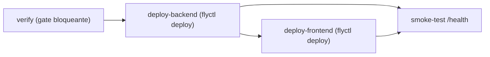

# CD Config — Pipeline de despliegue Fly.io (documentación del existente)

Intent: `sync-god-file` (Oleada 3, FR13) · scope `refactor` · fase Operation.
Este intent **no cambia** el pipeline; documenta el existente
(`.github/workflows/fly-deploy.yml`) adaptado al stack real. Coste 0 €.

## Contexto del stack real

- **Hosting**: Fly.io, región `cdg`. Dos apps: backend `futmondo-api` (puerto
  8000, healthcheck `/health`) y frontend `futmondo-app` (nginx, `/`).
- **BD**: Neon PostgreSQL (Frankfurt, tier free).
- **CI/CD**: GitHub Actions, tiers gratuitos. `ci.yml` gatea el PR (required
  status check en `main`); `fly-deploy.yml` corre en push a `main` y despliega.
- **Secretos**: vía `secrets`/`vars` de GitHub Actions y `fly secrets`; en CI el
  `JWT_SECRET` es efímero y no productivo.

## Pipeline de CD (`fly-deploy.yml`) — cadena de jobs

Disparo: `push` a `main` (y `workflow_dispatch`). Cadena `needs:` **intacta**
(este intent no la reordena):

**Text fallback:** `verify` (gate bloqueante) precede a `deploy-backend`;
`deploy-frontend` depende de `deploy-backend`; `smoke-test` depende de ambos
deploys. Un `verify` rojo impide los deploys (un rojo nunca llega a producción).

### Job `verify` (gate bloqueante — paridad con el PR-gate de `ci.yml`)

Réplica del gate para el push directo a `main` (los `needs:` no cruzan
workflows). Pasos bloqueantes:
1. `gitleaks/gitleaks-action@v3` — escaneo de secretos (unificado a `@v3` en
   ambos gates).
2. `setup-python@v6` (Python `3.12`) + `pip install -r backend/requirements.txt`.
3. `scripts/check-allowlist-expiry.sh backend/.pip-audit-allowlist` — una entrada
   caducada de la allowlist bloquea.
4. `pip-audit` sobre el entorno instalado (sin `-r`), con `--ignore-vuln` de la
   allowlist versionada; bloquea findings con fix.
5. `ruff==0.16.9 check .` (backend) — lint bloqueante.
6. `pytest tests -q --cov=app --cov-report=term-missing` con `JWT_SECRET`
   efímero — piso `--cov-fail-under` desde `pytest.ini` (paridad de cobertura).
7. `setup-node@v5` (Node `22`) + `npm ci` (frontend).
8. `npm audit --audit-level=high` — bloqueante en `high`.
9. `npx ng test --watch=false` — umbrales de cobertura por métrica desde
   `angular.json` (fuente única).

### Jobs de despliegue

- `deploy-backend` (`needs: verify`): `flyctl deploy` en `./backend` con
  `FLY_API_TOKEN` (secret). Imagen a `futmondo-api`.
- `deploy-frontend` (`needs: deploy-backend`): `flyctl deploy` en `./angular-app`.
  Imagen a `futmondo-app` (nginx).
- Acción `superfly/flyctl-actions/setup-flyctl@master` (el pin por SHA de acciones
  de terceros mutables se decide en `ci-pipeline`, no aquí).

### Job `smoke-test` (`needs: [deploy-backend, deploy-frontend]`)

- `curl` contra `${SMOKE_HEALTH_URL:-https://futmondo-api.fly.dev/health}`, 5
  reintentos con `sleep 10`, éxito en HTTP 200. Es la **verificación de release**
  (no hay staging separado).

## Crons (coste ~0, no tocados)

- `daily-sync.yml` y `sofascore-sync.yml`: máquinas Fly one-shot para
  sincronizaciones programadas. Este intent no cambia su orden ni su contenido.

## Adaptación al stack real (AWS → equivalente gratuito)

| Concepto CD genérico (AWS) | Equivalente real / Estado |
|---|---|
| CodePipeline / CodeBuild | GitHub Actions (`ci.yml` + `fly-deploy.yml`), free tier |
| ECR (registry) | Registry gestionado por Fly.io (`registry.fly.io/...`) |
| CodeDeploy blue/green / canary | NO-APLICA: recreate on-merge + smoke `/health` (sin staging, coste 0 €) |
| Feature flags (AppConfig/Evidently) | NO-APLICA: trunk-based + gate bloqueante; sin servicio de flags de pago |
| Secrets Manager | `secrets`/`vars` de GitHub Actions + `fly secrets` |
| Config drift detection | diff de git sobre `fly.toml` y los workflows versionados |

## Free tier (impacto)

- El job `verify` añade coste de minutos de GitHub Actions (cobertura + audits +
  lint en el push-gate además del PR-gate). Se mantiene dentro del free tier;
  umbral de vigilancia: minutos de Actions/mes.
