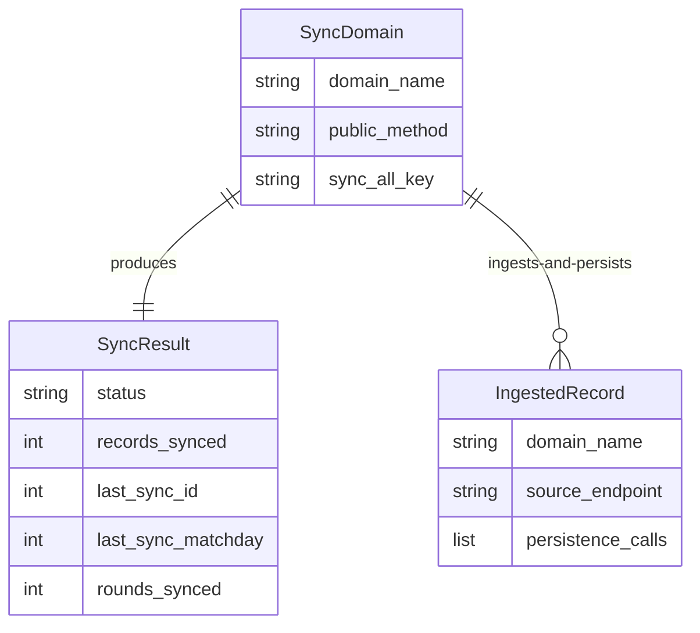

# Functional Specification — `261001-sync-god-file-resto`

> Fuente de verdad de **flujos y máquinas de estado** del refactor. Las vistas ER
> y de reglas son **derivadas** (`entities.md` y `rules.md` son la fuente). Es un
> diseño de equivalencia estricta: los flujos describen cómo se reubica el
> comportamiento existente, no comportamiento nuevo. Idioma: castellano;
> identificadores en inglés.

## Workflow 1 — Extracción canónica de un dominio de sync (parametrizado)

Los 8 dominios pendientes comparten esta forma; el único parámetro es el nombre
de dominio y la variante de `SyncResult`. Secuencia (characterization-first):

1. **Congelar** (BR6.1): escribir el test de caracterización del dominio que
   captura (a) el `SyncResult` observable exacto y (b) las llamadas a
   `DataManagerV2` (métodos + argumentos), con fakes en memoria. Debe estar
   verde contra el código actual.
2. **Crear la terna** (BR1.1): `sync/<domain>/orchestrator.py`,
   `sync/<domain>/domain/ports.py` (Protocol con los métodos de `DataManagerV2`
   verbatim, BR1.2), `sync/<domain>/infrastructure/<domain>_adapter.py`
   (delega 1:1 a `DataManagerV2`, BR3.1).
3. **Mover la orquestación** al orchestrator verbatim (ingesta vía
   `FutmondoClient` inyectado, throttling `time.sleep`, mapeo de rondas, manejo
   de errores) — BR4.1; delegar la persistencia al port.
4. **Adelgazar el método público** `sync_<domain>` a delegación fina al
   orchestrator, devolviendo su `SyncResult` sin reformatear (BR2.1, BR5.2).
5. **Verde de nuevo**: la caracterización y la suite existente siguen verdes; el
   piso de cobertura no baja (BR8.2). Equivalencia confirmada.

```mermaid
sequenceDiagram
  participant Pub as DataSyncService.sync_&lt;domain&gt; (delegacion fina)
  participant Orch as &lt;Domain&gt;SyncOrchestrator
  participant Cli as FutmondoClient (inyectado)
  participant Port as domain/ports.py (Protocol)
  participant Adp as infrastructure/&lt;domain&gt;_adapter.py
  participant DM as DataManagerV2 (verbatim)
  Pub->>Orch: run()
  Orch->>Cli: ingesta (get_*)
  Cli-->>Orch: datos crudos | Integration*Error
  Orch->>Orch: mapeo + throttling (time.sleep) verbatim
  Orch->>Port: save_*/update_sync_metadata
  Port->>Adp: (implementado por)
  Adp->>DM: delega 1:1 verbatim
  DM-->>Adp: resultado persistencia
  Orch-->>Pub: SyncResult (forma por dominio)
```

<!-- Text fallback: El metodo publico sync_<domain> delega finamente al <Domain>SyncOrchestrator. El orchestrator ingesta via FutmondoClient inyectado (excepciones tipadas Integration*Error), aplica mapeo y throttling time.sleep verbatim, y persiste a traves del domain port (Protocol); el port lo implementa el infrastructure adapter, que delega 1:1 verbatim a DataManagerV2. El orchestrator devuelve el SyncResult cuya forma depende del dominio. -->

## State machine — Resultado de un paso de sync (preservado verbatim, BR4.1/BR5.2)

```mermaid
stateDiagram-v2
  [*] --> Running
  Running --> OK: ingesta+persistencia sin error
  Running --> DEGRADED: error recoverable (Integration Timeout/Unparseable/Request)
  Running --> Fatal: error fatal (IntegrationBanError)
  OK --> [*]: SyncResult status=ok
  DEGRADED --> [*]: paso marcado DEGRADED via sync_step_status; operacion NO falla
  Fatal --> [*]: excepcion tipada propagada; sin datos a medias
```



<!-- Text fallback: Un paso de sync arranca en Running. Si ingesta y persistencia terminan sin error -> OK (SyncResult status=ok). Si ocurre un error recoverable (IntegrationTimeoutError / IntegrationUnparseableError / IntegrationRequestError) -> DEGRADED: el paso se marca degradado via sync_step_status y la operacion NO falla. Si ocurre un error fatal (IntegrationBanError) -> Fatal: se propaga la excepcion tipada sin dejar datos a medias. Esta clasificacion se preserva verbatim solo donde ya existe hoy (BR4.1); no se introduce en dominios que no la tengan. -->

## Workflow 2 — Delegación fina del método público (invariante de superficie)

El método público conserva su firma y su clave en `sync_all()` (BR5.1). Tras la
extracción, su cuerpo es: construir/obtener el orchestrator del dominio →
`return orchestrator.run()`. No contiene `FutmondoClient`, SQL ni `time.sleep`
(BR2.1). `sync_all()` sigue invocando los 10 `sync_*` en orden fijo y devuelve
las 10 claves literales; `_run_sync_in_background` (router) permanece intacto
(BR5.1, FR5.4).

Snippet ilustrativo (≤15 líneas, interface-level, no implementación):

```python
# DataSyncService (facade) — after extraction
def sync_clauses(self) -> dict:
    orchestrator = ClausesSyncOrchestrator(client=self.client, store=self._clauses_adapter)
    return orchestrator.run()  # returns the exact SyncResult shape, verbatim
```

## Workflow 3 — Uniformar `prizes/` (BR7.1)

`prizes/` ya tiene `calculator.py` (cálculo puro) y
`team_prizes_writer.replace_team_prizes` (escritura atómica set-replacement). Se
añade un facade/orchestrator (como `analytics/__init__.py` y
`assistant/__init__.py`, que re-exportan desde `facade.py`); `sync_prizes` queda
como delegación fina que preserva su `SyncResult` (`rounds_processed`,
`stale_prizes_removed`). No se mueve el `SELECT user_championships` (deuda,
BR3.2).

## Entity-relationship (derivado de `entities.md` — fuente de verdad allí)



<!-- Text fallback: SyncDomain produce exactamente un SyncResult (1:1) e ingesta/persiste uno o mas IngestedRecord (1:N). SyncDomain tiene domain_name, public_method y sync_all_key. SyncResult tiene status y claves variables por dominio (records_synced, last_sync_id, last_sync_matchday, rounds_synced, ...). IngestedRecord tiene domain_name, source_endpoint y persistence_calls. Fuente de verdad del modelo: entities.md. -->

## Rules summary (derivado de `rules.md` — fuente de verdad allí)

- BR1.1/BR1.2 — terna orchestrator+port+adapter por dominio; port con métodos de `DataManagerV2` verbatim.
- BR2.1 — método público = delegación fina.
- BR3.1/BR3.2 — persistencia principal al adapter; migraciones/helpers transversales fuera de alcance.
- BR4.1/BR4.2 — errores y throttling verbatim; sin credenciales en logs.
- BR5.1/BR5.2 — superficie pública y `SyncResult` por dominio byte-a-byte.
- BR6.1 — caracterización primero (SyncResult + llamadas a DataManagerV2).
- BR7.1 — uniformar `prizes/`.
- BR8.1/BR8.2 — sin `ruff format` masivo; piso de cobertura no baja; gate verde.

## Business scenarios

- **Camino feliz (dominio por-registro, p. ej. `clauses`)**: ingesta ok →
  persistencia vía adapter → `SyncResult {status: "ok", records_synced: N, ...}`
  idéntico al actual.
- **Camino recoverable**: `IntegrationTimeoutError` en una página/ronda → el paso
  se marca `DEGRADED` vía `sync_step_status`, la operación continúa y no corrompe
  datos (comportamiento preservado verbatim donde ya existe).
- **Camino fatal**: `IntegrationBanError` → se propaga la excepción tipada sin
  dejar datos a medias; `sync_all()` lo refleja como hoy.
- **Invariante de superficie**: un consumidor (worker del router, frontend) que
  llama `sync_all()` recibe las mismas 10 claves en el mismo orden antes y
  después del refactor.
