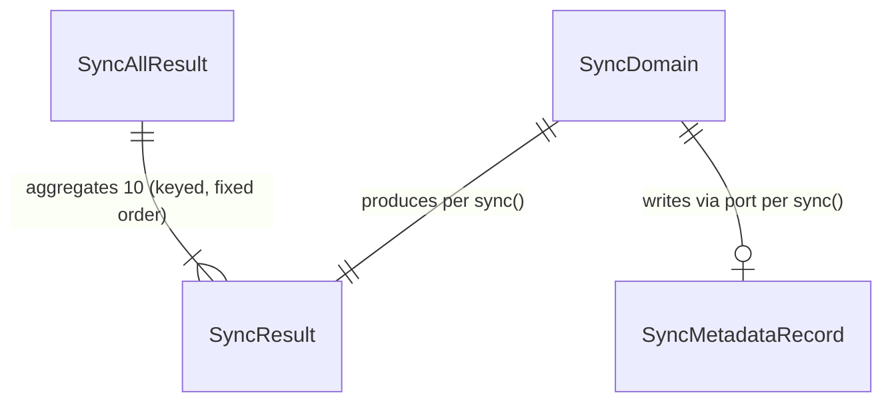

# Functional Spec — Sync Domain Decomposition (unit: sync-domains-decomposition)

Source of truth for the **workflows and state transitions** of this refactor
unit. `entities.md` owns data shapes; `rules.md` owns the invariants; this file
owns the ordered behaviour: the per-domain extraction procedure, the prizes
uniformisation procedure, the preserved `sync_all()` behaviour, and the per-unit
delivery lifecycle. It carries two **derived** views (ER diagram from
`entities.md`, rules summary from `rules.md`).

## Sources

- `aidlc/spaces/default/intents/261002-sync-god-file-8/inception/requirements-analysis/requirements.md` (FR1–FR6, NFR1–NFR9, Constraints)
- `entities.md`, `rules.md` (this stage)
- Pilots `backend/app/services/sync/clauses/orchestrator.py`, `sync/match_odds/orchestrator.py` (reference behaviour)
- `backend/app/services/data_sync_service.py` (frozen facade), `prizes/calculator.py`, `prizes/team_prizes_writer.py`
- Interview answers Q1–Q3 (`functional-design-questions.md`)

## Reference target structure (post-refactor, per domain)

Each extracted domain mirrors the pilots exactly:

```
backend/app/services/sync/<domain>/
  __init__.py                         # re-exports the orchestrator
  orchestrator.py                     # <Domain>SyncOrchestrator (application): ingestion + throttle + error handling + delegation; returns the SyncResult dict
  domain/
    __init__.py
    ports.py                          # <Domain>SyncDataPort (typing.Protocol, consumer-owned, no SQL/framework)  [+ pricing.py for transactions — pure helper, BR4.3]
  infrastructure/
    __init__.py
    <domain>_adapter.py               # DataManager<Domain>Adapter: ONLY module touching DataManagerV2; wraps calls (and any raw SQL) verbatim
```

## Workflow W1 — Extract one inline domain (applies to the 7 inline domains)

Each domain is one unit of work (BR6.1). The ordered steps:

1. **Characterize (freeze baseline)** — write characterization tests (fakes, no
   network/DB, `conftest.py` pattern) asserting the domain's observable
   `SyncResult` (keys/values) and ingestion behaviour (pagination limit,
   operation order, throttle). The existing suite must be green first (BR5.1, BR7.3).
2. **Author the domain port** — `domain/ports.py` as a `typing.Protocol`
   declaring ONLY the persistence operations this orchestrator consumes; no SQL,
   no framework import (BR1.1).
3. **Author the adapter** — `infrastructure/<domain>_adapter.py` implementing the
   port, defaulting to `DataManagerV2(skip_init=True)`, delegating each call
   verbatim and forwarding only the kwargs the inline call supplied (BR1.3).
   Any raw SQL that ran on `self.dm.db` moves here VERBATIM (BR4.1).
4. **Author the orchestrator** — `orchestrator.py` hosting the ingestion loop
   (injected `FutmondoClient`), per-domain throttle (`time.sleep`), pagination
   limit, per-page try/except, the error path, and delegation to the port;
   returns the identical `SyncResult` dict (BR1.1, BR5.2, BR7.1). For
   `transactions`, the pure `_find_price_at_date` lands in
   `domain/pricing.py` (BR4.3); `_find_championship` is injected from the facade
   for `dream_teams_mvps`/`rosters` (BR4.2).
5. **Thin the facade method** — rewrite `DataSyncService.sync_<domain>` as a thin
   delegation: lazy-import orchestrator + adapter, instantiate with
   `client=self.client`, `championship_id=self.championship_id`,
   `data=DataManager<Domain>Adapter(dm=self.dm)`, `return orchestrator.sync()`
   (BR1.2). Signature unchanged (BR3.3).
6. **Verify green** — the characterization suite and the existing suite pass
   unchanged; `SyncResult` and observable behaviour identical (BR5.2). Coverage
   floor `--cov-fail-under=27` not relaxed (NFR3).
7. **Land the unit** — one commit, Conventional Commits in Spanish; per-unit gate.
   New files formatted surgically only (BR7.2).

### W1 state transitions (per unit)

```
pending --(characterization frozen, suite green)--> characterized
characterized --(port + adapter + orchestrator authored, facade thinned)--> extracted
extracted --(characterization + existing suite green, SyncResult identical)--> verified
verified --(per-unit gate approved, committed)--> landed
(any step fails) --> blocked (fix before advancing; never merge half-done — BR6.1)
```

<!-- Text fallback: a unit moves pending → characterized → extracted → verified → landed; any failing step sends it to blocked, which must be resolved before advancing. -->

## Workflow W2 — Uniformise `sync_prizes`

Unlike W1, prizes already has its pure calculator and atomic writer under
`prizes/`. The uniformisation:

1. **Characterize** the observable `sync_prizes` behaviour/payload as in W1 step 1.
2. **Move orchestration** into `sync/prizes/orchestrator.py`, reusing
   `prizes/calculator.py` and `prizes/team_prizes_writer.replace_team_prizes`
   unchanged; the raw SQL via `get_db()` is wrapped verbatim in the prizes
   adapter (BR2.1, BR4.1). Prize calc logic and the atomic set-replacement write
   pattern are NOT altered (BR2.2, BR3.3).
3. **Thin** `DataSyncService.sync_prizes` to a delegation (BR1.2).
4. **Verify green** and **land** as W1 steps 6–7.

Prizes is sequenced LAST (BR6.2).

## Workflow W3 — Preserve `sync_all()` (no behavioural change)

`sync_all()` is NOT re-ordered or re-keyed. After each domain is thinned, its
method still returns the same `SyncResult`, so `sync_all()` keeps producing the
identical aggregate dict:

Fixed key order (BR3.2):
```
players          <- sync_players_full()
transactions     <- sync_transactions()
clauses          <- sync_clauses()
punishments_bonuses <- sync_punishments_bonuses()
dream_teams      <- sync_dream_teams_mvps()
player_performance  <- sync_player_performance()
rosters          <- sync_rosters()
team_standings   <- sync_round_rankings()
match_odds       <- sync_match_odds()
prizes           <- sync_prizes()
```

The three name↔key divergences (`players`↔`sync_players_full`,
`dream_teams`↔`sync_dream_teams_mvps`, `team_standings`↔`sync_round_rankings`)
are preserved verbatim because the router worker `_run_sync_in_background`
depends on them (BR3.1, BR3.2).

## Unit sequencing (delivery order, BR6.2)

| # | Unit (domain) | Notes |
|---|---------------|-------|
| 1 | transactions | Pure `_find_price_at_date` → `domain/pricing.py`; raw SQL (ALTER/UPDATE, `_enrich_market_values`, `_store_bids`) wrapped in adapter; `except: pass` preserved verbatim (BR5.3) |
| 2 | punishments_bonuses | |
| 3 | dream_teams_mvps | injects `_find_championship` from facade (BR4.2) |
| 4 | rosters | injects `_find_championship`; `_save_favorites` raw SQL (incl. Postgres `execute_values` branch) wrapped verbatim in adapter |
| 5 | round_rankings | key `team_standings` in `sync_all()` |
| 6 | player_performance | |
| 7 | players_full | key `players` in `sync_all()` |
| 8 | prizes (uniformise) | reuse calculator + atomic writer; raw SQL via `get_db()` wrapped verbatim |

Note: this functional-design unit (`sync-domains-decomposition`) covers the
design for all domains; the per-domain build units above are executed in
code-generation following this spec.

## Business scenarios (equivalence checks)

- **Happy path, incremental domain (e.g. transactions)**: given a fake client
  returning N new items, after extraction `sync_<domain>()` returns the same
  `status`, `records_synced`, `last_sync_id`, `duration_seconds` as before, and
  the same `SyncMetadataRecord` is written. (BR5.2)
- **No new data**: given a fake client whose first page already matches the
  previous sync id, the payload resolves to the historical `no_new_data`/`success`
  per the domain's frozen rule. (BR5.2)
- **Failure path**: given a fake client raising, `sync_<domain>()` returns
  `status: "error"` with `error`/`duration_seconds` and the error row carries
  `str(e)` only — no credential material. (BR7.1)
- **Idempotent ALTER (transactions)**: the `except: pass` around the idempotent
  `ALTER TABLE ... IF NOT EXISTS` behaves identically (swallowed), preserved
  verbatim. (BR5.3)
- **sync_all order**: `sync_all()` returns the 10 keys in the fixed order with
  the name↔key divergences intact; the router worker consumes it unchanged. (BR3.2)

## Derived view — Entity relationships (from `entities.md`)



<!-- Text fallback: Each SyncDomain produces exactly one SyncResult per sync() call and writes zero-or-one SyncMetadataRecord via its persistence port. SyncAllResult aggregates ten SyncResult values, one per domain, keyed and ordered as frozen. -->

## Derived view — Rules summary (from `rules.md`)

- **Structure**: BR1.1 triad per domain; BR1.2 thin facade; BR1.3 kwargs-faithful adapter; BR2.1 prizes reuse calc+writer.
- **Frozen surface**: BR3.1 10 methods + sync_all; BR3.2 keys/order/divergences; BR3.3 signatures + prize logic unchanged.
- **Raw SQL / helpers**: BR4.1 wrap verbatim in adapter; BR4.2 `_find_championship` injected from facade; BR4.3 `_find_price_at_date` in transactions `domain/`.
- **Equivalence**: BR5.1 characterize first; BR5.2 identical behaviour (throttle/pagination); BR5.3 preserve `except: pass`.
- **Delivery**: BR6.1 one unit per domain + per-unit gate; BR6.2 order least→most coupling, prizes last.
- **Guardrails**: BR7.1 no credentials in errors/logs; BR7.2 don't grow god-files / no mass reformat; BR7.3 fakes assert effects, cost 0 €, language policy.
