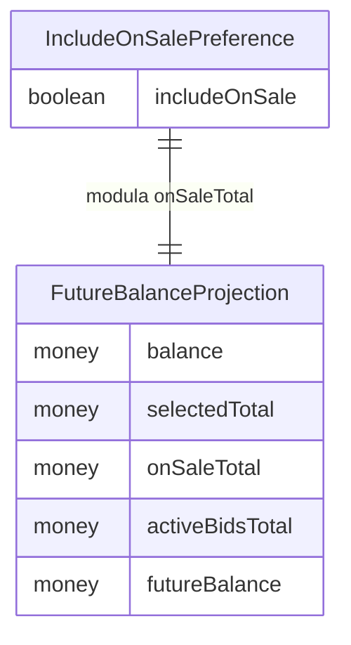

# Functional Spec — calculator-toggle

Especificación de comportamiento de la mejora del toggle "Incorporar jugadores
en venta" en la pantalla Calculadora. Fuente de verdad de **workflows** y
**máquina de estados** del toggle. Las vistas ER y de reglas son **derivadas**
(fuente de verdad en `entities.md` y `rules.md`).

## Workflows

### WF1 — Inicialización de la pantalla (restaurar preferencia)

1. El componente Calculadora se inicializa.
2. Lee `localStorage[futmondo_calc_include_onsale]`.
3. Si el valor es `'true'` → `includeOnSale = true`; si es `'false'` → `includeOnSale = false`.
4. Si la clave no existe o el valor no es `'true'` ni `'false'` → `includeOnSale = true` (BR3.3, BR3.4).
5. Carga en paralelo roster, mercado (balance, pujas activas) y jugadores en venta (sin cambios respecto a hoy).
6. Calcula `futureBalance` según BR1.1/BR1.2 usando el `includeOnSale` restaurado.

### WF2 — Alternar el toggle

1. El usuario activa/desactiva el toggle "Incorporar jugadores en venta".
2. `includeOnSale` cambia su valor.
3. Se persiste `localStorage[futmondo_calc_include_onsale] = 'true' | 'false'` (BR3.1).
4. `futureBalance` se recomputa reactivamente (BR1.3): incluye `onSaleTotal` solo si `includeOnSale = true` (BR1.1/BR1.2); `activeBidsTotal` siempre resta (BR2.1).
5. El bloque "En venta" (sección de tarjetas) se MUESTRA si `includeOnSale = true` y se OCULTA si `false` (BR4.1).
6. La lista seleccionable se reconstruye (BR5.1/BR5.3): con ON, los jugadores en venta se EXCLUYEN de la lista; con OFF, se INCLUYEN deseleccionados (BR5.2). Al pasar de OFF a ON, se re-excluyen y se descarta cualquier selección manual que tuvieran (BR5.3).

### WF3 — Recálculo por otras interacciones (sin cambios de comportamiento)

1. El usuario selecciona/deselecciona jugadores o cambia la fecha de proyección.
2. `selectedTotal` se recomputa como hoy.
3. `futureBalance` se recomputa aplicando la condición de `onSaleTotal` vigente (BR1.1/BR1.2) y la invariante de pujas (BR2.1).

### WF4 — Composición de la lista seleccionable

1. Al cargar o al cambiar el toggle, se calcula el conjunto `onSaleIds` de jugadores en venta.
2. Si `includeOnSale = true`: la lista seleccionable = roster SIN `onSaleIds` (comportamiento actual).
3. Si `includeOnSale = false`: la lista seleccionable = roster COMPLETO (incluye `onSaleIds`); los jugadores en venta entran deseleccionados (BR5.2).
4. Invariante (BR5.4): un jugador en venta aporta su valor por una sola vía — vía `onSaleTotal` con ON (y no está en la lista), o vía `selectedTotal` solo si se selecciona con OFF; nunca ambas.

## Máquina de estados — IncludeOnSalePreference

Estados: `ON` (incluye en venta) y `OFF` (excluye en venta).

```mermaid
stateDiagram-v2
  [*] --> ON: sin valor guardado o valor invalido (BR3.3, BR3.4)
  [*] --> ON: localStorage = 'true' (BR3.2)
  [*] --> OFF: localStorage = 'false' (BR3.2)
  ON --> OFF: usuario desactiva (persiste 'false'; oculta bloque, lista incluye onSale deseleccionados)
  OFF --> ON: usuario activa (persiste 'true'; muestra bloque, lista re-excluye onSale y limpia su seleccion)
```

Texto fallback: al iniciar, el estado se restaura de `localStorage` ('true'→ON,
'false'→OFF; ausente/inválido→ON). El usuario alterna entre ON y OFF; cada
cambio persiste el nuevo valor, muestra/oculta el bloque "En venta" y reconstruye
la lista seleccionable. ON suma `onSaleTotal` y excluye esos jugadores de la
lista; OFF no suma `onSaleTotal` y los incluye deseleccionados.

## Vista ER (derivada de entities.md)



Texto fallback: `IncludeOnSalePreference` (booleano `includeOnSale`) modula si
`onSaleTotal` entra en `FutureBalanceProjection` (balance, selectedTotal,
onSaleTotal, activeBidsTotal → futureBalance).

## Vista de reglas (derivada de rules.md)

- BR1.1/BR1.2 — `onSaleTotal` entra en `futureBalance` solo con toggle ON.
- BR1.3 — recálculo reactivo al cambiar el toggle.
- BR2.1 — `activeBidsTotal` siempre resta (invariante).
- BR3.1–BR3.4 — persistencia, restauración, por defecto ON, fallback a ON ante valor inválido.
- BR4.1 — bloque "En venta" oculto con toggle OFF, visible con ON.
- BR5.1 — lista seleccionable incluye los jugadores en venta solo con OFF.
- BR5.2 — esos jugadores entran deseleccionados con OFF.
- BR5.3 — reconstrucción reactiva; OFF→ON re-excluye y limpia su selección manual.
- BR5.4 — invariante anti-doble-conteo (una sola vía de aporte).

## Escenarios de negocio (happy / unhappy)

- **Happy ON**: valor guardado `'true'`; `futureBalance` incluye `onSaleTotal`; bloque "En venta" visible; jugadores en venta excluidos de la lista.
- **Happy OFF**: usuario desactiva; `futureBalance` excluye `onSaleTotal`; pujas siguen restando; bloque "En venta" oculto; jugadores en venta en la lista, deseleccionados.
- **Simular venta desde cero (OFF)**: con OFF, el usuario selecciona un jugador que estaba en venta → su valor entra vía `selectedTotal` (una sola vía, BR5.4).
- **Transición OFF→ON**: los jugadores en venta se re-excluyen de la lista, su selección manual se descarta y su valor cuenta de nuevo vía `onSaleTotal` (BR5.3).
- **Primera visita**: sin clave → ON (comportamiento idéntico al actual).
- **Valor corrupto**: `localStorage` contiene `'maybe'` → se trata como ON, sin error.
- **Invariante de pujas**: con OFF y pujas activas, `futureBalance = balance + selectedTotal - activeBidsTotal`.

## Sources

- `requirements.md` (FR1–FR5), `functional-design-questions.md`.
- `entities.md`, `rules.md` (fuentes de verdad de las vistas derivadas).
- Código: `calculator.component.ts` (`futureBalance`, `onSaleTotal`, `loadData`, filtrado `onSaleIds`).

## Assumptions & Open Questions

None.
