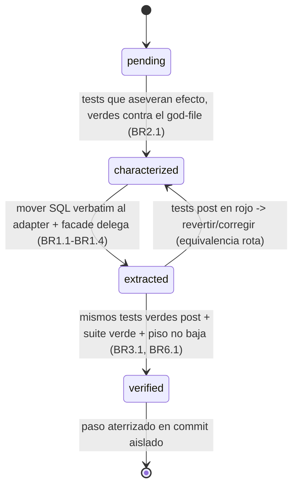
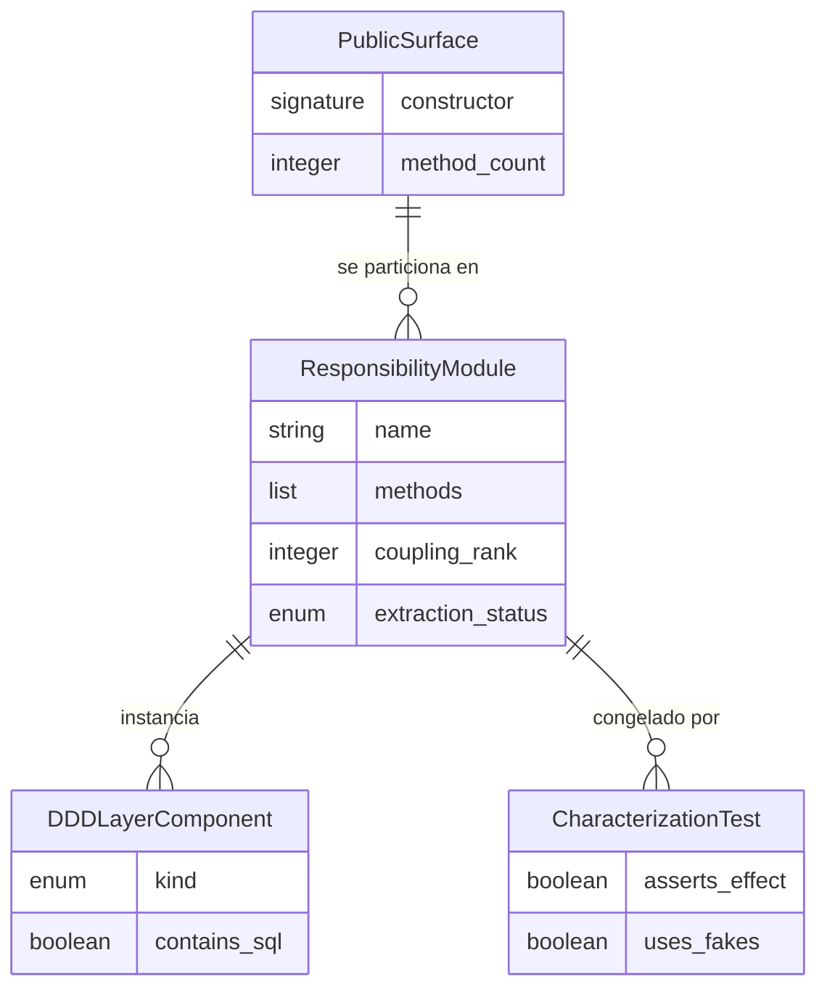

# Functional Spec — Workflow de descomposición de `data_manager_v2`

> Fuente de verdad de los **workflows** (secuencias de pasos de la extracción) y
> de la **máquina de estados** (ciclo de vida de cada `ResponsibilityModule`).
> Las vistas ER y de reglas son **derivadas** de `entities.md` y `rules.md`
> (que son su fuente de verdad). Fundamentado en `requirements.md` (FR1–FR5,
> NFR1–NFR2) y en el patrón DDD de referencia del CodeKB (`architecture.md`).

## Workflow 1 — Extracción de una responsabilidad (characterization-first)

El ciclo que se repite por cada `ResponsibilityModule`, en orden de menor a
mayor acoplamiento (BR5.1; orden exacto en Plan Approval):

1. **Seleccionar** el siguiente módulo pendiente según `coupling_rank`.
2. **Caracterizar**: escribir characterization tests que congelen el
   comportamiento observable de sus métodos usando los fakes in-memory
   (`_FakeInMemoryDB`/`_FakeCursor`/`fake_db`). Aseverar efecto (payload / filas
   / estado / modo de fallo), nunca `assert True` (BR2.1, BR2.2, BR2.3).
3. **Verde (pre)**: ejecutar los tests contra el god-file sin cambios → verdes.
   Esto fija la línea base de equivalencia.
4. **Extraer** al patrón DDD de referencia (BR1.1–BR1.4):
   - crear `domain/ports.py` — `typing.Protocol` consumer-owned, sin SQL;
   - crear `application/orchestrator` por responsabilidad, sin SQL;
   - crear `infrastructure/<resp>_adapter.py` — único módulo con SQL, que
     **envuelve verbatim** el SQL del god-file (incluida la rama por engine);
   - adelgazar los métodos del god-file para que **deleguen** manteniendo
     nombre y firma exactos (facade delgado).
5. **Verde (post)**: re-ejecutar los MISMOS characterization tests sin cambiar
   sus aserciones → verdes. Es el pass/fail de la equivalencia estricta (BR3.1).
6. **Verificar gate**: la suite `backend/tests/` completa queda verde y el piso
   `--cov-fail-under` no baja (BR6.1).
7. **Aterrizar** el paso de forma aislada (commit propio) para rollback
   quirúrgico, y pasar al siguiente módulo.

Invariantes transversales en cada paso: el error-handling heredado y los puntos
de corrupción por reemplazo de conjunto se mueven **verbatim** (BR3.2, BR3.3,
deuda diferida); los consumidores y el SQL-en-router no se tocan (BR4.1); no se
añade ningún método al god-file (BR1.4).

<!-- Text fallback (Workflow 1): por cada responsabilidad, en orden de menor a mayor acoplamiento: 1 seleccionar, 2 caracterizar con fakes aseverando efecto, 3 verde pre contra el god-file, 4 extraer a domain-port/orchestrator/infrastructure-adapter adelgazando el god-file a facade que delega, 5 verde post con los mismos tests, 6 verificar suite completa + piso de cobertura, 7 aterrizar en commit aislado y siguiente. Error-handling y puntos de corrupcion se mueven verbatim; consumidores y SQL-en-router intactos; no se amplia el god-file. -->

## Máquina de estados — ciclo de vida de un `ResponsibilityModule`

<!-- Text fallback (state machine): un ResponsibilityModule nace pending; pasa a characterized cuando sus tests de caracterizacion aseveran el efecto y estan verdes contra el god-file; pasa a extracted al mover el SQL verbatim al adapter con el facade delegando; pasa a verified cuando los mismos tests siguen verdes tras extraer y la suite completa + piso de cobertura pasan; si los tests post fallan vuelve a characterized para corregir; verified y aterrizado en commit aislado es terminal. -->

## Vista derivada — Entidades (ER, derivado de `entities.md`)

<!-- Text fallback (ER): PublicSurface se particiona en N ResponsibilityModule; cada ResponsibilityModule instancia N DDDLayerComponent (facade/orchestrator/domain-port/infrastructure-adapter) y es congelado por N CharacterizationTest. Fuente de verdad: entities.md. -->

## Vista derivada — Reglas (resumen, derivado de `rules.md`)

- **Equivalencia** (BR1.1 superficie byte-a-byte, BR1.2 SQL verbatim, BR3.1
  comportamiento observable idéntico): la vara de medir del refactor.
- **Patrón** (BR1.3 sólo el adapter con SQL, BR1.4 no ampliar el god-file): el
  molde DDD de referencia.
- **Seguridad del cambio** (BR2.1–BR2.3 characterization-first con fakes que
  aseveran efecto, BR6.1 cobertura sólo-sube y suite verde): la red que prueba
  la equivalencia.
- **Alcance** (BR3.2/BR3.3 deuda de errores y corrupción diferida verbatim,
  BR4.1 consumidores y SQL-en-router intactos, BR5.1 inventario/orden en Plan
  Approval): los límites del intent.

## Escenarios de negocio (equivalencia observable)

- **Lectura analítica** (p. ej. `GET /api/v1/statistics` → `get_users_unique_players_stats`):
  tras extraer el módulo `users-stats-evolution`, la misma petición devuelve el
  mismo payload byte-a-byte; el router no cambia (BR3.1, BR4.1).
- **Escritura de ingesta** (p. ej. `save_players_batch` + `delete_orphan_players`
  durante un sync): tras extraer `players`, el efecto en Neon es idéntico,
  incluido el comportamiento actual de `delete_orphan_players` (reemplazo de
  conjunto preservado verbatim, su riesgo queda registrado — BR3.3).
- **Camino infeliz** (un `get_*` que hoy devuelve `None` ante no-encontrado o
  ante un `except` tragado): tras extraer, devuelve `None` exactamente igual; el
  characterization test aservera ese `None` como efecto (BR2.2, BR3.1, BR3.2).
- **Concurrencia / rama por engine**: la rama productiva PostgreSQL y la rama
  SQLite (fake de tests) se mueven verbatim al adapter; el characterization
  cubre la rama efectiva sin romper el `_FakeInMemoryDB` (BR1.2).
